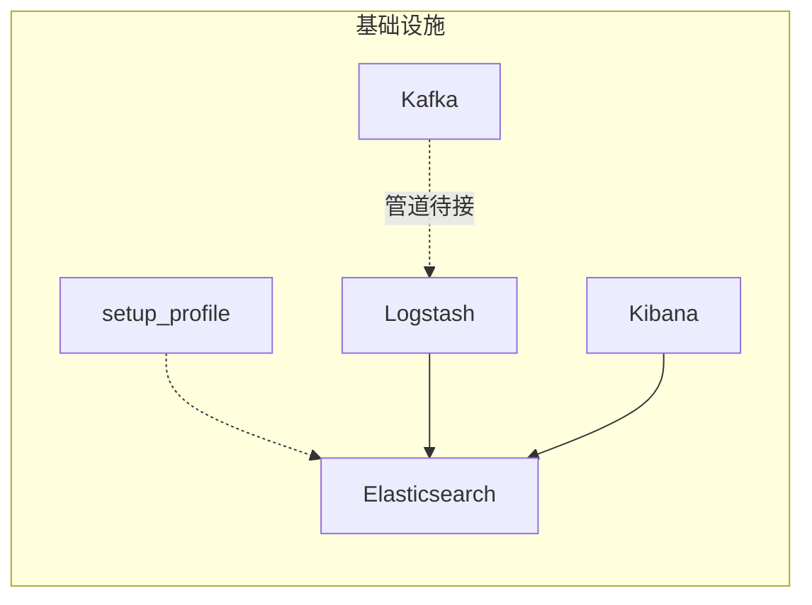
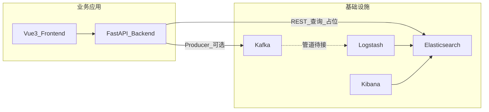

# location 项目说明

本文档结合《工程实践项目实施方案》《项目结构文档》的设计意图，并以当前仓库内代码与配置为**事实来源**，说明 `location` 目录下项目的定位、架构、目录、数据流、配置运维、接口与页面对照，以及文档愿景与实现差距、后续工作。

---

## 1. 项目简介

**定位**：`location` 采用「基础设施层 + 业务应用层」双层结构——底层基于 Docker Compose 运行 **Elasticsearch、Logstash、Kibana、Kafka**（及可选 `setup` 初始化），上层为团队自研的 **FastAPI 后端**与 **Vue 3 前端**，用于模拟电商等场景下的访问日志、异常日志，并完成采集、（规划中的）管道处理、存储、可视化与智能诊断演示。

**与课程/实施方案的对应关系**（目标闭环，以仓库实装为准）：

- **设计愿景**：模拟业务产生日志 → **Kafka** 缓冲与解耦 → **Logstash** 消费、解析、写入 → **Elasticsearch** 存储与聚合 → **Kibana** 与后端查询展示 → 基于规则与 **LangChain / LangGraph** 的异常诊断 → 前端呈现结论与建议。
- **当前实装**：后端可经 Kafka Producer 写入 Topic；Elasticsearch 客户端与查询、智能诊断模块多为**占位实现**；Logstash 管道**尚未接入 Kafka**，详见第 4、7 节。

---

## 2. 整体架构

### 2.1 文字说明

- **基础设施（Compose）**：`elasticsearch`、`logstash`、`kibana`、`kafka`；`setup` 与 `kibana-genkeys` 位于 `setup` profile，用于初始化用户/角色或生成密钥（见 `docker-compose.yml` 注释）。
- **业务应用**：Vue 前端通过 `VITE_API_BASE_URL` 调用 FastAPI；后端除 HTTP 外，还可通过 `tasks/run_log_producer.py` 向 Kafka 发送模拟日志（与前端独立）。

### 2.2 基础设施拓扑（Compose）



### 2.3 业务应用与外部依赖



---

## 3. 目录与职责

### 3.1 顶层树状概览

| 路径 | 职责 |
|------|------|
| `elasticsearch/`、`kibana/`、`logstash/`、`setup/` | ELK 镜像构建与配置；与上游 docker-elk 范式一致 |
| `docker-compose.yml` | 编排 ES、Logstash、Kibana、Kafka 及 setup 相关服务 |
| `extensions/` | 可选扩展（Filebeat、Metricbeat、Heartbeat、Fleet 等），非本专题必开 |
| `backend/` | FastAPI：配置、API、Schema、服务层、模拟日志、Kafka 生产、诊断占位等 |
| `frontend/` | Vue 3 + Vite：布局、页面、调用后端 API |

### 3.2 后端 `backend/app`（当前实有文件）

- `main.py`：创建 FastAPI 应用，挂载 `api_router`，前缀 `/api`。
- `core/config.py`：集中读取环境变量（Kafka、Elasticsearch、应用端口等）。
- `api/router.py`：聚合 `health`、`logs`、`diagnosis`、`system` 四类 v1 路由。
- `api/v1/*.py`：仅负责接请求、校验、调服务，不写复杂业务分支。
- `schemas/`：`log.py`、`diagnosis.py` —— 请求/响应与校验，前后端协作契约。
- `services/kafka/producer.py`：Kafka 生产与 `send_log_message`。
- `services/elasticsearch/`：`client.py`、`log_query_service.py`（查询逻辑当前为占位）。
- `services/simulation/log_generator.py`：构造模拟日志，供 `tasks/run_log_producer.py` 使用。
- `services/diagnosis/`：`rule_engine.py`（关键词规则分流）、`analyzer.py`（诊断总入口占位）。
- `tasks/run_log_producer.py`：循环发送模拟日志到 Kafka。

路由注册关系如下（节选）：

```7:11:location/backend/app/api/router.py
api_router = APIRouter()
api_router.include_router(health_router, prefix="/v1/health", tags=["health"])
api_router.include_router(logs_router, prefix="/v1/logs", tags=["logs"])
api_router.include_router(diagnosis_router, prefix="/v1/diagnosis", tags=["diagnosis"])
api_router.include_router(system_router, prefix="/v1/system", tags=["system"])
```

### 3.3 前端 `frontend/src`

- `router/index.js`：子路由 `home`、`monitor`、`diagnosis`、`results`、`system`。
- `api/`：`request.js`（`baseURL` 来自 `VITE_API_BASE_URL`）、`logs.js`、`diagnosis.js`、`system.js`。
- `views/`、`components/`、`layout/`：页面与布局（具体 UI 以组件为准）。

---

## 4. 核心数据流

### 4.1 方案中的目标路径

模拟业务 / Producer → **Kafka** → **Logstash**（过滤、解析、字段标准化）→ **Elasticsearch** → **Kibana** 大盘与 **后端检索** → 规则与 **LangGraph** 诊断 → 前端展示。

### 4.2 仓库当前可运行与未接通部分

1. **模拟日志 → Kafka**  
   `tasks/run_log_producer.py` 调用 `build_mock_log()` 与 `send_log_message()`，可向 `settings.kafka_topic`（默认 `app-logs`）持续写入 JSON 消息。

2. **Logstash → Elasticsearch**  
   `logstash/pipeline/logstash.conf` 当前 **input** 为 `beats`（5044）与 `tcp`（50000），**output** 指向 Elasticsearch；**未配置 `kafka` input**，因此 Kafka 中的日志不会自动进入该管道。

3. **后端 → Elasticsearch**  
   `log_query_service.search_logs` 返回占位结构（`items: []`），尚未执行真实 ES 查询。

4. **诊断**  
   `analyzer.analyze_logs` 结合 `classify_by_rules` 返回结构化占位结果，明确预留 LangChain/LangGraph 与日志检索接入点。

---

## 5. 配置与运维

### 5.1 后端环境变量（参见 `backend/.env.example`）

| 变量 | 含义 |
|------|------|
| `APP_HOST` / `APP_PORT` | 后端监听地址与端口（默认 `8000`） |
| `KAFKA_BOOTSTRAP_SERVERS` | Kafka 地址，默认 `localhost:9092` |
| `KAFKA_TOPIC` | 生产消息使用的 Topic，默认 `app-logs` |
| `ELASTICSEARCH_HOSTS` | ES 地址，默认 `http://localhost:9200` |
| `ELASTICSEARCH_INDEX_PATTERN` | 查询使用的索引模式，默认 `app-logs-*` |
| `LOG_PRODUCER_INTERVAL_SECONDS` | 日志生产者循环间隔（秒） |

配置类集中在 `backend/app/core/config.py`，通过 `pydantic-settings` 读取。

### 5.2 前端环境（`frontend/.env.development`）

- `VITE_API_BASE_URL=http://localhost:8000/api/v1` —— 与后端 `include_router(..., prefix="/api")` + `/v1/...` 一致。
- `VITE_KIBANA_URL=http://localhost:5601` —— 便于页面跳转或外链 Kibana（以实际页面使用为准）。

### 5.3 Docker Compose 要点

- **Kafka**（`apache/kafka:4.1.2`）：`KAFKA_ADVERTISED_LISTENERS: PLAINTEXT://localhost:9092`，宿主机上的后端、脚本使用 `localhost:9092` 连接；**其他容器内**若要连接 Kafka，需按网络 DNS 或服务名调整 bootstrap servers（当前 Compose 未将后端放入同一 `elk` 网络时，以后端跑在宿主机为主场景）。
- **Elasticsearch**：端口 `9200`；`setup` profile 用于首次初始化用户与角色，详见 compose 文件头部注释。
- **Logstash**：暴露 `5044`、`50000`、`9600` 等，与 `logstash.conf` 中 input 一致。

### 5.4 本地启动（简述）

1. 在 `location` 目录：`docker compose up -d`（按需加 `--profile=setup` 执行初始化）。
2. 后端：安装依赖后运行 FastAPI（参见 `backend/README.md` 或 `scripts/start_dev.bat`）。
3. 前端：`npm install` / `npm run dev`（参见 `frontend/README.md`）。
4. 可选：在 `backend` 目录执行 `python -m app.tasks.run_log_producer`（或等价模块路径）持续向 Kafka 写模拟日志。

---

## 6. API 与前端页面对照

以下路径均以**后端全局前缀 `/api`** 为准；前端 `axios` 的 `baseURL` 已含 `/api/v1`，故前端路径为表中「前端相对路径」。

| 方法 | 完整路径 | 说明 | 前端封装（`src/api`） |
|------|-----------|------|------------------------|
| GET | `/api/v1/health` | 健康检查 | （可按需直接请求） |
| POST | `/api/v1/logs/search` | 日志检索（占位） | `searchLogs` → `/logs/search` |
| POST | `/api/v1/diagnosis` | 智能诊断（规则 + 占位说明） | `runDiagnosis` → `/diagnosis` |
| GET | `/api/v1/system/status` | 返回当前 Kafka/ES 相关配置快照 | `getSystemStatus` → `/system/status` |

**路由与页面（菜单）对应**（`frontend/src/router/index.js`）：

| 路由 path | 视图 | 典型关联 |
|-----------|------|----------|
| `/` | `home` | 项目说明、总览 |
| `/monitor` | `monitor` | 日志监控、与检索 API 联动 |
| `/diagnosis` | `diagnosis` | 诊断表单与结果展示 |
| `/results` | `results` | 分析结果列表或详情 |
| `/system` | `system` | 系统状态、配置展示 |

---

## 7. 方案/结构文档与仓库现状差异（重要）

下列条目便于答辩或评审时对齐「文档愿景」与「当前仓库」。

| 类别 | 文档/方案常见描述 | 当前仓库 |
|------|-------------------|----------|
| 管道 | Kafka → Logstash → ES | Logstash **未配置 Kafka input**，与 Kafka **未接通** |
| 日志查询 | ES 检索与聚合 | `log_query_service` **占位**，未走真实 `client` 查询 |
| 智能诊断 | LangChain + LangGraph 工作流 | `analyzer` **占位**，仅 `rule_engine` 简单关键词分流 |
| 目录 | `repositories/`、`metrics` 相关 API/Schema | **不存在**对应包或路由 |
| 服务文件 | `topic_manager.py`、`langchain_service.py`、`langgraph_flow.py`、`event_templates.py`、`mock_user_behavior.py`、`index_service.py` 等 | **未出现**；Kafka 生产集中在 `producer.py` |
| 核心模块 | `core/logger.py`、`constants.py`、`security.py` | **未出现**；仅 `config.py` |
| 任务脚本 | `init_indices.py`、`smoke_test.py` 等 | **未出现**；仅有 `run_log_producer.py` |
| 数据存储 | 方案提及可选用 MySQL 存告警、分析结果 | **未集成** |

诊断占位实现示例（便于对照后续改造）：

```5:21:location/backend/app/services/diagnosis/analyzer.py
def analyze_logs(payload: DiagnosisRequest) -> dict:
    rule_result = classify_by_rules(payload.keyword)
    return {
        "message": "这是智能诊断占位实现，后续可接 LangChain/LangGraph",
        "input": payload.model_dump(),
        "diagnosis": {
            "anomaly_type": rule_result["anomaly_type"],
            "severity": rule_result["severity"],
            "route": rule_result["route"],
            "root_cause": "待接入日志检索与图式诊断流程",
            "suggestion": [
                "检查 Kafka 到 Logstash 链路是否正常",
                "检查 Elasticsearch 索引是否持续写入",
                "检查对应服务最近 5 分钟错误日志",
            ],
        },
    }
```

---

## 8. 后续工作清单（建议优先级）

1. **接通 Kafka → Logstash → ES**：在 `logstash/pipeline/logstash.conf` 增加 `kafka` input，与现有 `output { elasticsearch { ... } }` 衔接；统一字段与时间戳格式，与实施方案中的字段设计对齐。
2. **索引与 Mapping**：按方案中的 `timestamp`、`log_level`、`service_name` 等字段创建/固化 `app-logs-*`（及 `access-logs-*`、`analysis-results-*` 等）mapping，便于 Kibana 与后端查询。
3. **落地 `log_query_service`**：使用 `services/elasticsearch/client.py` 实现分页、时间范围、关键字、聚合等，与 `schemas/log.py` 一致。
4. **诊断链路**：从 ES 拉取证据日志 → 接入 LangGraph 节点编排 → 结构化输出根因与建议；保留 `rule_engine` 作为快速路径。
5. **可观测与压测**：按方案补充吞吐、延迟、查询耗时指标；必要时增加 `metrics` API 与前端展示。
6. **可选持久化**：分析结果、告警写入 MySQL 或其它存储，便于历史追溯。
7. **工程化**：补齐 `repositories` 分层、`init_indices`/`smoke_test`、日志与配置常量模块，与《项目结构文档》目标目录对齐。

---

## 附录：与两份 Word 文档的关系

- **《工程实践项目实施方案》**：提供业务目标、功能/非功能需求、技术选型、模块划分、字段与索引设计思路、实施阶段、测试与风险、预期成果等。**本文档不逐字摘录**，仅提炼与仓库对应的条目，并以**当前代码与配置**为准标出完成度与差距。
- **《项目结构文档》**：描述目标分层与推荐目录（含部分尚未创建的模块）。**本文档第 3、7、8 节**将「推荐结构」与「实际树」对照，避免读者误以为未实现的文件已存在。

---

*文档版本：与仓库同步撰写；修改代码或 Compose 后请同步更新本节与第 4、7 节。*
