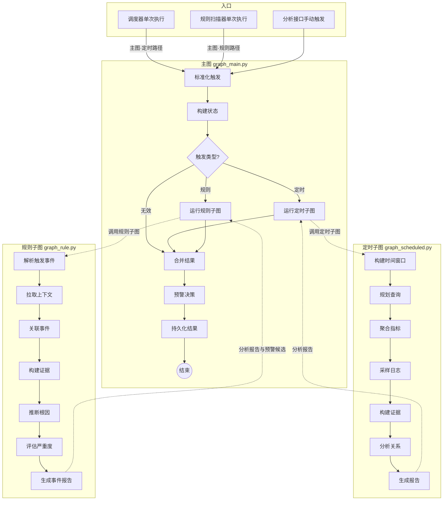
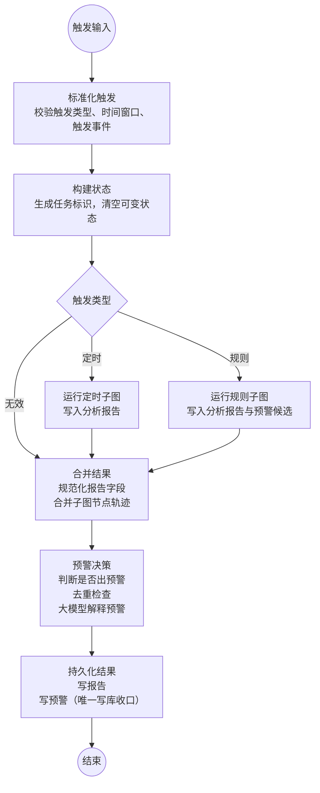
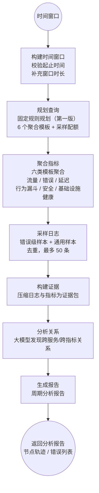
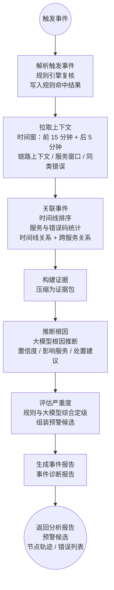
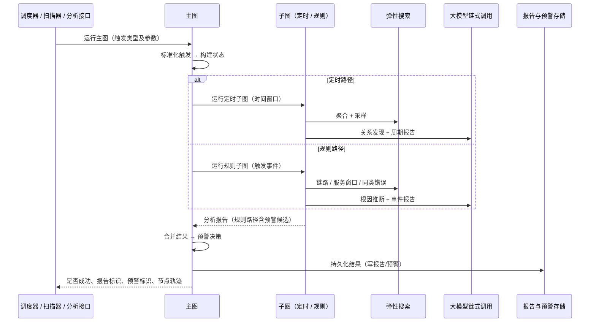

# LangGraph 三张图流程说明

> 代码落点：`app/services/analysis/graph_main.py`、`graph_scheduled.py`、`graph_rule.py`  
> 状态契约：`app/services/analysis/state.py`（分析状态 `AnalysisState`）  
> 关联文档：`doc/LangGraph技术目标.md`（目标）、`doc/后端开发总体规划-Services-LangGraph-MCP.md`（规划）

本文档描述**当前已落地**的三张 LangGraph 图的节点流程、数据流与触发关系，供开发、答辩演示与前端节点轨迹对照使用。

---

## 1. 总体关系

三张图共用分析状态，分工如下：

| 图 | 文件 | 入口函数 | 职责 |
| --- | --- | --- | --- |
| 主图 | `graph_main.py` | `run_main_graph()` | 路由、结果收敛、预警决策、持久化收口 |
| 定时子图 | `graph_scheduled.py` | `run_scheduled_subgraph()` | 按时间窗口做平台/业务周期体检 |
| 规则子图 | `graph_rule.py` | `run_rule_subgraph()` | 针对单条关键错误做上下文深挖 |

生产路径均经主图；子图可单独调用，但**不负责最终写库**（写报告/写预警仅在主图「持久化结果」节点）。

### 1.1 总览流程图



> 说明：主图通过节点内调用子图执行函数运行子图，未使用 LangGraph 的嵌套子图 API；虚线表示函数级调用关系。

### 1.2 触发入口

| 入口 | 调用方式 | 说明 |
| --- | --- | --- |
| `scheduler.py` | `run_main_graph("scheduled", time_window=...)` | 按配置的周期间隔（`analysis_schedule_minutes`）触发 |
| `trigger_scanner.py` | `run_main_graph("rule", trigger_event=...)` | 扫描弹性搜索中命中「需触发子图」规则的日志后逐条触发 |
| 分析接口 | `run_main_graph(...)` | 手动调试或前端「立即分析」 |

---

## 2. 主图（`graph_main.py`）

**定位**：总调度器，7 个节点，一条条件分支。不做弹性搜索查询与根因推断，只负责编排与收口。

### 2.1 流程图



### 2.2 节点说明

| 节点（代码名） | 核心逻辑 | 关键产出（状态字段） |
| --- | --- | --- |
| 标准化触发 | 校验并标准化触发输入 | 触发类型、时间窗口、触发事件、查询计划中的已标准化触发 |
| 构建状态 | 生成/确认任务标识，清空上一轮可变字段 | 干净的运行上下文 |
| 条件路由 | 定时 → 定时子图；规则 → 规则子图；无效 → 直接合并 | — |
| 运行定时子图 | 调用定时子图并传入时间窗口 | 分析报告；子图轨迹记入查询计划的子图结果 |
| 运行规则子图 | 调用规则子图并传入触发事件 | 分析报告、预警候选 |
| 合并结果 | 规范化报告字段；子图节点轨迹加前缀「定时./规则.」后合并；无报告时生成降级报告 | 统一格式的分析报告 |
| 预警决策 | **定时**：风险等级为「高」才预警；**规则**：严重度不低于「高」才预警；去重；大模型润色标题与描述 | 预警决策 |
| 持久化结果 | **唯一写库收口**：写报告；应预警且未去重则写预警；去重命中则累加已有预警 | 持久化结果（报告标识、预警标识） |

### 2.3 返回值

`run_main_graph()` 返回字段说明：

| 字段 | 含义 |
| --- | --- |
| 是否成功 | 报告写入成功且报告标识非空时为真 |
| 报告标识 | 持久化后的报告主键 |
| 预警标识 | 持久化后的预警主键（可能为空） |
| 节点轨迹 | 主图与子图各节点执行记录列表 |
| 预警决策 | 是否出预警、是否重复、解释文案等 |
| 错误列表 | 各节点降级过程中记录的错误 |

---

## 3. 定时子图（`graph_scheduled.py`）

**定位**：周期体检 + 业务洞察，7 个节点线性执行。

**典型场景**：每 N 分钟扫描过去一个时间窗口内的日志，生成平台运行报告（报告类型：周期报告）。

### 3.1 流程图



### 3.2 节点说明

| 节点（代码名） | 核心逻辑 | 关键产出（状态字段） |
| --- | --- | --- |
| 构建时间窗口 | 校验起止时间可解析且结束晚于开始，补充窗口秒数 | 规范化时间窗口 |
| 规划查询 | 固定规则规划（非大模型规划） | 查询计划（6 模板 + 采样配额） |
| 聚合指标 | 按模板调用弹性搜索聚合工具 | 指标字典 |
| 采样日志 | 先查错误/严重级别，再补通用日志，去重后最多 50 条 | 原始日志列表 |
| 构建证据 | 将原始日志与指标压缩为证据包 | 证据包 |
| 分析关系 | 大模型关系发现；失败或无结果标记为已跳过 | 关系列表 |
| 生成报告 | 生成周期报告；大模型不可用时模板降级 | 分析报告 |

### 3.3 数据流

```text
时间窗口 → 弹性搜索六类聚合 + 日志采样 → 证据包 → 关系发现 → 周期报告
```

子图返回是否成功、分析报告、节点轨迹、错误列表，不写数据库。

---

## 4. 规则子图（`graph_rule.py`）

**定位**：关键错误即时深挖，7 个节点线性执行。

**典型场景**：规则扫描器发现命中「需触发子图」规则的日志后，以该条日志为中心拉上下文、推断根因、定级并产出事件报告。

### 4.1 流程图



### 4.2 节点说明

| 节点（代码名） | 核心逻辑 | 关键产出（状态字段） |
| --- | --- | --- |
| 解析触发事件 | 规则引擎复核；未命中仍继续（降级模式） | 查询计划中的规则命中 |
| 拉取上下文 | 以触发时间为中心开窗口，三路拉上下文并去重 | 原始日志、查询计划中的上下文包 |
| 关联事件 | 纯规则关联：时间线、服务/错误码统计 | 关系列表、指标中的关联统计 |
| 构建证据 | 压缩上下文日志与关联指标 | 证据包 |
| 推断根因 | 大模型推断根因、置信度、影响服务、处置建议 | 查询计划中的根因诊断 |
| 评估严重度 | 规则严重度与大模型结论综合定级；组装预警候选 | 预警候选、查询计划中的严重度评估 |
| 生成事件报告 | 生成事件报告并回填根因、严重度、规则命中信息 | 分析报告（报告类型：事件报告） |

### 4.3 与定时子图的主要差异

| 维度 | 定时子图 | 规则子图 |
| --- | --- | --- |
| 输入 | 时间窗口 | 单条触发事件 |
| 弹性搜索查询 | 六模板聚合 + 通用采样 | 链路上下文 / 服务窗口 / 同类错误 |
| 关系分析 | 大模型关系发现 | 规则统计关联事件 |
| 大模型用途 | 写周期报告 | 根因推断 + 事件报告 |
| 预警 | 不决策（交给主图） | 产出预警候选（主图再决策、去重、写入） |

### 4.4 数据流

```text
触发事件 → 三路弹性搜索上下文 → 规则关联 → 证据包 → 根因推断 → 定级 → 事件报告 + 预警候选
```

---

## 5. 端到端时序



---

## 6. 共享状态（分析状态）

三张图读写同一套字段：

| 分类 | 状态字段 | 说明 |
| --- | --- | --- |
| 触发上下文 | 触发类型、触发事件、时间窗口、任务标识 | 触发类型取值为「定时」或「规则」 |
| 查询与证据 | 查询计划、指标、原始日志、证据包 | 子图中间产物 |
| 分析结果 | 关系列表、分析报告、预警候选、预警决策 | 报告与预警相关 |
| 运行管理 | 持久化结果、节点轨迹、错误列表 | 持久化结果与可观测性 |

节点失败统一走「记录错误 + 降级默认值 + 继续下游」，不中断整图。

---

## 7. 设计要点

1. **主图 = 编排 + 收口**，子图 = 具体分析流水线。
2. **无智能体自主选工具**：各节点显式调用服务层或工具函数，大模型仅用于链式调用的结构化输出（报告、根因、关系发现、预警解释）。
3. **写库只在主图「持久化结果」节点**；调度器、规则扫描器、子图均不直接写报告或写预警。
4. **降级为默认策略**：弹性搜索不可用、大模型不可用、规则未命中时记错并尽量产出降级结果。
5. **子图挂载方式**：主图节点内通过 Python 函数调用，非 LangGraph 原生子图嵌套。

---

## 8. 版本与维护

| 项目 | 说明 |
| --- | --- |
| 主图落地 | 里程碑 M6（`graph_main.py`） |
| 定时子图落地 | 里程碑 M4（`graph_scheduled.py`） |
| 规则子图落地 | 里程碑 M5（`graph_rule.py`） |
| 测试覆盖 | `tests/test_m4_scheduled.py`、`tests/test_m5_rule.py`、`tests/test_m6_main.py` |

图结构或节点职责变更时，请同步更新本文档与 `app/services/analysis/DEV.md`。
