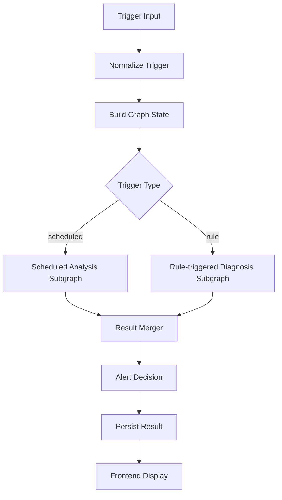
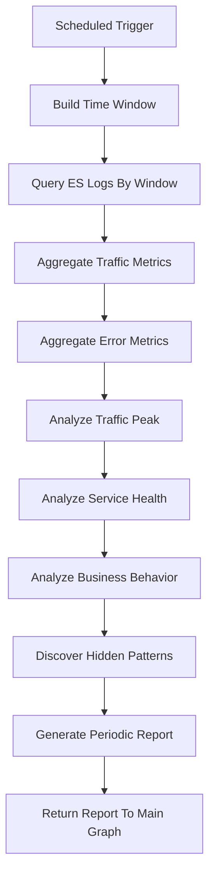
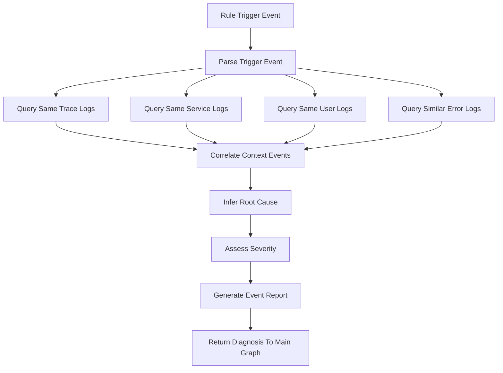

# LangGraph 技术目标

## 1. 文档定位

本文档用于明确当前项目中 LangGraph 的最终技术目标、图结构设计、触发方式、与 Kafka-ELK 链路的关系，以及后续落地需要构建的中间组件。

当前项目目标不是“用户告诉系统分析什么，然后系统回答什么”，而是：

```text
LangGraph 主动消费 Elasticsearch 中的日志内容，
周期性生成电商平台运行报告，
在关键错误出现时自动触发事件分析，
发现普通统计不容易直接看出的日志关系与潜在问题，
并生成可展示、可追溯、带证据的报告与预警。
```

因此，LangGraph 的定位是：

```text
主动智能分析与预警编排引擎。
```

## 2. 与 Kafka-ELK 链路的关系

Kafka-ELK 是本项目的数据底座，LangGraph 是其上的智能分析层。

完整目标链路为：

```text
模拟电商日志
  -> Kafka
  -> Logstash
  -> Elasticsearch
  -> LangGraph 主动分析
  -> LangChain 模型分析
  -> 报告与预警
  -> 前端展示
```

LangGraph 不建议直接消费 Kafka。原因是：

- Kafka 更适合实时传输和削峰缓冲
- Elasticsearch 更适合时间窗口查询、过滤、聚合和回溯
- 智能分析需要上下文日志、历史日志和聚合结果，这些更适合从 ES 获取

推荐关系：

```text
Kafka / Logstash 负责日志进入 ES。
Elasticsearch 作为 LangGraph 的主要证据源。
LangGraph 通过工具层查询 ES，并将结果交给 LangChain 分析。
```

## 3. 当前项目现状

当前项目中已经具备以下基础：

- Docker Compose 中包含 Elasticsearch、Logstash、Kibana、Kafka
- 后端已有 FastAPI 接口结构
- 前端已有监控、诊断、结果、系统状态等页面
- 后端已有模拟日志生成器
- 后端已有 Kafka Producer
- 后端已有简单规则引擎

但当前仍处于“脚手架和占位实现”阶段：

- Logstash 尚未配置 Kafka input，`Kafka -> Logstash -> Elasticsearch` 主链路未完全打通
- `log_query_service` 目前返回空 `items`，尚未真实查询 Elasticsearch
- `analyzer.py` 只调用规则函数，没有实际 LangGraph 工作流
- 尚无定时分析图
- 尚无规则触发图
- 尚无报告写入和预警写入机制
- 尚无主动消费 ES 内容的后台分析任务

因此，LangGraph 当前的主要任务不是替换现有代码，而是把现有诊断占位升级为主动分析编排系统。

## 4. 总体设计目标

LangGraph 最终需要实现两类主动分析：

```text
周期性分析：定时扫描 ES，生成平台运行报告和业务洞察。
事件型分析：一旦出现被规则标记的关键错误，立即触发上下文诊断。
```

这两类分析都应进入统一的主图，由主图负责路由、调度和结果收敛。

整体结构为三张图：

```text
1. LangGraph 主图
2. LangGraph 定时任务子图
3. LangGraph 规则任务子图
```

其中：

```text
主图负责路由与调度。
子图负责具体查询与分析。
```

## 5. 三张 LangGraph 流程图

### 5.1 LangGraph 主图

主图是总调度器，不直接承担复杂分析。

职责：

- 接收触发事件
- 标准化任务上下文
- 判断触发类型
- 路由到定时任务子图或规则任务子图
- 合并子图输出
- 统一判断是否产生预警
- 写入分析结果或预警结果
- 将结果提供给前端展示

主图流程：



主图核心边界：

```text
主图负责什么时候分析、交给谁分析、结果怎么收敛。
主图不负责具体查哪些日志、怎么算指标、如何推断根因。
```

### 5.2 LangGraph 定时任务子图

定时任务子图负责“常规体检”和“业务洞察”。

触发方式：

```text
每 5 分钟 / 15 分钟 / 1 小时运行一次。
```

职责：

- 拉取固定时间窗口内的 ES 日志
- 统计请求量、错误率、接口耗时
- 识别请求高峰
- 分析热门接口和热门业务行为
- 分析服务健康状态
- 发现趋势型异常
- 总结埋点日志中的业务价值数据
- 生成周期性分析报告

定时任务子图流程：



定时任务子图适合输出：

- 最近时间窗口请求总量
- 请求高峰时间段
- 热门接口
- 热门行为，例如浏览、搜索、下单、支付
- 服务错误率排名
- 慢接口排名
- 错误码分布
- 支付失败趋势
- 用户行为分布
- 潜在风险总结

示例报告目标：

```text
最近 15 分钟内，平台请求高峰出现在 14:08-14:10。
/api/goods/list 是访问量最高接口。
/api/pay 请求量不高，但平均响应时间和错误率均明显高于其他接口。
payment-service 的 PAY_FAIL 多集中在请求高峰后 2 分钟，可能存在下游支付服务瓶颈。
```

### 5.3 LangGraph 规则任务子图

规则任务子图负责“关键错误即时深挖”。

触发方式：

```text
一旦出现某类被标记的错误，直接触发事件分析。
```

适合触发的规则：

- 出现 `log_level = ERROR`
- 出现 `log_level = CRITICAL`
- 出现 `error_code = PAY_FAIL`
- 出现 `error_code = DB_TIMEOUT`
- 出现 `status_code >= 500`
- `/api/pay` 响应时间超过阈值
- 同一 trace_id 出现多个服务异常
- 同一 user_id 短时间内触发大量失败请求
- 某服务连续出现 N 条 ERROR
- Logstash 或 ES 长时间无新日志写入

职责：

- 接收被规则标记的触发日志
- 解析 `trace_id`、`service_name`、`user_id`、`error_code`、`request_path`
- 查询同 trace 上下文日志
- 查询同服务短时间窗口日志
- 查询同用户近期行为
- 查询同类错误是否集中爆发
- 分析错误前后顺序
- 判断根因和影响范围
- 生成事件级诊断报告
- 必要时生成预警

规则任务子图流程：



规则任务子图适合输出：

- 异常类型
- 触发日志
- 证据日志
- 相关服务
- 影响接口
- 影响用户或业务流程
- 根因推断
- 严重等级
- 置信度
- 处理建议

示例事件诊断目标：

```text
14:31:22 检测到 PAY_FAIL。
系统自动分析上下文日志 42 条。
关联发现：支付失败前 30 秒内，/api/pay 超时显著增加。
初步判断：payment-service 调用下游支付接口异常。
严重等级：high。
建议：检查 payment-service 到第三方支付接口的网络连通性和超时配置。
```

## 6. 触发机制设计

LangGraph 需要支持两类触发入口。

### 6.1 定时触发

定时触发负责趋势和总结。

输入示例：

```json
{
  "trigger_type": "scheduled",
  "time_window": {
    "start": "2026-05-11T14:00:00",
    "end": "2026-05-11T14:15:00"
  },
  "task_name": "periodic_platform_analysis"
}
```

### 6.2 规则触发

规则触发负责实时应急分析。

输入示例：

```json
{
  "trigger_type": "rule",
  "trigger_rule": "PAY_FAIL_WITH_TIMEOUT",
  "event": {
    "timestamp": "2026-05-11T14:31:22",
    "service_name": "payment-service",
    "request_path": "/api/pay",
    "error_code": "PAY_FAIL",
    "trace_id": "T123456",
    "user_id": "U1001",
    "log_level": "ERROR"
  }
}
```

## 7. Graph State 设计

LangGraph 中需要定义统一状态对象，用于在主图和子图之间流转。

建议字段：

```json
{
  "trigger_type": "scheduled",
  "trigger_event": {},
  "time_window": {},
  "query_plan": {},
  "raw_logs": [],
  "evidence_logs": [],
  "metrics": {},
  "relations": [],
  "analysis_report": {},
  "alert_candidate": {},
  "alert_decision": {},
  "persist_result": {},
  "errors": []
}
```

关键说明：

| 字段 | 作用 |
|---|---|
| `trigger_type` | 标识定时触发或规则触发 |
| `trigger_event` | 规则触发时的原始事件 |
| `time_window` | 分析时间窗口 |
| `query_plan` | ES 查询计划 |
| `raw_logs` | 原始查询日志 |
| `evidence_logs` | 筛选后的证据日志 |
| `metrics` | 统计指标 |
| `relations` | 发现的日志关系 |
| `analysis_report` | 分析报告 |
| `alert_candidate` | 候选预警 |
| `alert_decision` | 最终预警判断 |
| `persist_result` | 写入结果 |
| `errors` | 图运行过程中的错误 |

## 8. 中间组件设计

LangGraph 会涉及以下中间组件：

| 组件 | 作用 |
|---|---|
| `Trigger Event` | 统一表示触发来源，包括定时触发、规则触发 |
| `Graph State` | 保存时间窗口、触发事件、查询结果、统计结果、报告和预警 |
| `Main Router` | 主图路由节点，决定进入哪个子图 |
| `Scheduled Subgraph` | 定时任务分析子图 |
| `Rule Subgraph` | 规则触发诊断子图 |
| `ES Query Planner` | 根据任务类型决定查哪些 ES 数据 |
| `Evidence Builder` | 把原始日志整理成可分析证据包 |
| `Metrics Aggregator` | 统计请求量、错误率、接口耗时、错误码分布 |
| `Relation Analyzer` | 分析日志之间的前后关系、同 trace 关系、服务关联 |
| `Report Generator` | 生成周期报告或事件诊断报告 |
| `Alert Decider` | 判断是否产生预警和预警等级 |
| `Persistence Writer` | 写入 `analysis-results-*` 或 `alerts-*` |
| `Dedup / Idempotency` | 防止同一错误反复触发重复报告 |
| `Status Tracker` | 记录任务状态：running、success、failed、skipped |

## 9. 查询与分析目标

### 9.1 普通统计可以发现的问题

普通 ES 聚合或 Kibana 图表可以发现：

- 请求量
- 错误数
- 错误率
- 接口平均耗时
- 服务错误排名
- 错误码分布
- 请求高峰

这些应由代码和 ES 聚合完成，不需要交给 LLM。

### 9.2 LangGraph + LangChain 要发现的问题

智能分析层应重点发现普通统计不容易直接看出的关系：

- 支付失败是否总是发生在请求高峰之后
- 某个接口变慢是否会带来后续订单失败
- 某类错误是否总和某个服务、路径或用户行为同时出现
- 看起来错误率不高的问题是否集中影响关键业务链路
- 某些 WARN 日志是否经常出现在 ERROR 前面
- 同一 trace_id 是否体现出跨服务连锁故障
- 某个用户行为路径是否更容易触发失败
- 某个服务是否在高峰期明显变慢

## 10. 输出结果设计

### 10.1 周期报告

周期报告面向平台体检和运营分析：

```json
{
  "report_type": "periodic",
  "summary": "最近 15 分钟平台整体稳定，但支付接口延迟升高。",
  "request_total": 12430,
  "traffic_peak": "14:08-14:10",
  "top_api": "/api/goods/list",
  "slowest_api": "/api/pay",
  "top_error_service": "payment-service",
  "business_insights": [
    "浏览和搜索请求占比最高。",
    "支付失败集中出现在请求高峰后。"
  ],
  "hidden_relations": [
    "search-service 延迟升高后，订单提交失败数量略有上升。"
  ],
  "risk_level": "medium",
  "suggestions": []
}
```

### 10.2 事件诊断报告

事件诊断报告面向关键异常：

```json
{
  "report_type": "event_diagnosis",
  "anomaly_type": "支付服务超时",
  "severity": "high",
  "root_cause": "payment-service 调用下游支付接口超时。",
  "affected_service": "payment-service",
  "affected_api": "/api/pay",
  "evidence_logs": [],
  "related_events": [],
  "suggestions": [
    "检查 payment-service 到第三方支付接口的网络连通性。",
    "在 Kibana 中按 trace_id 查询完整调用链。",
    "关注最近 5 分钟 /api/pay 的响应时间趋势。"
  ],
  "confidence": 0.82
}
```

### 10.3 预警结果

预警结果用于前端展示和历史追踪：

```json
{
  "alert_type": "payment_timeout",
  "severity": "high",
  "status": "active",
  "title": "支付服务疑似超时异常",
  "description": "payment-service 最近 5 分钟 PAY_FAIL 和 timeout 日志明显增加。",
  "evidence_count": 42,
  "created_at": "2026-05-11T14:31:22"
}
```

## 11. MCP 工具需求

LangGraph 不应直接写复杂 ES DSL，也不应直接操作底层存储。推荐通过受控 MCP/工具层访问外部能力。

第一阶段核心工具：

| MCP 工具 | 作用 |
|---|---|
| `es_search_logs` | 按时间、服务、级别、关键词、trace_id 查询日志 |
| `es_aggregate_metrics` | 聚合请求量、错误率、接口耗时、错误码分布 |
| `es_get_trace_context` | 根据 `trace_id` 获取完整上下文 |
| `es_get_service_window` | 查询某服务某时间窗口内的日志 |
| `es_get_similar_errors` | 查询同类 `error_code` 或相似错误 |
| `analysis_write_report` | 写入分析报告 |
| `alert_write_event` | 写入预警事件 |
| `alert_check_duplicate` | 检查是否已有相同预警，避免重复 |
| `system_health_check` | 检查 ES、Kafka、Logstash 链路状态 |
| `rule_match_log` | 判断某条日志是否命中规则触发条件 |

第二阶段增强工具：

| MCP 工具 | 作用 |
|---|---|
| `kibana_generate_link` | 为报告生成 Kibana 查询链接 |
| `es_get_business_funnel` | 统计浏览、搜索、下单、支付等行为漏斗 |
| `es_detect_traffic_peak` | 找出请求高峰时间段 |
| `es_compare_time_windows` | 比较当前窗口和上一窗口指标变化 |
| `report_list_recent` | 给前端读取历史报告 |
| `alert_list_active` | 给前端读取当前活跃预警 |

## 12. 推荐目录结构

建议新增如下目录：

```text
backend/app/services/analysis/
  __init__.py
  state.py
  schemas.py
  graph_main.py
  graph_scheduled.py
  graph_rule.py
  scheduler.py
  trigger_scanner.py
```

说明：

| 文件 | 职责 |
|---|---|
| `state.py` | 定义 LangGraph State |
| `schemas.py` | 定义分析报告、预警、触发事件等 Schema |
| `graph_main.py` | 主图，负责路由与调度 |
| `graph_scheduled.py` | 定时任务子图 |
| `graph_rule.py` | 规则任务子图 |
| `scheduler.py` | 定时触发入口 |
| `trigger_scanner.py` | 扫描 ES 中被标记的异常日志并触发规则任务 |

可配合 LangChain 层：

```text
backend/app/services/langchain/
  llm_manager.py
  prompts.py
  output_parsers.py
  report_chain.py
  diagnosis_chain.py
  relation_chain.py
```

可配合工具层：

```text
backend/app/services/tools/
  elasticsearch_tools.py
  report_tools.py
  alert_tools.py
  rule_tools.py
  system_tools.py
```

## 13. 落地路线

### 第一阶段：打通数据底座

目标：

```text
Kafka -> Logstash -> Elasticsearch 可用。
```

任务：

- 为 Logstash 增加 Kafka input
- 统一日志字段
- 确认模拟日志能进入 ES
- 创建 `app-logs-*` 索引模式

### 第二阶段：实现 ES 查询工具

目标：

```text
LangGraph 可以从 ES 获取日志、聚合和上下文。
```

任务：

- 实现 `es_search_logs`
- 实现 `es_aggregate_metrics`
- 实现 `es_get_trace_context`
- 实现 `es_get_service_window`
- 实现 `es_get_similar_errors`

### 第三阶段：实现定时任务子图

目标：

```text
系统可以定时生成周期分析报告。
```

任务：

- 实现定时触发
- 查询最近时间窗口日志
- 聚合请求量、错误率、接口耗时
- 分析请求高峰和业务行为
- 调用 LangChain 生成周期报告
- 写入 `analysis-results-*`

### 第四阶段：实现规则任务子图

目标：

```text
系统可以在关键错误出现时自动触发诊断。
```

任务：

- 定义规则触发条件
- 扫描 ES 中被标记的异常日志
- 查询同 trace、同服务、同用户、同错误码上下文
- 调用 LangChain 生成事件诊断
- 写入 `alerts-*`
- 做预警去重

### 第五阶段：前端展示

目标：

```text
前端展示系统主动生成的报告和预警。
```

任务：

- 展示最新周期报告
- 展示历史报告列表
- 展示当前活跃预警
- 展示关键证据日志
- 展示请求高峰、热门接口、服务健康状态

## 14. 最小可落地版本

第一版最小闭环：

```text
定时触发
  -> 查询 ES 最近 15 分钟日志
  -> 聚合请求量、错误率、慢接口
  -> LangChain 生成报告
  -> 写入 analysis-results-*

规则触发
  -> 扫描 ES 最近 ERROR 日志
  -> 命中 PAY_FAIL / DB_TIMEOUT / timeout
  -> 查询上下文日志
  -> LangChain 生成诊断
  -> 写入 alerts-*
```

该版本可以暂不实现机器学习预警，只使用：

- 阈值规则
- 趋势规则
- 错误码规则
- 服务异常规则
- LLM 辅助解释

## 15. 最终技术目标

LangGraph 在本项目中的最终技术目标是：

```text
构建一套主动运行的电商日志智能分析编排系统，
通过主图统一调度定时任务子图和规则任务子图，
周期性消费 Elasticsearch 日志生成业务与运维报告，
并在关键错误出现时自动深挖上下文、发现日志关系、生成预警和诊断建议。
```

最终它应实现：

- 主动分析，而不是等待用户输入
- 定时触发和规则触发双入口
- 主图负责路由和调度
- 子图负责具体查询与分析
- 自动发现请求高峰和业务关键数据
- 自动发现普通统计不易发现的日志关系
- 自动生成周期报告
- 自动生成事件诊断报告
- 自动生成预警
- 报告和预警可写入 ES 或数据库
- 前端可展示最新分析结果和历史结果

