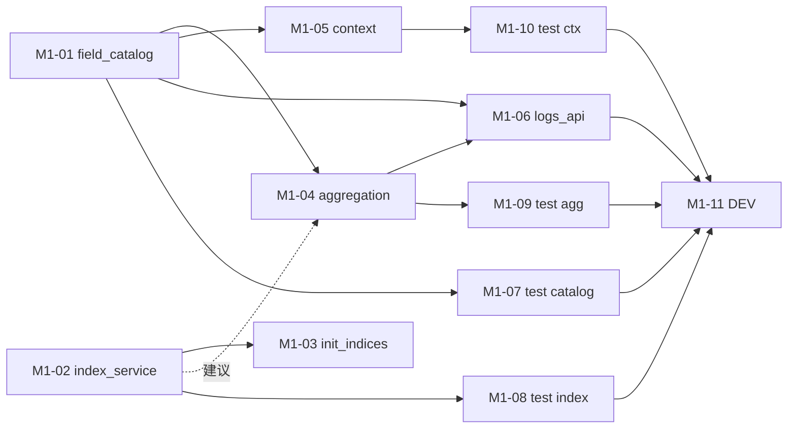

# M1 任务分发 Prompt 手册

> 建议每个执行 Agent 附加 skill：`/elk-backend-agent`  
> 任务详情真相来源：`task_m1/M1-0x-*.md`  
> **进度与依赖真相源**：`task_m1/STATUS.md`（开工前必读，完成后必更新）  
> 编排总览：`task_m1/README.md`

---

## 零、执行顺序与可并行任务

### 0.1 阶段总览

```text
阶段 A（可并行，2 Agent）
├── M1-01  field_catalog.py
└── M1-02  index_service.py

阶段 B（串行，依赖 A 之 M1-02）
└── M1-03  init_indices.py          ← 仅 M1-02 合并后

阶段 C（可并行，2 Agent；均依赖 M1-01）
├── M1-04  aggregation_service.py   ← 建议 M1-02 已完成
└── M1-05  context_service.py

阶段 D（串行，依赖 M1-01 + M1-04）
└── M1-06  api/v1/logs.py

阶段 E（可并行，最多 4 Agent；各测各文件）
├── M1-07  test_m1_field_catalog.py    ← 依赖 M1-01
├── M1-08  test_m1_index_service.py    ← 依赖 M1-02
├── M1-09  test_m1_aggregation_service.py ← 依赖 M1-04
└── M1-10  test_m1_context_service.py  ← 依赖 M1-05

阶段 F（串行，必须最后）
└── M1-11  elasticsearch/DEV.md + tasks/DEV.md
```

### 0.2 依赖关系图



### 0.3 并行派发矩阵

| 阶段 | 可同时派发的任务 | 条件 |
| --- | --- | --- |
| A | **M1-01 ∥ M1-02** | 无前置；改不同文件 |
| B | M1-03 | 仅 M1-02 已合并 |
| C | **M1-04 ∥ M1-05** | M1-01 已合并；建议 M1-02 已合并 |
| D | M1-06 | M1-01 + M1-04 已合并 |
| E | **M1-07 ∥ M1-08 ∥ M1-09 ∥ M1-10** | 各自依赖的 Service 已合并（可只派已就绪的测试） |
| F | M1-11 | M1-01~M1-10 全部完成 |

### 0.4 派发时注意

1. **开工前必读 `task_m1/STATUS.md`**：以第 2、3 节为准判断依赖是否满足，勿仅凭 git 猜测。
2. **同一阶段并行任务**：每个 Agent 只改一个主脚本，Prompt 内已写「并行冲突提醒」。
3. **阶段 E 可 partial 派发**：例如 M1-01 合并后即可派 M1-07，不必等 M1-04。
4. **M1-11 必须最后**：避免多人同时改 `DEV.md`。
5. **执行 Agent 完成后**：必须更新 STATUS 本人任务行（见各 Prompt「STATUS.md」小节）。
6. **不要 commit**：除非负责人明确要求。

### 0.5 速查表

| 任务 | 任务文档 | 唯一负责文件 | 前置依赖 |
| --- | --- | --- | --- |
| M1-01 | M1-01-field_catalog.md | `app/services/elasticsearch/field_catalog.py` | 无 |
| M1-02 | M1-02-index_service.md | `app/services/elasticsearch/index_service.py` | 无 |
| M1-03 | M1-03-init_indices.md | `app/tasks/init_indices.py` | M1-02 |
| M1-04 | M1-04-aggregation_service.md | `app/services/elasticsearch/aggregation_service.py` | M1-01 |
| M1-05 | M1-05-context_service.md | `app/services/elasticsearch/context_service.py` | M1-01 |
| M1-06 | M1-06-logs_api.md | `app/api/v1/logs.py` | M1-01, M1-04 |
| M1-07 | M1-07-test_field_catalog.md | `tests/test_m1_field_catalog.py` | M1-01 |
| M1-08 | M1-08-test_index_service.md | `tests/test_m1_index_service.py` | M1-02 |
| M1-09 | M1-09-test_aggregation_service.md | `tests/test_m1_aggregation_service.py` | M1-04 |
| M1-10 | M1-10-test_context_service.md | `tests/test_m1_context_service.py` | M1-05 |
| M1-11 | M1-11-dev_docs.md | `elasticsearch/DEV.md` + `tasks/DEV.md` | M1-01~10 |

---

## 一、编排 Agent Prompt（负责人用）

```markdown
你是 ELK 后端 M1 编排 Agent。阅读 `task_m1/PROMPT_DISPATCH.md` 第零节、`task_m1/README.md` 与 **`task_m1/STATUS.md`**。

根据 STATUS.md 第 3 节任务状态表与第 2 节依赖规则，判断各 M1-0x 是否可派发；不要仅依赖 git 猜测。
为每个可派发任务从本文档「三、各任务派发 Prompt」复制对应完整 Prompt。
同一阶段可并行任务须同时派发，并确认各 Agent 负责不同文件。
M1-11 仅在 STATUS 显示 M1-01~10 均为「已完成」或「已合并」后派发。不要自己写业务代码。
派发后提醒执行 Agent：开工/完成时更新 STATUS.md 中本人任务行。
```

---

## 二、完成汇报模板（每个执行 Agent 结束时必填）

```markdown
## M1 任务完成汇报 — {TASK_ID}

### 1. 分层
（Service / Task / API / 测试 / 文档）

### 2. 修改文件
- `location/backend/{TARGET_FILE}`

### 3. 实现摘要
（3~5 条）

### 4. 验收结果
| AC | 结果 | 说明 |
|----|------|------|

### 5. 自测命令与输出

### 6. 阻塞与遗留

### 7. 下游提醒

### 8. STATUS 已更新
- [ ] 已在 `task_m1/STATUS.md` 将本任务标为 `已完成` 或 `已合并`
```

---

## 二点五、STATUS.md 标准说明（写入各任务 Prompt）

各任务 Prompt 中的「STATUS.md」小节均基于以下定义；执行 Agent **必须遵守**。

| 项 | 说明 |
| --- | --- |
| **文件路径** | `location/backend/task_m1/STATUS.md` |
| **定位** | M1 里程碑各 Agent 共享的**进度与依赖唯一真相源**（动态）；与静态编排 `README.md`、派发手册 `PROMPT_DISPATCH.md` 互补 |
| **状态枚举** | `未开始` → `进行中` → `已完成` / `已合并`；异常用 `阻塞` |
| **依赖判定** | 下游任务仅以依赖项在 STATUS 中为 `已完成` 或 `已合并` 为准；单分支开发时二者等价 |
| **开工前** | 阅读 STATUS 第 2、3 节；确认本任务依赖已满足；将**本任务行**改为 `进行中` 并填写 `负责人/Agent` |
| **完成后** | 将**本任务行**改为 `已完成`（合入集成分支后改为 `已合并`）；填写完成时间、验收摘要、分支/PR（如有） |
| **协作纪律** | **只改自己那一行**，勿改其他任务行，避免并行冲突 |
| **阻塞时** | 状态改 `阻塞`，备注写明缺哪一任务、现象与建议 |

---

## 三、各任务派发 Prompt

---

### M1-01：field_catalog

**阶段 A | 可与 M1-02 并行**

```markdown
/elk-backend-agent

## 任务标识
- 任务编号：**M1-01**
- 任务文档：`location/backend/task_m1/M1-01-field_catalog.md`
- 编排说明：`location/backend/task_m1/README.md`

## STATUS.md（进度与依赖真相源）
- **路径**：`location/backend/task_m1/STATUS.md`（开工前必读，完成后必更新）
- **定义**：各 Agent 共享的 M1 动态进度表；记录每任务状态与依赖是否满足，供下游 Agent 判断是否可开工
- **状态**：`未开始` | `进行中` | `已完成` | `已合并` | `阻塞`（详见 STATUS 第 1 节）
- **开工前**：阅读 STATUS 第 2、3 节；**本任务无前置依赖**；将表中 **M1-01** 行改为 `进行中` 并填写负责人
- **完成后**：将 **M1-01** 行改为 `已完成` 或 `已合并`，填写完成时间、验收摘要；**只改本行**
- **说明**：M1-04/M1-05/M1-07 将依赖你此行状态为 `已完成`/`已合并` 后才可派发

## 你的角色
Elasticsearch 字段目录专项 Agent — 实现 7 类日志的 `FIELD_CATALOG` 与校验函数。

## 文件边界（强制）
- **唯一允许修改**：`location/backend/app/services/elasticsearch/field_catalog.py`
- **禁止修改**：aggregation_service、context_service、index_service、api/、schemas/、tasks/、DEV.md 及任何其他文件

## 并行冲突提醒
当前处于**阶段 A**，可与 **M1-02**（`index_service.py`）同时执行。
- 你**不得**修改 `index_service.py`
- 本任务不访问 ES；M1-02 不会依赖你的合并顺序，但 M1-04/M1-05 必须等你合并后才开始

## 跨任务约定
1. 不得修改 `app/schemas/log.py`（只读参考）
2. 删除所有 `placeholder: true` 返回
3. 简体中文；不要 commit

## 开发要点
- 全量注册 7 类：`behavior` / `application` / `web_server` / `performance` / `security` / `infrastructure` / `audit`
- 每类含：`filter_fields`、`terms_fields`、`metric_fields`、`trace_capable`、`user_capable`
- `behavior` 必须含 `funnel_steps` 五步
- 实现 5 个公开函数：`get_catalog_for_log_type`、`list_registered_log_types`、`validate_aggregate_field`、`resolve_index_pattern`、`validate_aggregate_request`

## 验收标准
AC-01~AC-07（见任务文档）；`python -c "from app.services.elasticsearch.field_catalog import FIELD_CATALOG; assert len(FIELD_CATALOG)==7"`

## 完成标准
- git diff 仅 `field_catalog.py`
- 已更新 `task_m1/STATUS.md` 中 M1-01 行
- 按第二节完成汇报模板输出
```

---

### M1-02：index_service

**阶段 A | 可与 M1-01 并行**

```markdown
/elk-backend-agent

## 任务标识
- 任务编号：**M1-02**
- 任务文档：`location/backend/task_m1/M1-02-index_service.md`
- 总体规划：`doc/后端开发总体规划-Services-LangGraph-MCP.md` §1.2.1

## STATUS.md（进度与依赖真相源）
- **路径**：`location/backend/task_m1/STATUS.md`（开工前必读，完成后必更新）
- **定义**：各 Agent 共享的 M1 动态进度表；记录每任务状态与依赖是否满足
- **开工前**：阅读 STATUS 第 2、3 节；**本任务无前置依赖**；将 **M1-02** 行改为 `进行中` 并填写负责人
- **完成后**：将 **M1-02** 行改为 `已完成` 或 `已合并`，填写完成时间、验收摘要；**只改本行**
- **说明**：M1-03/M1-08 将依赖你此行状态后才可派发

## 你的角色
Elasticsearch 索引模板专项 Agent — 实现 composable/index template 创建与幂等管理。

## 文件边界（强制）
- **唯一允许修改**：`location/backend/app/services/elasticsearch/index_service.py`
- **禁止修改**：field_catalog、aggregation_service、context_service、`init_indices.py`、`client.py`、api/、schemas/、core/config.py、DEV.md

## 并行冲突提醒
当前处于**阶段 A**，可与 **M1-01**（`field_catalog.py`）同时执行。
- 你**不得**修改 `field_catalog.py`
- **M1-03** 将在你合并后新建 `init_indices.py` 并只 import 你的函数；你不要写 CLI

## 跨任务约定
1. 只读 `schemas/log.py`；只复用 `get_es_client()`，不改 `client.py`
2. ES 失败返回 `{ok: false, error}`，不抛未捕获异常
3. 无 `placeholder: true`；简体中文；不要 commit

## 开发要点
- 保留 `INDEX_PREFIX`、`LOG_TYPES`
- 实现：`create_component_templates`、`create_index_templates`、`create_analysis_indices`、`init_all_indices`、`verify_templates`
- 8 component + 7 index template + analysis-results/alerts 预留
- mapping：keyword / numeric / message.text+keyword / timestamp.date

## 验收标准
AC-01~AC-07（见任务文档）

### 建议自测
```powershell
cd location\backend
python -m compileall app/services/elasticsearch/index_service.py -q
python -c "from app.services.elasticsearch.index_service import init_all_indices, verify_templates; print(init_all_indices()); print(verify_templates())"
```

## 完成标准
- git diff 仅 `index_service.py`
- 已更新 `task_m1/STATUS.md` 中 M1-02 行
- 下游提醒：M1-03 可调用 `init_all_indices()` / `verify_templates()`
```

---

### M1-03：init_indices

**阶段 B | 串行 | 依赖 M1-02**

```markdown
/elk-backend-agent

## 任务标识
- 任务编号：**M1-03**
- 任务文档：`location/backend/task_m1/M1-03-init_indices.md`

## STATUS.md（进度与依赖真相源）
- **路径**：`location/backend/task_m1/STATUS.md`
- **定义**：各 Agent 共享的 M1 动态进度表；下游以表中依赖任务状态是否为 `已完成`/`已合并` 判断是否可开工
- **开工前**：确认 STATUS 中 **M1-02** = `已完成` 或 `已合并`；否则**停止**并汇报阻塞；将 **M1-03** 行改为 `进行中`
- **完成后**：更新 **M1-03** 行为 `已完成`/`已合并`；只改本行

## 你的角色
Task 层 Agent — 新建索引初始化 CLI，**仅调用** M1-02 的 service。

## 文件边界（强制）
- **唯一允许新建**：`location/backend/app/tasks/init_indices.py`
- **禁止修改**：`index_service.py` 及任何其他文件

## 并行冲突提醒
本任务**不可与 M1-02 并行**（M1-02 必须先合并）。
可与已完成的 **M1-01 / M1-04 / M1-05** 无冲突（你不改那些文件）。
- 你**不得**在 task 内重复 mapping 或直连 `get_es_client`（`--verify-only` 调 `verify_templates` 除外）

## 前置依赖检查
开始前执行：
`python -c "from app.services.elasticsearch.index_service import init_all_indices; r=init_all_indices(); assert 'placeholder' not in str(r)"`
若失败则**停止**，汇报 M1-02 未就绪。

## 跨任务约定
1. 唯一 service 导入：`init_all_indices`, `verify_templates`
2. 风格对齐 `run_log_producer.py`；不要 commit

## 开发要点
- `python -m app.tasks.init_indices`
- 建议支持 `--verify-only`；成功 stdout 摘要，失败 `sys.exit(1)`

## 验收标准
AC-01~AC-05（见任务文档）

## 完成标准
- git diff 仅新增 `init_indices.py`
- 已更新 `task_m1/STATUS.md` 中 M1-03 行
```

---

### M1-04：aggregation_service

**阶段 C | 可与 M1-05 并行 | 依赖 M1-01**

```markdown
/elk-backend-agent

## 任务标识
- 任务编号：**M1-04**
- 任务文档：`location/backend/task_m1/M1-04-aggregation_service.md`

## STATUS.md（进度与依赖真相源）
- **路径**：`location/backend/task_m1/STATUS.md`
- **定义**：各 Agent 共享的 M1 动态进度表；下游以表中依赖任务状态是否为 `已完成`/`已合并` 判断是否可开工
- **开工前**：确认 **M1-01** = `已完成` 或 `已合并`；建议 **M1-02** 亦已就绪；将 **M1-04** 行改为 `进行中`
- **完成后**：更新 **M1-04** 行；M1-06/M1-09 将依赖你此行状态

## 你的角色
Elasticsearch 聚合专项 Agent — 六类受控聚合模板 + `aggregate()` 统一入口。

## 文件边界（强制）
- **唯一允许修改**：`location/backend/app/services/elasticsearch/aggregation_service.py`
- **禁止修改**：field_catalog（只 import）、log_query_service、context_service、index_service、api/、schemas/

## 并行冲突提醒
当前处于**阶段 C**，可与 **M1-05**（`context_service.py`）同时执行。
- 你**不得**修改 `context_service.py`
- 可与 **M1-03** 并行（若 M1-02 已合并），互不碰对方文件
- **M1-06** 必须等你合并后才能挂载 API

## 前置依赖检查
`from app.services.elasticsearch.field_catalog import validate_aggregate_request, resolve_index_pattern` 必须可用且非占位。

## 跨任务约定
1. 只读 `LogAggregateRequest`；ES 错误风格同 `log_query_service`
2. `size:0`；`top_n≤50`；禁止裸 DSL 入参
3. 无 placeholder；不要 commit

## 开发要点
- `aggregate(request)` + 六模板：traffic / errors / latency / behavior_funnel / security / infra_health
- 校验走 `field_catalog`；索引走 `resolve_index_pattern`
- 多 log_type 单次多索引查询

## 验收标准
AC-01~AC-10；数据准备：`python -m app.tasks.run_log_producer --count 200`

## 完成标准
- git diff 仅 `aggregation_service.py`
- 已更新 `task_m1/STATUS.md` 中 M1-04 行
- 下游：M1-06 调 `aggregate()`；M1-09 写测试
```

---

### M1-05：context_service

**阶段 C | 可与 M1-04 并行 | 依赖 M1-01**

```markdown
/elk-backend-agent

## 任务标识
- 任务编号：**M1-05**
- 任务文档：`location/backend/task_m1/M1-05-context_service.md`

## STATUS.md（进度与依赖真相源）
- **路径**：`location/backend/task_m1/STATUS.md`
- **定义**：各 Agent 共享的 M1 动态进度表；下游以表中依赖任务状态是否为 `已完成`/`已合并` 判断是否可开工
- **开工前**：确认 **M1-01** = `已完成` 或 `已合并`；将 **M1-05** 行改为 `进行中`
- **完成后**：更新 **M1-05** 行；M1-10 将依赖你此行状态

## 你的角色
Elasticsearch 诊断上下文专项 Agent — 四个受控上下文查询入口。

## 文件边界（强制）
- **唯一允许修改**：`location/backend/app/services/elasticsearch/context_service.py`
- **禁止修改**：`log_query_service.py`（含 `search_recent_context`）、diagnosis/analyzer、aggregation_service

## 并行冲突提醒
当前处于**阶段 C**，可与 **M1-04**（`aggregation_service.py`）同时执行。
- 你**不得**修改 `aggregation_service.py` 或 `log_query_service.py`
- 可 import `field_catalog.resolve_index_pattern`（只读，不改 field_catalog.py）

## 前置依赖检查
`from app.services.elasticsearch.field_catalog import resolve_index_pattern` 必须可用。

## 跨任务约定
1. `limit` 硬上限 50；时间窗 ≤24h
2. ES 失败：`available: false` + `error`
3. **不得**改 `search_recent_context` 来调用本模块
4. 无 placeholder；不要 commit

## 开发要点
实现四函数：
- `get_trace_context`
- `get_service_window`（含 `level_distribution`）
- `get_similar_errors`（含 `by_service`、`time_histogram`）
- `get_user_recent_actions`

## 验收标准
AC-01~AC-08（见任务文档）

## 完成标准
- git diff 仅 `context_service.py`
- 已更新 `task_m1/STATUS.md` 中 M1-05 行
- 下游：M1-10 写测试
```

---

### M1-06：logs_api

**阶段 D | 串行 | 依赖 M1-01 + M1-04**

```markdown
/elk-backend-agent

## 任务标识
- 任务编号：**M1-06**
- 任务文档：`location/backend/task_m1/M1-06-logs_api.md`

## STATUS.md（进度与依赖真相源）
- **路径**：`location/backend/task_m1/STATUS.md`
- **定义**：各 Agent 共享的 M1 动态进度表；下游以表中依赖任务状态是否为 `已完成`/`已合并` 判断是否可开工
- **开工前**：确认 **M1-01** 与 **M1-04** 均为 `已完成` 或 `已合并`；将 **M1-06** 行改为 `进行中`
- **完成后**：更新 **M1-06** 行；只改本行

## 你的角色
API 层 Agent — 完善 `GET /fields`，新增 `POST /aggregate`。

## 文件边界（强制）
- **唯一允许修改**：`location/backend/app/api/v1/logs.py`
- **禁止修改**：aggregation_service、field_catalog（只 import）、schemas/、router.py

## 并行冲突提醒
本任务**不可与 M1-04 并行**（须等 M1-04 合并）。
可与已完成的 **M1-05 / M1-07~10** 无文件冲突。
- 仅薄路由：不写 DSL、不定义新 schema

## 前置依赖检查
1. `get_catalog_for_log_type` / `list_registered_log_types` 非占位
2. `from app.services.elasticsearch.aggregation_service import aggregate` 非占位

## 跨任务约定
1. 保留 `POST /search` 行为不变
2. 无 placeholder 响应；不要 commit

## 开发要点
- `GET /fields`：`log_type` 有/无两种响应
- `POST /aggregate`：body=`LogAggregateRequest`，调 `aggregate()`
- 目标文件 <60 行

## 验收标准
AC-01~AC-06；TestClient 验证

## 完成标准
- git diff 仅 `logs.py`
- 已更新 `task_m1/STATUS.md` 中 M1-06 行
```

---

### M1-07：test_field_catalog

**阶段 E | 可与 M1-08/09/10 并行 | 依赖 M1-01**

```markdown
/elk-backend-agent

## 任务标识
- 任务编号：**M1-07**
- 任务文档：`location/backend/task_m1/M1-07-test_field_catalog.md`

## STATUS.md（进度与依赖真相源）
- **路径**：`location/backend/task_m1/STATUS.md`
- **定义**：各 Agent 共享的 M1 动态进度表；下游以表中依赖任务状态是否为 `已完成`/`已合并` 判断是否可开工
- **开工前**：确认 **M1-01** = `已完成` 或 `已合并`；将 **M1-07** 行改为 `进行中`
- **完成后**：更新 **M1-07** 行；只改本行

## 你的角色
测试 Agent — 仅为 field_catalog 编写单元测试。

## 文件边界（强制）
- **唯一允许新建**：`location/backend/tests/test_m1_field_catalog.py`
- **禁止修改**：任何生产代码及其他测试文件

## 并行冲突提醒
处于**阶段 E**，可与 **M1-08 / M1-09 / M1-10** 同时执行（各写各的测试文件）。
- **不得**修改 `field_catalog.py` 以迎合测试

## 前置依赖
M1-01 已合并。

## 开发要点
- pytest；不 mock ES；≥7 个 test 函数
- 覆盖：7 类、funnel、白名单、resolve_index_pattern、validate_aggregate_request

## 验收标准
`pytest tests/test_m1_field_catalog.py -v` 全绿；git diff 仅一个测试文件

## 完成标准
- git diff 仅一个测试文件
- 已更新 `task_m1/STATUS.md` 中 M1-07 行
- 按第二节完成汇报模板输出；不要 commit
```

---

### M1-08：test_index_service

**阶段 E | 可与 M1-07/09/10 并行 | 依赖 M1-02**

```markdown
/elk-backend-agent

## 任务标识
- 任务编号：**M1-08**
- 任务文档：`location/backend/task_m1/M1-08-test_index_service.md`

## STATUS.md（进度与依赖真相源）
- **路径**：`location/backend/task_m1/STATUS.md`
- **定义**：各 Agent 共享的 M1 动态进度表；下游以表中依赖任务状态是否为 `已完成`/`已合并` 判断是否可开工
- **开工前**：确认 **M1-02** = `已完成` 或 `已合并`；将 **M1-08** 行改为 `进行中`
- **完成后**：更新 **M1-08** 行；只改本行

## 你的角色
测试 Agent — 为 index_service 编写 mock 单测 + 可选 integration。

## 文件边界（强制）
- **唯一允许新建**：`location/backend/tests/test_m1_index_service.py`
- **禁止修改**：`index_service.py`、`init_indices.py` 及任何生产代码

## 并行冲突提醒
可与 **M1-07 / M1-09 / M1-10** 并行。
- mock `get_es_client`；integration 用 `@pytest.mark.integration` 可 skip

## 前置依赖
M1-02 已合并。

## 开发要点
- ≥4 个 test：ES 离线 mock、verify_templates、无 placeholder 键
- 可选 integration：`init_all_indices` 成功路径

## 验收标准
离线 mock 全绿；`pytest tests/test_m1_index_service.py -v`

## 完成标准
- git diff 仅一个测试文件
- 已更新 `task_m1/STATUS.md` 中 M1-08 行
- 不要 commit
```

---

### M1-09：test_aggregation_service

**阶段 E | 可与 M1-07/08/10 并行 | 依赖 M1-04**

```markdown
/elk-backend-agent

## 任务标识
- 任务编号：**M1-09**
- 任务文档：`location/backend/task_m1/M1-09-test_aggregation_service.md`

## STATUS.md（进度与依赖真相源）
- **路径**：`location/backend/task_m1/STATUS.md`
- **定义**：各 Agent 共享的 M1 动态进度表；下游以表中依赖任务状态是否为 `已完成`/`已合并` 判断是否可开工
- **开工前**：确认 **M1-04** = `已完成` 或 `已合并`；将 **M1-09** 行改为 `进行中`
- **完成后**：更新 **M1-09** 行；只改本行

## 你的角色
测试 Agent — 为 aggregation_service 编写 mock + integration 测试。

## 文件边界（强制）
- **唯一允许新建**：`location/backend/tests/test_m1_aggregation_service.py`
- **禁止修改**：`aggregation_service.py` 及任何生产代码

## 并行冲突提醒
可与 **M1-07 / M1-08 / M1-10** 并行。

## 前置依赖
M1-01 + M1-04 已合并。

## 开发要点
- mock：非法 group_by 不调用 ES（call_count=0）、top_n 截断、ES 离线
- integration：`aggregate_traffic` buckets 非空（需 `run_log_producer`）
- ≥5 个 test 函数

## 验收标准
AC-01~AC-04；`pytest tests/test_m1_aggregation_service.py -v`

## 完成标准
- git diff 仅一个测试文件
- 已更新 `task_m1/STATUS.md` 中 M1-09 行
- 不要 commit
```

---

### M1-10：test_context_service

**阶段 E | 可与 M1-07/08/09 并行 | 依赖 M1-05**

```markdown
/elk-backend-agent

## 任务标识
- 任务编号：**M1-10**
- 任务文档：`location/backend/task_m1/M1-10-test_context_service.md`

## STATUS.md（进度与依赖真相源）
- **路径**：`location/backend/task_m1/STATUS.md`
- **定义**：各 Agent 共享的 M1 动态进度表；下游以表中依赖任务状态是否为 `已完成`/`已合并` 判断是否可开工
- **开工前**：确认 **M1-05** = `已完成` 或 `已合并`；将 **M1-10** 行改为 `进行中`
- **完成后**：更新 **M1-10** 行；只改本行

## 你的角色
测试 Agent — 为 context_service 编写 mock + 可选 integration 测试。

## 文件边界（强制）
- **唯一允许新建**：`location/backend/tests/test_m1_context_service.py`
- **禁止修改**：`context_service.py`、`log_query_service.py` 及任何生产代码

## 并行冲突提醒
可与 **M1-07 / M1-08 / M1-09** 并行。

## 前置依赖
M1-05 已合并。

## 开发要点
- mock：空 trace、ES 离线、level_distribution、limit≤50
- ≥5 个 test 函数；integration 可 skip

## 验收标准
`pytest tests/test_m1_context_service.py -v` 离线全绿

## 完成标准
- git diff 仅一个测试文件
- 已更新 `task_m1/STATUS.md` 中 M1-10 行
- 不要 commit
```

---

### M1-11：DEV 文档收敛

**阶段 F | 必须最后执行 | 依赖 M1-01~10**

```markdown
/elk-backend-agent

## 任务标识
- 任务编号：**M1-11**
- 任务文档：`location/backend/task_m1/M1-11-dev_docs.md`

## STATUS.md（进度与依赖真相源）
- **路径**：`location/backend/task_m1/STATUS.md`
- **定义**：各 Agent 共享的 M1 动态进度表；M1 收尾前须确认 M1-01~10 均为 `已完成`/`已合并`
- **开工前**：确认 **M1-01 ~ M1-10** 均为 `已完成` 或 `已合并`；将 **M1-11** 行改为 `进行中`
- **完成后**：更新 **M1-11** 行；可在 STATUS 第 4 节注明 M1 里程碑已收尾
- **注意**：本任务必须最后执行；更新 DEV 前以 STATUS 为据，勿与未完成 Agent 并行

## 你的角色
文档 Agent — 统一更新 M1 相关 DEV 基线（**不碰业务代码**）。

## 文件边界（强制）
- **唯一允许修改**：
  - `location/backend/app/services/elasticsearch/DEV.md`
  - `location/backend/app/tasks/DEV.md`
- **禁止修改**：任何 `.py` 文件

## 并行冲突提醒
**本任务必须单独执行**，不可与任何开发/测试 Agent 并行（避免同时改 DEV.md）。

## 前置依赖检查
确认 M1-01~M1-10 均已合并；`pytest tests/test_m1_*.py` 至少离线用例通过。

## 开发要点
### elasticsearch/DEV.md
更新：模块总览、已实现清单、待开发清单、状态表、愿景差异、开发日志

### tasks/DEV.md
增加 `init_indices.py` 用法与开发日志

## 验收标准
AC-01~AC-04；git diff 仅两个 DEV.md

## 完成标准
- 已更新 `task_m1/STATUS.md` 中 M1-11 行，并刷新 STATUS 第 4 节「当前可派发」
- 按第二节完成汇报；标注 Logstash 单索引回退说明

```

---

## 四、推荐派发时间线（示例）

| 时间点 | 派发任务 | Agent 数 |
| --- | --- | --- |
| T0 | M1-01 + M1-02 | 2 |
| T1（M1-02 合并后） | M1-03 | 1 |
| T2（M1-01 合并后） | M1-04 + M1-05 | 2 |
| T3（M1-04 合并后） | M1-06 | 1 |
| T4 | M1-07 + M1-08 + M1-09 + M1-10（已就绪的测试） | 最多 4 |
| T5（全部完成） | M1-11 | 1 |

**最短关键路径**：M1-02 → M1-03 与 M1-01 → M1-04 → M1-06 → M1-09 → M1-11（约 6 个串行环节）；并行可显著缩短日历时间。
