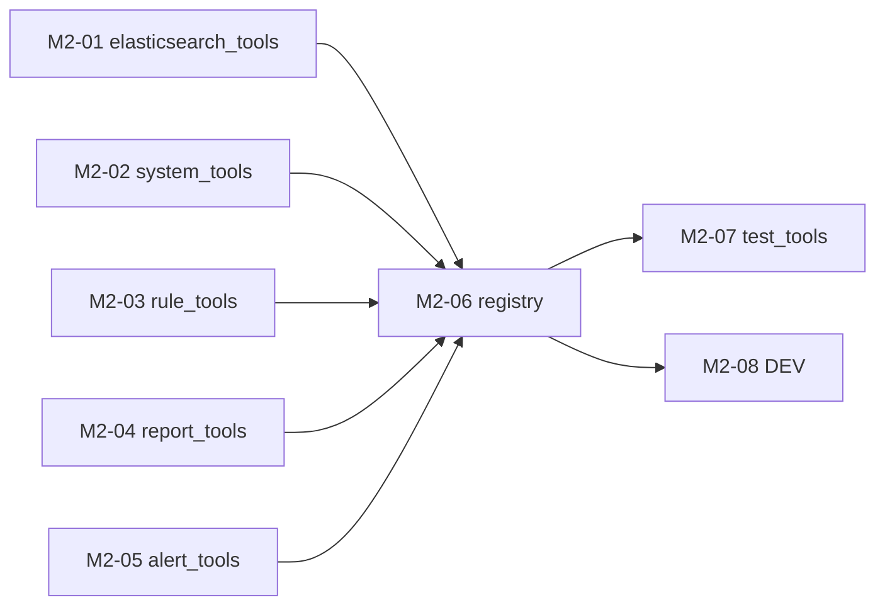

# M2 任务分发 Prompt 手册

> 建议每个执行 Agent 附加 skill：`/elk-backend-agent`  
> 任务详情真相来源：`task_m2/M2-0x-*.md`  
> **进度与依赖真相源**：`task_m2/STATUS.md`（开工前必读，完成后必更新）  
> 编排总览：`task_m2/README.md`  
> 总体规划：`doc/后端开发总体规划-Services-LangGraph-MCP.md` §3、§4

---

## 零、执行顺序与可并行任务

### 0.1 阶段总览

```text
阶段 A（可并行，最多 5 Agent）
├── M2-01  elasticsearch_tools.py   工具 1~5
├── M2-02  system_tools.py          工具 9
├── M2-03  rule_tools.py            工具 10
├── M2-04  report_tools.py          工具 6
└── M2-05  alert_tools.py           工具 7、8

阶段 B（串行，依赖 A 全部完成）
└── M2-06  registry.py + requirements.txt（langchain-core）

阶段 C（可并行，2 Agent；依赖 B）
├── M2-07  tests/test_m2_tools.py
└── M2-08  tools/DEV.md
```

### 0.2 依赖关系图



### 0.3 并行派发矩阵

| 阶段 | 可同时派发的任务 | 条件 |
| --- | --- | --- |
| A | **M2-01 ∥ M2-02 ∥ M2-03 ∥ M2-04 ∥ M2-05** | M1 全部 `已完成`/`已合并`；五文件互不冲突 |
| B | M2-06 | M2-01~05 均为 `已完成`/`已合并` |
| C | **M2-07 ∥ M2-08** | M2-06 已合并；各改不同文件 |

### 0.4 派发时注意

1. **开工前必读 `task_m2/STATUS.md`** 与 **`task_m1/STATUS.md` 前置检查**：M1 未收口不得派 M2。
2. **阶段 A 五任务可一次性并行派发**，每个 Agent 只改一个 `tools/*.py` 文件。
3. **M2-06 必须等阶段 A 全部完成**：registry 会 import 五个工具模块。
4. **底层 service 占位不阻塞 M2**：`report_service` / `alert_service` / `dedup` / `match_log` 可仍返回占位结果，但**工具层**不得再返回 `placeholder: true`。
5. **M2 不做**：LangGraph、LangChain Chain、FastMCP Server（`create_mcp_server` 完整实装属 M7）。
6. **执行 Agent 完成后**：必须更新 STATUS 本人任务行（见各 Prompt「STATUS.md」小节）。
7. **不要 commit**：除非负责人明确要求。

### 0.5 速查表

| 任务 | 任务文档 | 唯一负责文件 | 前置依赖 |
| --- | --- | --- | --- |
| M2-01 | M2-01-elasticsearch_tools.md | `app/services/tools/elasticsearch_tools.py` | M1 完成 |
| M2-02 | M2-02-system_tools.md | `app/services/tools/system_tools.py` | M1 完成 |
| M2-03 | M2-03-rule_tools.md | `app/services/tools/rule_tools.py` | M1 完成 |
| M2-04 | M2-04-report_tools.md | `app/services/tools/report_tools.py` | M1 完成 |
| M2-05 | M2-05-alert_tools.md | `app/services/tools/alert_tools.py` | M1 完成 |
| M2-06 | M2-06-registry.md | `app/services/tools/registry.py` + `requirements.txt` | M2-01~05 |
| M2-07 | M2-07-test_tools.md | `tests/test_m2_tools.py` | M2-06 |
| M2-08 | M2-08-tools_dev.md | `app/services/tools/DEV.md` | M2-06 |

### 0.6 第一阶段 10 工具与任务映射

| # | 工具名 | 读写 | 负责任务 |
| --- | --- | --- | --- |
| 1~5 | `es_search_logs` … `es_get_similar_errors` | 读 | M2-01 |
| 6 | `analysis_write_report` | **写** | M2-04 |
| 7 | `alert_write_event` | **写** | M2-05 |
| 8 | `alert_check_duplicate` | 读 | M2-05 |
| 9 | `system_health_check` | 读 | M2-02 |
| 10 | `rule_match_log` | 读 | M2-03 |

---

## 一、编排 Agent Prompt（负责人用）

```markdown
你是 ELK 后端 M2 编排 Agent。阅读 `task_m2/PROMPT_DISPATCH.md` 第零节、`task_m2/README.md`、**`task_m2/STATUS.md`** 与 **`task_m1/STATUS.md` 前置检查**。

确认 M1-01~M1-11 均为「已完成」或「已合并」后，根据 STATUS.md 第 3、4 节判断各 M2-0x 是否可派发；不要仅依赖 git 猜测。
为每个可派发任务从本文档「三、各任务派发 Prompt」复制对应完整 Prompt。
阶段 A 五任务（M2-01~05）可同时派发，并确认各 Agent 负责不同文件。
M2-06 仅在 STATUS 显示 M2-01~05 均为「已完成」或「已合并」后派发。
M2-07 与 M2-08 可在 M2-06 合并后并行派发。不要自己写业务代码。
派发后提醒执行 Agent：开工/完成时更新 STATUS.md 中本人任务行。
```

---

## 二、完成汇报模板（每个执行 Agent 结束时必填）

```markdown
## M2 任务完成汇报 — {TASK_ID}

### 1. 分层
（Tools / Registry / 测试 / 文档）

### 2. 修改文件
- `location/backend/{TARGET_FILE}`

### 3. 实现摘要
（3~5 条）

### 4. 验收结果
| AC | 结果 | 说明 |
|----|------|------|

### 5. 自测命令与输出

### 6. 阻塞与遗留

### 7. 下游提醒

### 8. STATUS 已更新
- [ ] 已在 `task_m2/STATUS.md` 将本任务标为 `已完成` 或 `已合并`
```

---

## 二点五、STATUS.md 标准说明（写入各任务 Prompt）

各任务 Prompt 中的「STATUS.md」小节均基于以下定义；执行 Agent **必须遵守**。

| 项 | 说明 |
| --- | --- |
| **文件路径** | `location/backend/task_m2/STATUS.md` |
| **定位** | M2 里程碑各 Agent 共享的**进度与依赖唯一真相源**（动态）；与静态编排 `README.md`、派发手册 `PROMPT_DISPATCH.md` 互补 |
| **前置** | 开工前确认 STATUS 第 1 节「M1 里程碑」已满足 |
| **状态枚举** | `未开始` → `进行中` → `已完成` / `已合并`；异常用 `阻塞` |
| **依赖判定** | 下游任务仅以依赖项在 STATUS 中为 `已完成` 或 `已合并` 为准；单分支开发时二者等价 |
| **开工前** | 阅读 STATUS 第 3、4 节；确认本任务依赖已满足；将**本任务行**改为 `进行中` 并填写 `负责人/Agent` |
| **完成后** | 将**本任务行**改为 `已完成`（合入集成分支后改为 `已合并`）；填写完成时间、验收摘要、分支/PR（如有） |
| **协作纪律** | **只改自己那一行**，勿改其他任务行，避免并行冲突 |
| **阻塞时** | 状态改 `阻塞`，备注写明缺哪一任务、现象与建议 |

---

## 三、各任务派发 Prompt

---

### M2-01：elasticsearch_tools

**阶段 A | 可与 M2-02~05 并行**

```markdown
/elk-backend-agent

## 任务标识
- 任务编号：**M2-01** (作为会话窗口名称)
- 任务文档：`location/backend/task_m2/M2-01-elasticsearch_tools.md`
- 编排说明：`location/backend/task_m2/README.md`
- 总体规划：`doc/后端开发总体规划-Services-LangGraph-MCP.md` §3.2 工具 1~5

## STATUS.md（进度与依赖真相源）
- **路径**：`location/backend/task_m2/STATUS.md`（开工前必读，完成后必更新）
- **前置**：确认 STATUS 第 1 节 M1 已满足
- **开工前**：将表中 **M2-01** 行改为 `进行中` 并填写负责人
- **完成后**：将 **M2-01** 行改为 `已完成` 或 `已合并`，填写完成时间、验收摘要；**只改本行**
- **说明**：M2-06 将依赖你此行状态为 `已完成`/`已合并` 后才可派发

## 你的角色
工具层 ES 读工具专项 Agent — 实现工具 1~5，薄包装 M1 已完成的 ES services。

## 文件边界（强制）
- **唯一允许修改**：`location/backend/app/services/tools/elasticsearch_tools.py`
- **禁止修改**：`services/elasticsearch/*`（只 import 调用）、`registry.py`、其他 `tools/*.py`、`DEV.md`

## 并行冲突提醒
当前处于**阶段 A**，可与 **M2-02 / M2-03 / M2-04 / M2-05** 同时执行。
- 你**不得**修改其他 `tools/*.py` 文件
- 你**不得**修改 `elasticsearch/*_service.py` 业务实现

## 跨任务约定
1. 删除 `_PLACEHOLDER` 与所有 `placeholder: true` 返回
2. 工具内 `try/except` 捕获异常，返回 `{"ok": false, "error": "...", "tool": "..."}`
3. 时间窗 ≤ 24h；`limit` / `top_n` 硬上限 50
4. 不得在工具内拼 ES DSL
5. 简体中文；不要 commit

## 开发要点

### 工具 1：`es_search_logs(params: EsSearchLogsInput)`
- 将 `EsSearchLogsInput` 映射为 `LogQueryRequest`（`schemas/log.py`）
- `limit` → `page_size`（上限 50），`page=1`
- 调用 `log_query_service.search_logs`
- 成功时透传 service 结果，可加 `"tool": "es_search_logs"`

### 工具 2：`es_aggregate_metrics(params: EsAggregateMetricsInput)`
- 按 `template` 分发到 `aggregation_service` 六模板函数：
  - `traffic` → `aggregate_traffic`
  - `errors` → `aggregate_errors`
  - `latency` → `aggregate_latency`
  - `behavior_funnel` → `aggregate_behavior_funnel`
  - `security` → `aggregate_security`
  - `infra_health` → `aggregate_infra_health`
- 传入 `start_time`、`end_time`、`log_types`、`interval`、`top_n` 等对应参数
- 未知 template 返回 `ok: false` 与明确 error

### 工具 3~5：上下文工具
- `es_get_trace_context` → `context_service.get_trace_context(trace_id, limit=...)`
- `es_get_service_window` → `context_service.get_service_window(service, start, end)`
- `es_get_similar_errors` → `context_service.get_similar_errors(error_code, start, end)`
- 时间窗在工具层或 service 层校验 ≤ 24h

## 验收标准
AC-01~AC-05（见任务文档）

### 建议自测
```powershell
cd location\backend
python -m compileall app/services/tools/elasticsearch_tools.py -q
python -c "from app.services.tools.elasticsearch_tools import es_search_logs, EsSearchLogsInput; r=es_search_logs(EsSearchLogsInput()); assert 'placeholder' not in r"
```

## 完成标准
- git diff 仅 `elasticsearch_tools.py`
- 五函数均无 `placeholder` 键
- 已更新 `task_m2/STATUS.md` 中 M2-01 行
- 按第二节完成汇报模板输出
```

---

### M2-02：system_tools

**阶段 A | 可与 M2-01/03/04/05 并行**

```markdown
/elk-backend-agent

## 任务标识
- 任务编号：**M2-02** (作为会话窗口名称)
- 任务文档：`location/backend/task_m2/M2-02-system_tools.md`
- 总体规划：`doc/后端开发总体规划-Services-LangGraph-MCP.md` §3.2 工具 9

## STATUS.md（进度与依赖真相源）
- **路径**：`location/backend/task_m2/STATUS.md`
- **前置**：确认 M1 已满足
- **开工前**：将 **M2-02** 行改为 `进行中`
- **完成后**：更新 **M2-02** 行；只改本行

## 你的角色
系统健康组合工具 Agent — 实现工具 9 `system_health_check`。

## 文件边界（强制）
- **唯一允许修改**：`location/backend/app/services/tools/system_tools.py`
- **禁止修改**：`elasticsearch/cluster_status.py`、`kafka/cluster_status.py`、`docker_status.py`、`api/v1/system.py`

## 并行冲突提醒
可与 **M2-01 / M2-03 / M2-04 / M2-05** 并行；不得改其他 tools 文件。

## 跨任务约定
1. 只读组合现有 service，不重复实现探测逻辑
2. 子系统失败不抛裸异常；`ok` 表示「全部健康」或按总体规划语义定义
3. 无 `placeholder: true`；不要 commit

## 开发要点

### `system_health_check() -> dict`
组合调用（只 import，不改实现体）：
- `get_elasticsearch_health_snapshot()` — `app/services/elasticsearch/cluster_status.py`
- `get_kafka_status_snapshot()` — `app/services/kafka/cluster_status.py`
- `get_docker_status(project_name, monitored_services)` — `app/services/docker_status.py`
  - 从 `app.core.config.get_settings()` 读取 `docker_project_name`、`docker_monitored_services`（逗号 split）

返回结构示例：
```python
{
  "ok": bool,
  "tool": "system_health_check",
  "elasticsearch": {...},  # 含 available / error 等
  "kafka": {...},
  "docker": {...},
}
```

单个子系统异常时记录 `available: false` 与 `error`，整函数仍返回 dict。

## 验收标准
AC-01~AC-04（见任务文档）

### 建议自测
```powershell
cd location\backend
python -c "from app.services.tools.system_tools import system_health_check; r=system_health_check(); assert 'placeholder' not in r; assert 'elasticsearch' in r"
```

## 完成标准
- git diff 仅 `system_tools.py`
- 已更新 `task_m2/STATUS.md` 中 M2-02 行
```

---

### M2-03：rule_tools

**阶段 A | 可与 M2-01/02/04/05 并行**

```markdown
/elk-backend-agent

## 任务标识
- 任务编号：**M2-03** (作为会话窗口名称)
- 任务文档：`location/backend/task_m2/M2-03-rule_tools.md`
- 总体规划：`doc/后端开发总体规划-Services-LangGraph-MCP.md` §3.2 工具 10

## STATUS.md（进度与依赖真相源）
- **路径**：`location/backend/task_m2/STATUS.md`
- **开工前**：将 **M2-03** 行改为 `进行中`
- **完成后**：更新 **M2-03** 行；只改本行

## 你的角色
规则匹配工具 Agent — 实现工具 10 `rule_match_log`。

## 文件边界（强制）
- **唯一允许修改**：`location/backend/app/services/tools/rule_tools.py`
- **禁止修改**：`diagnosis/rule_engine.py`（默认只包装；勿在本任务实装 match_log 业务）

## 并行冲突提醒
可与阶段 A 其他四任务并行。

## 跨任务约定
1. 保留 `RuleMatchLogInput`（`log_event: dict`）
2. 真实调用 `diagnosis.rule_engine.match_log(params.log_event)`
3. 透传 service 返回；service 若仍 `ok: false`，工具层**不得**再附加 `placeholder: true`
4. 异常捕获 → `{"ok": false, "error": "...", "tool": "rule_match_log"}`
5. 不要 commit

## 开发要点
- `rule_match_log(params)` 调用 `match_log`，合并/透传字段
- 可加 `"tool": "rule_match_log"` 便于 node_trace
- `match_log` 业务实装属 M5；本任务只保证工具契约稳定

## 验收标准
AC-01~AC-03（见任务文档）

### 建议自测
```powershell
cd location\backend
python -c "from app.services.tools.rule_tools import rule_match_log, RuleMatchLogInput; r=rule_match_log(RuleMatchLogInput(log_event={'log_id':'t1'})); assert 'placeholder' not in r"
```

## 完成标准
- git diff 仅 `rule_tools.py`
- 已更新 `task_m2/STATUS.md` 中 M2-03 行
```

---

### M2-04：report_tools

**阶段 A | 可与 M2-01/02/03/05 并行**

```markdown
/elk-backend-agent

## 任务标识
- 任务编号：**M2-04** (作为会话窗口名称)
- 任务文档：`location/backend/task_m2/M2-04-report_tools.md`
- 总体规划：`doc/后端开发总体规划-Services-LangGraph-MCP.md` §3.2 工具 6

## STATUS.md（进度与依赖真相源）
- **路径**：`location/backend/task_m2/STATUS.md`
- **开工前**：将 **M2-04** 行改为 `进行中`
- **完成后**：更新 **M2-04** 行；只改本行

## 你的角色
报告写工具 Agent — 实现工具 6 `analysis_write_report`（第一阶段）。

## 文件边界（强制）
- **唯一允许修改**：`location/backend/app/services/tools/report_tools.py`
- **禁止修改**：`report/report_service.py`（M4 实装）

## 并行冲突提醒
可与阶段 A 其他四任务并行。

## 跨任务约定
1. **写类工具**：docstring 标明「仅 persist 节点 / `include_write_tools=True` 时暴露」
2. 调用 `report_service.write_report(params.report)`
3. `report_list_recent` 属第二阶段工具 15，**保持未实装**或返回 `ok: false` + 明确 message（勿带 `placeholder`）
4. 不要 commit

## 开发要点
- 保留 `WriteReportInput`（`report: dict`）
- `analysis_write_report`：`try/except` + 调用 `write_report`，透传 `report_id` 等字段
- service 占位时工具仍返回结构化 dict（如 `ok: false, error/message`），无 `placeholder` 键

## 验收标准
AC-01~AC-03（见任务文档）

## 完成标准
- git diff 仅 `report_tools.py`
- `analysis_write_report` 无 `placeholder`
- 已更新 `task_m2/STATUS.md` 中 M2-04 行
```

---

### M2-05：alert_tools

**阶段 A | 可与 M2-01/02/03/04 并行**

```markdown
/elk-backend-agent

## 任务标识
- 任务编号：**M2-05** (作为会话窗口名称)
- 任务文档：`location/backend/task_m2/M2-05-alert_tools.md`
- 总体规划：`doc/后端开发总体规划-Services-LangGraph-MCP.md` §3.2 工具 7、8

## STATUS.md（进度与依赖真相源）
- **路径**：`location/backend/task_m2/STATUS.md`
- **开工前**：将 **M2-05** 行改为 `进行中`
- **完成后**：更新 **M2-05** 行；只改本行

## 你的角色
预警工具 Agent — 实现工具 7 `alert_write_event`、工具 8 `alert_check_duplicate`。

## 文件边界（强制）
- **唯一允许修改**：`location/backend/app/services/tools/alert_tools.py`
- **禁止修改**：`alert/alert_service.py`、`alert/dedup.py`

## 并行冲突提醒
可与阶段 A 其他四任务并行。

## 跨任务约定
1. 工具 7 为**写类**；工具 8 为读类
2. `alert_write_event` → `alert_service.write_alert(params.alert)`
3. `alert_check_duplicate` → `alert.dedup.check_duplicate(params.alert_candidate, bucket_minutes=params.bucket_minutes)`
4. `alert_list_active` 属第二阶段，保持未实装或 `ok: false`（无 `placeholder`）
5. 不要 commit

## 开发要点
- 保留 `WriteAlertInput`、`CheckDuplicateInput`
- 异常捕获，统一 `{ok: bool, tool: str, ...}` 结构
- 透传 `is_duplicate`、`existing_alert_id` 等 service 字段

## 验收标准
AC-01~AC-03（见任务文档）

## 完成标准
- git diff 仅 `alert_tools.py`
- 工具 7、8 无 `placeholder`
- 已更新 `task_m2/STATUS.md` 中 M2-05 行
```

---

### M2-06：registry

**阶段 B | 串行 | 依赖 M2-01~05**

```markdown
/elk-backend-agent

## 任务标识
- 任务编号：**M2-06** (作为会话窗口名称)
- 任务文档：`location/backend/task_m2/M2-06-registry.md`
- 总体规划：`doc/后端开发总体规划-Services-LangGraph-MCP.md` §3.1 / §3.3

## STATUS.md（进度与依赖真相源）
- **路径**：`location/backend/task_m2/STATUS.md`
- **开工前**：确认 **M2-01 ~ M2-05** 均为 `已完成` 或 `已合并`；否则**停止**并汇报阻塞；将 **M2-06** 行改为 `进行中`
- **完成后**：更新 **M2-06** 行；M2-07/M2-08 将依赖你此行状态

## 你的角色
Registry 专项 Agent — LangChain `StructuredTool` 注册 + 读写分离。

## 文件边界（强制）
- **主要修改**：`location/backend/app/services/tools/registry.py`
- **可附加修改**：`location/backend/requirements.txt`（追加 `langchain-core`，版本与 pydantic 2.x 兼容）
- **禁止修改**：M2-01~05 各工具实现逻辑（只 import）；**禁止**完整实装 `create_mcp_server`（M7）

## 并行冲突提醒
本任务**不可与 M2-01~05 并行**（须等五模块合并）。
可与已完成的 M1 任务无冲突。

## 前置依赖检查
```powershell
cd location\backend
python -c "
from app.services.tools import elasticsearch_tools, system_tools, rule_tools, report_tools, alert_tools
for fn in [elasticsearch_tools.es_search_logs, system_tools.system_health_check, rule_tools.rule_match_log, report_tools.analysis_write_report, alert_tools.alert_write_event]:
    pass
print('tools import ok')
```

## 跨任务约定
1. 使用 `langchain_core.tools.StructuredTool`
2. 读写分离：`get_langchain_tools(include_write_tools=False)` 默认 **9 个读工具**（1~5、8~10）
3. `include_write_tools=True` 时追加写工具 6、7
4. `create_mcp_server()` 保持占位或 `NotImplementedError`，注释指向 M7
5. 不要 commit

## 开发要点

### `get_langchain_tools(*, include_write_tools=False) -> list`
为每个工具函数创建 `StructuredTool`：
- `name`：与函数名一致（如 `es_search_logs`）
- `description`：中文简述 + 读写属性
- `args_schema`：对应 Pydantic Input 模型（无模型则用函数签名）
- `func`：工具函数

读工具（默认暴露）：`es_search_logs`、`es_aggregate_metrics`、`es_get_trace_context`、`es_get_service_window`、`es_get_similar_errors`、`alert_check_duplicate`、`system_health_check`、`rule_match_log`

写工具（仅 `include_write_tools=True`）：`analysis_write_report`、`alert_write_event`

### `list_registered_tool_names() -> list[str]`
返回 10 个名称，顺序稳定，与注册一致。

### requirements.txt
追加例如：`langchain-core>=0.3,<0.4`（以与 pydantic 2.11 兼容为准，安装后验证 import）

## 验收标准
AC-01~AC-05（见任务文档）

### 建议自测
```powershell
cd location\backend
pip install langchain-core -q
python -c "from app.services.tools.registry import get_langchain_tools, list_registered_tool_names; assert len(get_langchain_tools())==9; assert len(get_langchain_tools(include_write_tools=True))==10; assert len(list_registered_tool_names())==10"
```

## 完成标准
- git diff 仅 `registry.py` + `requirements.txt`
- 已更新 `task_m2/STATUS.md` 中 M2-06 行
- 下游：M2-07 写测试；M2-08 更新 DEV
```

---

### M2-07：test_tools

**阶段 C | 可与 M2-08 并行 | 依赖 M2-06**

```markdown
/elk-backend-agent

## 任务标识
- 任务编号：**M2-07** (作为会话窗口名称)
- 任务文档：`location/backend/task_m2/M2-07-test_tools.md`

## STATUS.md（进度与依赖真相源）
- **路径**：`location/backend/task_m2/STATUS.md`
- **开工前**：确认 **M2-06** = `已完成` 或 `已合并`；将 **M2-07** 行改为 `进行中`
- **完成后**：更新 **M2-07** 行；只改本行

## 你的角色
测试 Agent — 新建 M2 工具层单测，ES/Kafka 离线用 mock。

## 文件边界（强制）
- **唯一允许新建/修改**：`location/backend/tests/test_m2_tools.py`
- **可选**：`pytest.ini` 或 `pyproject.toml` 注册 `integration` mark（消除 M1 遗留 warning）
- **禁止修改**：`app/services/tools/*.py` 生产逻辑（发现 bug 记备注，由对应任务 Agent 修）

## 并行冲突提醒
可与 **M2-08**（`tools/DEV.md`）并行。

## 前置依赖
M2-06 已合并；`langchain-core` 已安装。

## 开发要点

| 类别 | 内容 |
| --- | --- |
| ES 五工具 | mock `search_logs` / 六模板聚合 / context 三函数；断言无 `placeholder` |
| system | mock 三个健康探测；断言 `elasticsearch`/`kafka`/`docker` 三节 |
| rule / report / alert | mock 底层 service；断言结构化返回 |
| registry | `len(get_langchain_tools())==9`；`include_write_tools=True` → 10；`list_registered_tool_names` |
| 异常路径 | ≥1 例 service 抛错 → 工具 `ok: false` |
| StructuredTool | ≥1 例 `.invoke` 合法入参（mock 环境） |

≥10 个 test 函数；不依赖真实 ES 集群。

## 验收标准
`pytest tests/test_m2_tools.py -v` 全绿；git diff 以测试文件为主

## 完成标准
- 已更新 `task_m2/STATUS.md` 中 M2-07 行
- 按第二节完成汇报模板输出；不要 commit
```

---

### M2-08：tools DEV 文档收敛

**阶段 C | 可与 M2-07 并行 | 依赖 M2-06**

```markdown
/elk-backend-agent

## 任务标识
- 任务编号：**M2-08** (作为会话窗口名称)
- 任务文档：`location/backend/task_m2/M2-08-tools_dev.md`

## STATUS.md（进度与依赖真相源）
- **路径**：`location/backend/task_m2/STATUS.md`
- **开工前**：确认 **M2-06** = `已完成` 或 `已合并`；将 **M2-08** 行改为 `进行中`
- **完成后**：更新 **M2-08** 行；刷新 STATUS 第 5 节「当前可派发」；若 M2-07 亦完成，备注「M2 里程碑可收口」

## 你的角色
文档 Agent — 更新 `tools/DEV.md`，标记 M2 完成状态（**不碰业务代码**）。

## 文件边界（强制）
- **唯一允许修改**：`location/backend/app/services/tools/DEV.md`
- **禁止修改**：任何 `.py` 文件

## 并行冲突提醒
可与 **M2-07** 并行（不同文件）。
**勿与** 仍在修改 `tools/*.py` 的 Agent 并行改 DEV（阶段 A/B 期间勿派本任务）。

## 前置依赖检查
确认 M2-06 已合并；建议 M2-07 测试已通过或进行中。

## 开发要点
1. 模块总览：六文件状态由「占位」→「已实现」（registry 的 MCP 仍标注 M7）
2. 记录 `get_langchain_tools` 读写分离约定与 10 工具清单
3. 模块状态表、开发日志追加 M2 完成条目
4. `create_mcp_server` 仍标注第二阶段 M7

## 验收标准
AC-01~AC-03（见任务文档）；git diff 仅 `tools/DEV.md`

## 完成标准
- 已更新 `task_m2/STATUS.md` 中 M2-08 行
- 按第二节完成汇报；若 M2-01~08 均完成，更新 STATUS 第 5 节为「无可派发 M2 任务，后续见 M3」
```

---

## 四、推荐派发时间线（示例）

| 时间点 | 派发任务 | Agent 数 |
| --- | --- | --- |
| T0（M1 已收口） | M2-01 + M2-02 + M2-03 + M2-04 + M2-05 | 5 |
| T1（M2-01~05 全部合并） | M2-06 | 1 |
| T2（M2-06 合并后） | M2-07 + M2-08 | 2 |

**最短关键路径**：M2-01~05（并行）→ M2-06 → M2-07 → M2 里程碑验收（约 3 个串行环节）；阶段 A 并行可显著缩短日历时间。

**M2 里程碑收口检查清单**：
- [ ] `task_m2/STATUS.md` M2-01~08 均为 `已完成`/`已合并`
- [ ] `pytest tests/test_m2_tools.py` 全绿
- [ ] `python -c "from app.services.tools.registry import get_langchain_tools; assert len(get_langchain_tools())==9"`
- [ ] 10 个工具函数均无 `placeholder: true`
