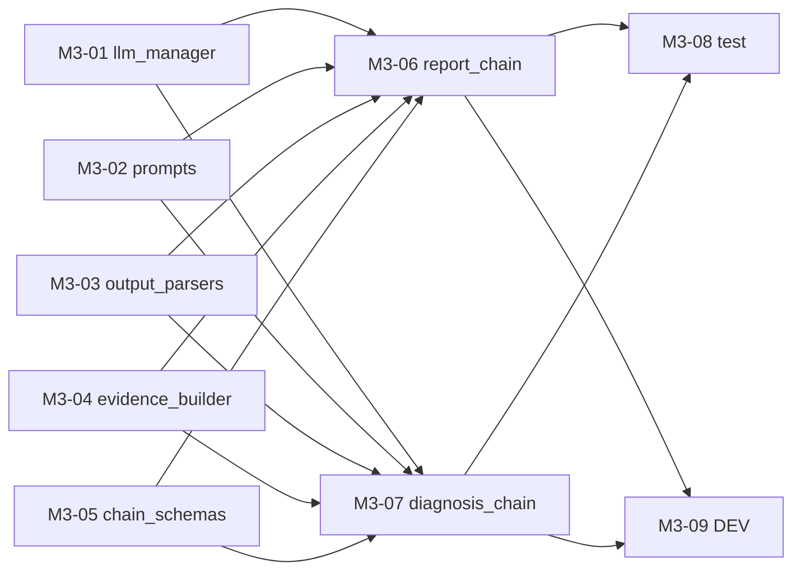

# M3 任务分发 Prompt 手册

> 建议每个执行 Agent 附加 skill：`/elk-backend-agent`  
> 任务详情真相来源：`task_m3/M3-0x-*.md`  
> **进度与依赖真相源**：`task_m3/STATUS.md`（开工前必读，完成后必更新）  
> 编排总览：`task_m3/README.md`  
> 总体规划：`doc/后端开发总体规划-Services-LangGraph-MCP.md` §2.6 / §2.7 / §2.8

---

## 零、执行顺序与可并行任务

### 0.1 阶段总览

```text
阶段 A（可并行，最多 5 Agent）
├── M3-01  llm_manager.py（+ requirements.txt）
├── M3-02  prompts.py
├── M3-03  output_parsers.py
├── M3-04  evidence_builder.py
└── M3-05  chain_schemas.py（新建）

阶段 B（可并行，2 Agent；依赖 A 全部）
├── M3-06  report_chain.py
└── M3-07  diagnosis_chain.py

阶段 C（可并行，2 Agent；依赖 B）
├── M3-08  tests/test_m3_langchain.py
└── M3-09  langchain/DEV.md
```

### 0.2 依赖关系图



### 0.3 并行派发矩阵

| 阶段 | 可同时派发的任务 | 条件 |
| --- | --- | --- |
| A | **M3-01 ∥ M3-02 ∥ M3-03 ∥ M3-04 ∥ M3-05** | M1+M2 全绿；五文件互不冲突 |
| B | **M3-06 ∥ M3-07** | M3-01~05 均为 `已完成`/`已合并` |
| C | **M3-08 ∥ M3-09** | M3-06、M3-07 已合并；各改不同文件 |

### 0.4 派发时注意

1. **开工前必读 `task_m3/STATUS.md`** 与第 1 节 M1/M2 前置检查：未收口不得派 M3。
2. **阶段 A 五任务可一次性并行派发**，每个 Agent 只改一个 langchain 文件（M3-01 可附加改 `requirements.txt`）。
3. **字段一致性**：`chain_schemas`（M3-05）是字段真相源，`prompts`（M3-02）与两个 Chain（M3-06/07）须与之对齐；阶段 A 并行时以 README §2/各任务文档约定字段为准。
4. **M3-06/07 必须等阶段 A 全部完成**：两个 Chain import 五个基础组件。
5. **降级铁律**：任一 LLM 调用失败不得抛裸异常，必须降级。
6. **M3 不做**：LangGraph 图 / scheduler / trigger_scanner（M4~M6）；`relation_chain`（M7）；`alert_chain`（M5/M6）；report/alert 持久化落地（M4/M5）。
7. **执行 Agent 完成后**：必须更新 STATUS 本人任务行。
8. **不要 commit**：除非负责人明确要求。

### 0.5 速查表

| 任务 | 任务文档 | 唯一负责文件 | 前置依赖 |
| --- | --- | --- | --- |
| M3-01 | M3-01-llm_manager.md | `langchain/llm_manager.py` + `requirements.txt` | M2 完成 |
| M3-02 | M3-02-prompts.md | `langchain/prompts.py` | M2 完成 |
| M3-03 | M3-03-output_parsers.md | `langchain/output_parsers.py` | M2 完成 |
| M3-04 | M3-04-evidence_builder.md | `langchain/evidence_builder.py` | M2 完成 |
| M3-05 | M3-05-chain_schemas.md | `langchain/chain_schemas.py`（新建） | M2 完成 |
| M3-06 | M3-06-report_chain.md | `langchain/report_chain.py` | M3-01~05 |
| M3-07 | M3-07-diagnosis_chain.md | `langchain/diagnosis_chain.py` | M3-01~05 |
| M3-08 | M3-08-test_langchain.md | `tests/test_m3_langchain.py` | M3-06、M3-07 |
| M3-09 | M3-09-langchain_dev.md | `langchain/DEV.md` | M3-06、M3-07 |

---

## 一、编排 Agent Prompt（负责人用）

```markdown
你是 ELK 后端 M3 编排 Agent。阅读 `task_m3/PROMPT_DISPATCH.md` 第零节、`task_m3/README.md`、**`task_m3/STATUS.md`** 与第 1 节 M1/M2 前置检查。

确认 M1-01~M1-11、M2-01~M2-08 均为「已完成」或「已合并」后，根据 STATUS.md 第 3、5 节判断各 M3-0x 是否可派发；不要仅依赖 git 猜测。
为每个可派发任务从本文档「三、各任务派发 Prompt」复制对应完整 Prompt。
阶段 A 五任务（M3-01~05）可同时派发，并确认各 Agent 负责不同文件。
M3-06/07 仅在 STATUS 显示 M3-01~05 均为「已完成」或「已合并」后派发，二者可并行。
M3-08 与 M3-09 可在 M3-06/07 合并后并行派发。不要自己写业务代码。
派发后提醒执行 Agent：开工/完成时更新 STATUS.md 中本人任务行。
```

---

## 二、完成汇报模板（每个执行 Agent 结束时必填）

```markdown
## M3 任务完成汇报 — {TASK_ID}

### 1. 分层
（LangChain 能力层 / 测试 / 文档）

### 2. 修改文件
- `location/backend/{TARGET_FILE}`

### 3. 实现摘要
（3~5 条）

### 4. 验收结果
| AC | 结果 | 说明 |
|----|------|------|

### 5. 自测命令与输出

### 6. 阻塞与遗留

### 7. 下游提醒

### 8. STATUS 已更新
- [ ] 已在 `task_m3/STATUS.md` 将本任务标为 `已完成` 或 `已合并`
```

---

## 二点五、STATUS.md 标准说明（写入各任务 Prompt）

| 项 | 说明 |
| --- | --- |
| **文件路径** | `location/backend/job/task_m3/STATUS.md` |
| **定位** | M3 里程碑各 Agent 共享的**进度与依赖唯一真相源**（动态） |
| **前置** | 开工前确认 STATUS 第 1 节 M1/M2 已满足 |
| **状态枚举** | `未开始` → `进行中` → `已完成` / `已合并`；异常用 `阻塞` |
| **依赖判定** | 下游仅以依赖项为 `已完成`/`已合并` 为准；单分支开发时二者等价 |
| **开工前** | 阅读 STATUS 第 3、5 节；确认依赖满足；将**本任务行**改为 `进行中` 并填负责人 |
| **完成后** | 将**本任务行**改为 `已完成`，填完成时间、验收摘要 |
| **协作纪律** | **只改自己那一行**，勿改其他任务行 |
| **阻塞时** | 状态改 `阻塞`，备注缺哪一任务、现象与建议 |

---

## 三、各任务派发 Prompt

---

### M3-01：llm_manager

**阶段 A | 可与 M3-02~05 并行**

```markdown
/elk-backend-agent

## 任务标识
- 任务编号：**M3-01** (作为会话窗口名称)
- 任务文档：`location/backend/job/task_m3/M3-01-llm_manager.md`
- 编排说明：`location/backend/job/task_m3/README.md`
- 总体规划：`doc/后端开发总体规划-Services-LangGraph-MCP.md` §2.6 / §2.7

## STATUS.md（进度与依赖真相源）
- **路径**：`location/backend/job/task_m3/STATUS.md`（开工前必读，完成后必更新）
- **前置**：确认 STATUS 第 1 节 M1/M2 已满足
- **开工前**：将 **M3-01** 行改为 `进行中` 并填负责人
- **完成后**：将 **M3-01** 行改为 `已完成`/`已合并`，填完成时间、验收摘要；**只改本行**
- **说明**：M3-06/07 将依赖你此行状态

## 你的角色
LLM 接入专项 Agent — 多模型管理、可用性探测、结构化调用入口。

## 文件边界（强制）
- **唯一允许修改**：`location/backend/app/services/langchain/llm_manager.py`
- **可附加修改**：`location/backend/requirements.txt`（追加 langchain-openai）
- **禁止修改**：`core/config.py`（只读）、其他 langchain/analysis/tools 文件

## 并行冲突提醒
处于**阶段 A**，可与 M3-02~05 并行；不得改其他 langchain 文件。

## 跨任务约定
1. LLM 配置项从 `core/config.settings` 读取，不改 config
2. 无 API Key → `is_llm_available()` 返回 False
3. 异常捕获降级，不抛裸异常；无 placeholder
4. 简体中文；不要 commit

## 开发要点
- `is_llm_available() -> bool`
- `get_llm(task)`：report/alert/json_repair → default_model；diagnosis/relation → analysis_model；不可用返回 None
- `invoke_structured(task, prompt, output_schema)`：不可用返回降级 dict；可用调用模型 + 解析
- `requirements.txt` 追加 `langchain-openai`

## 验收标准
AC-01~AC-05（见任务文档）

### 建议自测
```powershell
cd location\backend
python -c "from app.services.langchain.llm_manager import is_llm_available, invoke_structured; print(is_llm_available())"
```

## 完成标准
- git diff 仅 `llm_manager.py` + `requirements.txt`
- 已更新 `task_m3/STATUS.md` 中 M3-01 行
- 按第二节完成汇报模板输出
```

---

### M3-02：prompts

**阶段 A | 可与 M3-01/03/04/05 并行**

```markdown
/elk-backend-agent

## 任务标识
- 任务编号：**M3-02** (作为会话窗口名称)
- 任务文档：`location/backend/job/task_m3/M3-02-prompts.md`
- 总体规划：`doc/后端开发总体规划-Services-LangGraph-MCP.md` §2.6

## STATUS.md（进度与依赖真相源）
- **路径**：`location/backend/job/task_m3/STATUS.md`
- **前置**：确认 M1/M2 已满足
- **开工前**：将 **M3-02** 行改为 `进行中`
- **完成后**：更新 **M3-02** 行；只改本行

## 你的角色
Prompt 工程 Agent — 填充周期报告/根因诊断/证据摘要中文模板。

## 文件边界（强制）
- **唯一允许修改**：`location/backend/app/services/langchain/prompts.py`
- **禁止修改**：其他 langchain 文件

## 并行冲突提醒
处于阶段 A，可与其余四任务并行。

## 跨任务约定
1. 字段名与 `chain_schemas`（M3-05）对齐，以 README §2 字段为准
2. report/diagnosis 模板要求「仅输出 JSON」
3. relation 模板保留占位标 M7；不调用 LLM
4. 不要 commit

## 开发要点
- `REPORT_PROMPT`、`DIAGNOSIS_PROMPT`、`EVIDENCE_SUMMARY_PROMPT`、`ALERT_PROMPT` 填真实模板
- `get_prompt(name)` 映射

## 验收标准
AC-01~AC-04（见任务文档）

## 完成标准
- git diff 仅 `prompts.py`
- 已更新 `task_m3/STATUS.md` 中 M3-02 行
```

---

### M3-03：output_parsers

**阶段 A | 可与 M3-01/02/04/05 并行**

```markdown
/elk-backend-agent

## 任务标识
- 任务编号：**M3-03** (作为会话窗口名称)
- 任务文档：`location/backend/job/task_m3/M3-03-output_parsers.md`

## STATUS.md（进度与依赖真相源）
- **路径**：`location/backend/job/task_m3/STATUS.md`
- **开工前**：将 **M3-03** 行改为 `进行中`
- **完成后**：更新 **M3-03** 行；只改本行

## 你的角色
输出解析 Agent — LLM 文本 → Pydantic 模型解析与 JSON 修复重试。

## 文件边界（强制）
- **唯一允许修改**：`location/backend/app/services/langchain/output_parsers.py`
- **禁止修改**：其他 langchain 文件

## 并行冲突提醒
处于阶段 A，可与其余四任务并行。

## 跨任务约定
1. 纯解析路径不联网；LLM 修复为可选（`llm_manager.get_llm("json_repair")`），不可用则跳过
2. 失败不抛裸异常；无 placeholder
3. 不要 commit

## 开发要点
- `parse_with_retry(raw_text, schema, *, max_retries=2)`：提取 JSON（容忍代码块）→ `model_validate` → 失败重试/修复
- 成功 `{"ok": True, "data": ...}`；失败 `{"ok": False, "error": ..., "raw_preview": ...}`
- 内部 `_extract_json` 辅助

## 验收标准
AC-01~AC-04（见任务文档）

## 完成标准
- git diff 仅 `output_parsers.py`
- 已更新 `task_m3/STATUS.md` 中 M3-03 行
```

---

### M3-04：evidence_builder

**阶段 A | 可与 M3-01/02/03/05 并行**

```markdown
/elk-backend-agent

## 任务标识
- 任务编号：**M3-04** (作为会话窗口名称)
- 任务文档：`location/backend/job/task_m3/M3-04-evidence_builder.md`
- 总体规划：`doc/后端开发总体规划-Services-LangGraph-MCP.md` §2.6

## STATUS.md（进度与依赖真相源）
- **路径**：`location/backend/job/task_m3/STATUS.md`
- **开工前**：将 **M3-04** 行改为 `进行中`
- **完成后**：更新 **M3-04** 行；只改本行

## 你的角色
证据压缩 Agent — 原始日志 + 指标 → 受控证据包（纯代码，不用 LLM）。

## 文件边界（强制）
- **唯一允许修改**：`location/backend/app/services/langchain/evidence_builder.py`
- **禁止修改**：其他 langchain 文件

## 并行冲突提醒
处于阶段 A，可与其余四任务并行。

## 跨任务约定
1. 纯代码，不调用 LLM/ES
2. samples 总条数 ≤ max_logs；裁剪长 message 控制 token
3. 无 placeholder；空输入不报错
4. 不要 commit

## 开发要点
- `build_evidence_package(raw_logs, metrics=None, *, max_logs=50)`
- 流程：过滤（ERROR/WARN 优先）→ 分组（service/error_code/level）→ 采样 → 摘要
- 返回 `{ok, evidence_package:{summary,grouped,samples,metrics}, input_log_count, sampled_count}`

## 验收标准
AC-01~AC-05（见任务文档）

## 完成标准
- git diff 仅 `evidence_builder.py`
- 已更新 `task_m3/STATUS.md` 中 M3-04 行
```

---

### M3-05：chain_schemas

**阶段 A | 可与 M3-01/02/03/04 并行**

```markdown
/elk-backend-agent

## 任务标识
- 任务编号：**M3-05** (作为会话窗口名称)
- 任务文档：`location/backend/job/task_m3/M3-05-chain_schemas.md`

## STATUS.md（进度与依赖真相源）
- **路径**：`location/backend/job/task_m3/STATUS.md`
- **开工前**：将 **M3-05** 行改为 `进行中`
- **完成后**：更新 **M3-05** 行；只改本行

## 你的角色
Schema Agent — 新建链层 I/O Pydantic 模型，供 prompts / chain / parser 共用。

## 文件边界（强制）
- **唯一允许新建**：`location/backend/app/services/langchain/chain_schemas.py`
- **禁止修改**：`schemas/diagnosis.py`、`schemas/report.py`（只 import 复用枚举）、其他 langchain 文件

## 并行冲突提醒
处于阶段 A，可与其余四任务并行。

## 跨任务约定
1. 本文件是链层字段真相源；M3-02/06/07 与之对齐
2. 可复用 `schemas/diagnosis.py` 枚举，不改原文件
3. 可选字段给默认值，降低 LLM 漏字段校验失败概率
4. 不要 commit

## 开发要点
- `ReportChainOutput`：report_type / title / risk_level / summary / key_findings / recommendations
- `DiagnosisChainOutput`：root_cause / confidence / severity / affected_services / evidence_refs / action_suggestions

## 验收标准
AC-01~AC-04（见任务文档）

## 完成标准
- git diff 仅新增 `chain_schemas.py`
- 已更新 `task_m3/STATUS.md` 中 M3-05 行
```

---

### M3-06：report_chain

**阶段 B | 可与 M3-07 并行 | 依赖 M3-01~05**

```markdown
/elk-backend-agent

## 任务标识
- 任务编号：**M3-06** (作为会话窗口名称)
- 任务文档：`location/backend/job/task_m3/M3-06-report_chain.md`
- 总体规划：`doc/后端开发总体规划-Services-LangGraph-MCP.md` §2.4 generate_report

## STATUS.md（进度与依赖真相源）
- **路径**：`location/backend/job/task_m3/STATUS.md`
- **开工前**：确认 **M3-01~M3-05** 均为 `已完成`/`已合并`；否则**停止**汇报阻塞；将 **M3-06** 行改为 `进行中`
- **完成后**：更新 **M3-06** 行；M3-08/09 将依赖你此行状态

## 你的角色
报告链 Agent — 证据包 → 周期报告，LLM 不可用时降级模板报告。

## 文件边界（强制）
- **唯一允许修改**：`location/backend/app/services/langchain/report_chain.py`
- **禁止修改**：基础五组件（只 import）、diagnosis_chain、analysis/*

## 并行冲突提醒
可与 **M3-07** 并行（不同文件）；不可与 M3-01~05 并行。

## 前置依赖检查
```powershell
cd location\backend
python -c "from app.services.langchain.llm_manager import is_llm_available; from app.services.langchain.prompts import get_prompt; from app.services.langchain.output_parsers import parse_with_retry; from app.services.langchain.evidence_builder import build_evidence_package; from app.services.langchain.chain_schemas import ReportChainOutput; print('deps ok')"
```

## 跨任务约定
1. 不直接 import LLM SDK，统一走 `llm_manager`
2. 异常捕获降级，不抛裸异常；无 placeholder
3. 报告字段与 `ReportChainOutput` 对齐
4. 不要 commit

## 开发要点
- `generate_periodic_report(evidence_package)`：LLM 可用 → invoke_structured + 解析；否则模板降级
- 返回含 `ok`、`degraded: bool`、报告字段

## 验收标准
AC-01~AC-04（见任务文档）

## 完成标准
- git diff 仅 `report_chain.py`
- 已更新 `task_m3/STATUS.md` 中 M3-06 行
```

---

### M3-07：diagnosis_chain

**阶段 B | 可与 M3-06 并行 | 依赖 M3-01~05**

```markdown
/elk-backend-agent

## 任务标识
- 任务编号：**M3-07** (作为会话窗口名称)
- 任务文档：`location/backend/job/task_m3/M3-07-diagnosis_chain.md`
- 总体规划：`doc/后端开发总体规划-Services-LangGraph-MCP.md` §2.5 infer_root_cause

## STATUS.md（进度与依赖真相源）
- **路径**：`location/backend/job/task_m3/STATUS.md`
- **开工前**：确认 **M3-01~M3-05** 均为 `已完成`/`已合并`；将 **M3-07** 行改为 `进行中`
- **完成后**：更新 **M3-07** 行；M3-08/09 将依赖你此行状态

## 你的角色
诊断链 Agent — 证据包 → 根因 + 事件报告，LLM 不可用时降级规则结论。

## 文件边界（强制）
- **唯一允许修改**：`location/backend/app/services/langchain/diagnosis_chain.py`
- **禁止修改**：基础五组件（只 import）、report_chain、analysis/*

## 并行冲突提醒
可与 **M3-06** 并行（不同文件）。

## 前置依赖检查
同 M3-06（额外 import `DiagnosisChainOutput`）。

## 跨任务约定
1. 统一走 `llm_manager`，不直接 import LLM SDK
2. 异常捕获降级，不抛裸异常；无 placeholder
3. 字段与 `DiagnosisChainOutput` 对齐
4. 不要 commit

## 开发要点
- `infer_root_cause(evidence_package)`：LLM 可用 → 结构化输出；否则基于 top_error_codes/top_services 规则降级
- `generate_event_report(evidence_package)`：可与上者合并一次调用；降级同上
- 返回含 `ok`、`degraded`、root_cause/confidence 等

## 验收标准
AC-01~AC-04（见任务文档）

## 完成标准
- git diff 仅 `diagnosis_chain.py`
- 已更新 `task_m3/STATUS.md` 中 M3-07 行
```

---

### M3-08：test_langchain

**阶段 C | 可与 M3-09 并行 | 依赖 M3-06、M3-07**

```markdown
/elk-backend-agent

## 任务标识
- 任务编号：**M3-08** (作为会话窗口名称)
- 任务文档：`location/backend/job/task_m3/M3-08-test_langchain.md`

## STATUS.md（进度与依赖真相源）
- **路径**：`location/backend/job/task_m3/STATUS.md`
- **开工前**：确认 **M3-06、M3-07** 均为 `已完成`/`已合并`；将 **M3-08** 行改为 `进行中`
- **完成后**：更新 **M3-08** 行；只改本行

## 你的角色
测试 Agent — 新建 M3 单测，LLM 全程 mock 不联网。

## 文件边界（强制）
- **唯一允许新建/修改**：`location/backend/tests/test_m3_langchain.py`
- **禁止修改**：`app/services/langchain/*.py` 生产逻辑（bug 记备注）

## 并行冲突提醒
可与 **M3-09** 并行（不同文件）。

## 前置依赖
M3-06、M3-07 已合并；`langchain-openai`/`langchain-core` 已安装。

## 开发要点
- 用 `monkeypatch` mock `is_llm_available` / `get_llm` / `invoke_structured`
- 覆盖：llm_manager 降级、prompts 映射、output_parsers 三路径、evidence_builder 上限与 ERROR 优先、chain_schemas 校验、report/diagnosis 两 Chain 的 LLM 可用与降级路径、无 placeholder 断言
- ≥12 个 test 函数；不依赖真实 LLM/ES

## 验收标准
AC-01~AC-04（见任务文档）；`pytest tests/test_m3_langchain.py -v` 全绿

## 完成标准
- 已更新 `task_m3/STATUS.md` 中 M3-08 行
- 按第二节完成汇报模板输出；不要 commit
```

---

### M3-09：langchain DEV 文档收敛

**阶段 C | 可与 M3-08 并行 | 依赖 M3-06、M3-07**

```markdown
/elk-backend-agent

## 任务标识
- 任务编号：**M3-09** (作为会话窗口名称)
- 任务文档：`location/backend/job/task_m3/M3-09-langchain_dev.md`

## STATUS.md（进度与依赖真相源）
- **路径**：`location/backend/job/task_m3/STATUS.md`
- **开工前**：确认 **M3-06、M3-07** 均为 `已完成`/`已合并`；将 **M3-09** 行改为 `进行中`
- **完成后**：更新 **M3-09** 行；刷新 STATUS 第 5 节；若 M3-08 亦完成，备注「M3 里程碑可收口」

## 你的角色
文档 Agent — 更新 `langchain/DEV.md`，标记 M3 完成状态（不碰业务代码）。

## 文件边界（强制）
- **唯一允许修改**：`location/backend/app/services/langchain/DEV.md`
- **禁止修改**：任何 `.py` 文件

## 并行冲突提醒
可与 **M3-08** 并行（不同文件）。
**勿与**仍在改 langchain `.py` 的 Agent 并行（阶段 A/B 期间勿派本任务）。

## 前置依赖检查
确认 M3-06、M3-07 已合并；建议 M3-08 测试通过或进行中。

## 开发要点
1. 模块状态表：七文件由「占位」→「已实现」
2. 记录各 Chain 降级策略与依赖关系
3. `relation_chain` 标 M7、`alert_chain` 标 M5/M6
4. 开发日志追加 M3 完成条目

## 验收标准
AC-01~AC-03（见任务文档）；git diff 仅 `langchain/DEV.md`

## 完成标准
- 已更新 `task_m3/STATUS.md` 中 M3-09 行
- 若 M3-01~09 均完成，更新 STATUS 第 5 节为「无可派发 M3 任务，后续见 M4」
```

---

## 四、推荐派发时间线（示例）

| 时间点 | 派发任务 | Agent 数 |
| --- | --- | --- |
| T0（M1+M2 已收口） | M3-01 + M3-02 + M3-03 + M3-04 + M3-05 | 5 |
| T1（M3-01~05 全部合并） | M3-06 + M3-07 | 2 |
| T2（M3-06/07 合并后） | M3-08 + M3-09 | 2 |

**最短关键路径**：M3-01~05（并行）→ M3-06/07（并行）→ M3-08 → M3 里程碑验收（约 3 个串行环节）。

**M3 里程碑收口检查清单**：
- [ ] `task_m3/STATUS.md` M3-01~09 均为 `已完成`/`已合并`
- [ ] `pytest tests/test_m3_langchain.py` 全绿
- [ ] mock 证据包 → report_chain / diagnosis_chain 产出符合 `chain_schemas` 的结构
- [ ] LLM 不可用时两 Chain 均降级且不报错
- [ ] 7 个 langchain 文件无相关 `placeholder: true`
