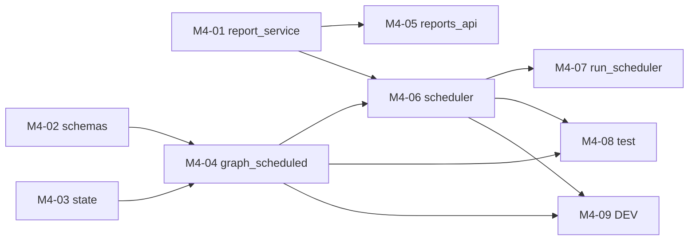

# M4 任务分发 Prompt 手册

> 建议每个执行 Agent 附加 skill：`/elk-backend-agent`  
> 任务详情真相来源：`task_m4/M4-0x-*.md`  
> **进度与依赖真相源**：`task_m4/STATUS.md`（开工前必读，完成后必更新）  
> 编排总览：`task_m4/README.md`  
> 总体规划：`doc/后端开发总体规划-Services-LangGraph-MCP.md` §2.4 / §2.8 / §1.3

---

## 零、执行顺序与可并行任务

### 0.1 阶段总览

```text
阶段 A（可并行，3 Agent）
├── M4-01  report_service.py     报告持久化
├── M4-02  analysis/schemas.py   normalize_trigger
└── M4-03  analysis/state.py     state + node_trace 辅助

阶段 B（可并行，2 Agent）
├── M4-04  graph_scheduled.py（+ langgraph）  依赖 M4-02、M4-03
└── M4-05  reports_api.py                      依赖 M4-01

阶段 C（串行）
└── M4-06  scheduler.py（+ apscheduler）        依赖 M4-01、M4-04

阶段 D（可并行，3 Agent）
├── M4-07  tasks/run_scheduler.py              依赖 M4-06
├── M4-08  tests/test_m4_scheduled.py          依赖 M4-04、M4-06
└── M4-09  analysis/DEV.md + report/DEV.md     依赖 M4-04、M4-06
```

### 0.2 依赖关系图



### 0.3 并行派发矩阵

| 阶段 | 可同时派发的任务 | 条件 |
| --- | --- | --- |
| A | **M4-01 ∥ M4-02 ∥ M4-03** | M1/M3 全绿；三文件互不冲突 |
| B | **M4-04 ∥ M4-05** | M4-04 待 M4-02/03；M4-05 待 M4-01 |
| C | M4-06 | M4-01、M4-04 均为 `已完成`/`已合并` |
| D | **M4-07 ∥ M4-08 ∥ M4-09** | M4-06（及 M4-04）已合并；各改不同文件 |

### 0.4 派发时注意

1. **开工前必读 `task_m4/STATUS.md`** 与第 1 节 M1/M2/M3 前置检查。
2. **requirements 冲突规避**：`langgraph` 由 M4-04 加、`apscheduler` 由 M4-06 加；二者分属阶段 B/C，串行无冲突。
3. **降级铁律**：图节点失败写 `state["errors"]` 并降级，不中断整图；`generate_report` 复用 M3 降级。
4. **持久化归属**：`graph_scheduled` 只产出报告，**scheduler** 负责调 `report_service.write_report`。
5. **M4 不做**：规则子图（M5）、主图与预警决策（M6）、relation_chain/MCP（M7）。
6. **执行 Agent 完成后**：必须更新 STATUS 本人任务行。
7. **不要 commit**：除非负责人明确要求。

### 0.5 速查表

| 任务 | 任务文档 | 唯一负责文件 | 前置依赖 |
| --- | --- | --- | --- |
| M4-01 | M4-01-report_service.md | `report/report_service.py` | M1 |
| M4-02 | M4-02-analysis_schemas.md | `analysis/schemas.py` | M3 |
| M4-03 | M4-03-analysis_state.md | `analysis/state.py` | M3 |
| M4-04 | M4-04-graph_scheduled.md | `analysis/graph_scheduled.py` + `requirements.txt` | M4-02、M4-03 |
| M4-05 | M4-05-reports_api.md | `api/v1/reports.py` | M4-01 |
| M4-06 | M4-06-scheduler.md | `analysis/scheduler.py` + `requirements.txt` | M4-01、M4-04 |
| M4-07 | M4-07-run_scheduler.md | `tasks/run_scheduler.py`（新建） | M4-06 |
| M4-08 | M4-08-test_scheduled.md | `tests/test_m4_scheduled.py`（新建） | M4-04、M4-06 |
| M4-09 | M4-09-dev_docs.md | `analysis/DEV.md` + `report/DEV.md` | M4-04、M4-06 |

---

## 一、编排 Agent Prompt（负责人用）

```markdown
你是 ELK 后端 M4 编排 Agent。阅读 `task_m4/PROMPT_DISPATCH.md` 第零节、`task_m4/README.md`、**`task_m4/STATUS.md`** 与第 1 节 M1/M2/M3 前置检查。

确认 M1/M2/M3 全部里程碑「已完成」后，根据 STATUS.md 第 3、5 节判断各 M4-0x 是否可派发；不要仅依赖 git 猜测。
为每个可派发任务从本文档「三、各任务派发 Prompt」复制对应完整 Prompt。
阶段 A（M4-01~03）可同时派发；阶段 B（M4-04、M4-05）按依赖派发；M4-06 待 M4-01+M4-04；阶段 D（M4-07~09）待 M4-06。
确认各 Agent 负责不同文件。不要自己写业务代码。
派发后提醒执行 Agent：开工/完成时更新 STATUS.md 中本人任务行。
```

---

## 二、完成汇报模板（每个执行 Agent 结束时必填）

```markdown
## M4 任务完成汇报 — {TASK_ID}

### 1. 分层
（Report 持久化 / Analysis 编排 / API / Task / 测试 / 文档）

### 2. 修改文件
- `location/backend/{TARGET_FILE}`

### 3. 实现摘要
（3~5 条）

### 4. 验收结果
| AC | 结果 | 说明 |
|----|------|------|

### 5. 自测命令与输出

### 6. 阻塞与遗留

### 7. 下游提醒

### 8. STATUS 已更新
- [ ] 已在 `task_m4/STATUS.md` 将本任务标为 `已完成` 或 `已合并`
```

---

## 二点五、STATUS.md 标准说明（写入各任务 Prompt）

| 项 | 说明 |
| --- | --- |
| **文件路径** | `location/backend/job/task_m4/STATUS.md` |
| **定位** | M4 里程碑各 Agent 共享的**进度与依赖唯一真相源**（动态） |
| **前置** | 开工前确认 STATUS 第 1 节 M1/M2/M3 已满足 |
| **状态枚举** | `未开始` → `进行中` → `已完成` / `已合并`；异常用 `阻塞` |
| **依赖判定** | 下游仅以依赖项为 `已完成`/`已合并` 为准；单分支开发时二者等价 |
| **开工前** | 阅读 STATUS 第 3、5 节；确认依赖满足；将**本任务行**改为 `进行中` 并填负责人 |
| **完成后** | 将**本任务行**改为 `已完成`，填完成时间、验收摘要 |
| **协作纪律** | **只改自己那一行**，勿改其他任务行 |
| **阻塞时** | 状态改 `阻塞`，备注缺哪一任务、现象与建议 |

---

## 三、各任务派发 Prompt

---

### M4-01：report_service

**阶段 A | 可与 M4-02/03 并行**

```markdown
/elk-backend-agent

## 任务标识
- 任务编号：**M4-01** (作为会话窗口名称)
- 任务文档：`location/backend/job/task_m4/M4-01-report_service.md`
- 编排说明：`location/backend/job/task_m4/README.md`
- 总体规划：`doc/后端开发总体规划-Services-LangGraph-MCP.md` §1.3 report 域

## STATUS.md（进度与依赖真相源）
- **路径**：`location/backend/job/task_m4/STATUS.md`（开工前必读，完成后必更新）
- **前置**：确认 STATUS 第 1 节 M1/M2/M3 已满足
- **开工前**：将 **M4-01** 行改为 `进行中` 并填负责人
- **完成后**：将 **M4-01** 行改为 `已完成`/`已合并`，填完成时间、验收摘要；**只改本行**
- **说明**：M4-05、M4-06 将依赖你此行状态

## 你的角色
报告持久化 Agent — 实现 analysis-results-* 索引读写。

## 文件边界（强制）
- **唯一允许修改**：`location/backend/app/services/report/report_service.py`
- **禁止修改**：`index_service.py`、`tools/report_tools.py`、其他文件

## 跨任务约定
1. 复用 `get_es_client`，不改 index_service（模板已就绪）
2. ES 错误风格沿用 `log_query_service`；不抛裸异常
3. 去除所有 placeholder；简体中文；不要 commit

## 开发要点
- `write_report(report)`：生成 report_id/created_at，写 analysis-results-*，返回 ok+report_id
- `list_recent_reports(limit, report_type)`：created_at 倒序，返回 items/total
- `get_report(report_id)`：命中/未命中均结构化返回

## 验收标准
AC-01~AC-05（见任务文档）

## 完成标准
- git diff 仅 `report_service.py`
- 已更新 `task_m4/STATUS.md` 中 M4-01 行
- 按第二节完成汇报模板输出
```

---

### M4-02：analysis/schemas

**阶段 A | 可与 M4-01/03 并行**

```markdown
/elk-backend-agent

## 任务标识
- 任务编号：**M4-02** (作为会话窗口名称)
- 任务文档：`location/backend/job/task_m4/M4-02-analysis_schemas.md`
- 总体规划：`doc/后端开发总体规划-Services-LangGraph-MCP.md` §2.3 / §2.6

## STATUS.md（进度与依赖真相源）
- **路径**：`location/backend/job/task_m4/STATUS.md`
- **开工前**：将 **M4-02** 行改为 `进行中`
- **完成后**：更新 **M4-02** 行；只改本行
- **说明**：M4-04 依赖你此行状态

## 你的角色
触发标准化 Agent — 实现 normalize_trigger。

## 文件边界（强制）
- **唯一允许修改**：`location/backend/app/services/analysis/schemas.py`
- **禁止修改**：`state.py`、`graph_*.py`、其他 analysis 文件

## 跨任务约定
1. 复用现有 `TriggerEvent`/`NodeTraceEntry` 模型
2. 非法输入结构化返回，不抛裸异常；无 placeholder
3. 不要 commit

## 开发要点
- `normalize_trigger(raw)`：校验 trigger_type；scheduled 补全 time_window；rule 保留 trigger_event
- 可选 `make_node_trace(...)` 辅助

## 验收标准
AC-01~AC-04（见任务文档）

## 完成标准
- git diff 仅 `schemas.py`
- 已更新 `task_m4/STATUS.md` 中 M4-02 行
```

---

### M4-03：analysis/state

**阶段 A | 可与 M4-01/02 并行**

```markdown
/elk-backend-agent

## 任务标识
- 任务编号：**M4-03** (作为会话窗口名称)
- 任务文档：`location/backend/job/task_m4/M4-03-analysis_state.md`
- 总体规划：`doc/后端开发总体规划-Services-LangGraph-MCP.md` §2.2

## STATUS.md（进度与依赖真相源）
- **路径**：`location/backend/job/task_m4/STATUS.md`
- **开工前**：将 **M4-03** 行改为 `进行中`
- **完成后**：更新 **M4-03** 行；只改本行
- **说明**：M4-04 依赖你此行状态

## 你的角色
状态契约 Agent — 完善 create_initial_state 与 node_trace 辅助。

## 文件边界（强制）
- **唯一允许修改**：`location/backend/app/services/analysis/state.py`
- **禁止修改**：`schemas.py`、`graph_*.py`、其他 analysis 文件

## 跨任务约定
1. 纯状态操作，不调用 ES/LLM；无 placeholder
2. 不要 commit

## 开发要点
- `create_initial_state`：生成 task_id（uuid4）、初始化 node_trace/errors/metrics/raw_logs
- `append_node_trace(state, node_name, status, ...)`
- `record_error(state, node_name, message)`

## 验收标准
AC-01~AC-04（见任务文档）

## 完成标准
- git diff 仅 `state.py`
- 已更新 `task_m4/STATUS.md` 中 M4-03 行
```

---

### M4-04：graph_scheduled

**阶段 B | 可与 M4-05 并行 | 依赖 M4-02、M4-03**

```markdown
/elk-backend-agent

## 任务标识
- 任务编号：**M4-04** (作为会话窗口名称)
- 任务文档：`location/backend/job/task_m4/M4-04-graph_scheduled.md`
- 总体规划：`doc/后端开发总体规划-Services-LangGraph-MCP.md` §2.4

## STATUS.md（进度与依赖真相源）
- **路径**：`location/backend/job/task_m4/STATUS.md`
- **开工前**：确认 **M4-02、M4-03** 均为 `已完成`/`已合并`；否则**停止**汇报阻塞；将 **M4-04** 行改为 `进行中`
- **完成后**：更新 **M4-04** 行；M4-06/08/09 将依赖你此行状态

## 你的角色
定时子图 Agent — 最小版：聚合→证据→报告（跳过关系发现）。

## 文件边界（强制）
- **唯一允许修改**：`location/backend/app/services/analysis/graph_scheduled.py`
- **可附加修改**：`location/backend/requirements.txt`（追加 langgraph）
- **禁止修改**：state/schemas/aggregation_service/evidence_builder/report_chain（只 import）、scheduler、graph_main

## 并行冲突提醒
可与 **M4-05** 并行（不同文件）。requirements 中你只追加 langgraph（apscheduler 由 M4-06 负责）。

## 前置依赖检查
```powershell
cd location\backend
python -c "from app.services.analysis.state import create_initial_state, append_node_trace; from app.services.analysis.schemas import normalize_trigger; from app.services.langchain.evidence_builder import build_evidence_package; from app.services.langchain.report_chain import generate_periodic_report; print('deps ok')"
```

## 跨任务约定
1. 节点失败写 errors 并降级，不中断整图
2. `generate_report` 复用 report_chain（含降级）
3. 子图不持久化（由 scheduler 写库）；无 placeholder
4. 不要 commit

## 开发要点
- 节点流：build_time_window→plan_queries→aggregate_metrics→sample_logs→build_evidence→generate_report
- 推荐 LangGraph StateGraph(AnalysisState)
- `run_scheduled_subgraph(time_window=None)` 返回 {ok, report, node_trace, errors}
- `build_scheduled_graph()` 返回编译图

## 验收标准
AC-01~AC-05（见任务文档）

## 完成标准
- git diff 仅 `graph_scheduled.py` + `requirements.txt`
- 已更新 `task_m4/STATUS.md` 中 M4-04 行
```

---

### M4-05：reports_api

**阶段 B | 可与 M4-04 并行 | 依赖 M4-01**

```markdown
/elk-backend-agent

## 任务标识
- 任务编号：**M4-05** (作为会话窗口名称)
- 任务文档：`location/backend/job/task_m4/M4-05-reports_api.md`

## STATUS.md（进度与依赖真相源）
- **路径**：`location/backend/job/task_m4/STATUS.md`
- **开工前**：确认 **M4-01** 为 `已完成`/`已合并`；将 **M4-05** 行改为 `进行中`
- **完成后**：更新 **M4-05** 行；只改本行

## 你的角色
API 层 Agent — reports.py 去占位，真实调用 report_service。

## 文件边界（强制）
- **唯一允许修改**：`location/backend/app/api/v1/reports.py`
- **禁止修改**：`report_service.py`（只 import）、`schemas/report.py`、`router.py`

## 并行冲突提醒
可与 **M4-04** 并行（不同文件）。

## 前置依赖检查
```powershell
cd location\backend
python -c "from app.services.report.report_service import list_recent_reports, get_report; r=list_recent_reports(limit=1); assert 'placeholder' not in r"
```

## 跨任务约定
1. 薄路由：不写 DSL、不定义新 schema
2. 保持 ReportListResponse/ReportDetailResponse 契约
3. 不要 commit

## 开发要点
- `GET /recent` → list_recent_reports 真实结果
- `GET /{id}` → get_report 真实结果，未命中合理语义

## 验收标准
AC-01~AC-04（见任务文档）

## 完成标准
- git diff 仅 `reports.py`
- 已更新 `task_m4/STATUS.md` 中 M4-05 行
```

---

### M4-06：scheduler

**阶段 C | 串行 | 依赖 M4-01、M4-04**

```markdown
/elk-backend-agent

## 任务标识
- 任务编号：**M4-06** (作为会话窗口名称)
- 任务文档：`location/backend/job/task_m4/M4-06-scheduler.md`
- 总体规划：`doc/后端开发总体规划-Services-LangGraph-MCP.md` §2.4 / §2.6

## STATUS.md（进度与依赖真相源）
- **路径**：`location/backend/job/task_m4/STATUS.md`
- **开工前**：确认 **M4-01、M4-04** 均为 `已完成`/`已合并`；将 **M4-06** 行改为 `进行中`
- **完成后**：更新 **M4-06** 行；M4-07/08/09 将依赖你此行状态

## 你的角色
调度器 Agent — 周期触发子图 + 报告持久化，形成闭环。

## 文件边界（强制）
- **唯一允许修改**：`location/backend/app/services/analysis/scheduler.py`
- **可附加修改**：`location/backend/requirements.txt`（追加 apscheduler，如采用）
- **禁止修改**：`graph_scheduled.py`、`report_service.py`（只 import）、`core/config.py`（只读）

## 前置依赖检查
```powershell
cd location\backend
python -c "from app.services.analysis.graph_scheduled import run_scheduled_subgraph; from app.services.report.report_service import write_report; print('deps ok')"
```

## 跨任务约定
1. 闭环：run_scheduled_subgraph → write_report
2. 按 settings.analysis_schedule_minutes 周期；防重叠（max_instances=1）
3. 不抛裸异常；去除 placeholder；不要 commit

## 开发要点
- `run_once()`：子图 → 持久化，返回 report_id + node_trace
- `start_scheduler()` / `stop_scheduler()`：APScheduler 或 asyncio 周期调度
- 调度异常不影响下一周期

## 验收标准
AC-01~AC-05（见任务文档）

## 完成标准
- git diff 仅 `scheduler.py`（+ requirements 如有）
- 已更新 `task_m4/STATUS.md` 中 M4-06 行
```

---

### M4-07：run_scheduler

**阶段 D | 可与 M4-08/09 并行 | 依赖 M4-06**

```markdown
/elk-backend-agent

## 任务标识
- 任务编号：**M4-07** (作为会话窗口名称)
- 任务文档：`location/backend/job/task_m4/M4-07-run_scheduler.md`

## STATUS.md（进度与依赖真相源）
- **路径**：`location/backend/job/task_m4/STATUS.md`
- **开工前**：确认 **M4-06** 为 `已完成`/`已合并`；将 **M4-07** 行改为 `进行中`
- **完成后**：更新 **M4-07** 行；只改本行

## 你的角色
Task 层 Agent — 新建调度入口，仅调用 scheduler。

## 文件边界（强制）
- **唯一允许新建**：`location/backend/app/tasks/run_scheduler.py`
- **禁止修改**：`scheduler.py` 及任何其他文件

## 前置依赖检查
```powershell
cd location\backend
python -c "from app.services.analysis.scheduler import start_scheduler, run_once; print('deps ok')"
```

## 跨任务约定
1. 风格对齐 `tasks/run_mcp_server.py`
2. 仅 import scheduler，不重复业务逻辑；不要 commit

## 开发要点
- `python -m app.tasks.run_scheduler` 常驻；`--once` 执行一次并打印摘要
- 成功 stdout 摘要；失败 sys.exit(1)

## 验收标准
AC-01~AC-03（见任务文档）

## 完成标准
- git diff 仅新增 `run_scheduler.py`
- 已更新 `task_m4/STATUS.md` 中 M4-07 行
```

---

### M4-08：test_scheduled

**阶段 D | 可与 M4-07/09 并行 | 依赖 M4-04、M4-06**

```markdown
/elk-backend-agent

## 任务标识
- 任务编号：**M4-08** (作为会话窗口名称)
- 任务文档：`location/backend/job/task_m4/M4-08-test_scheduled.md`

## STATUS.md（进度与依赖真相源）
- **路径**：`location/backend/job/task_m4/STATUS.md`
- **开工前**：确认 **M4-04、M4-06** 均为 `已完成`/`已合并`；将 **M4-08** 行改为 `进行中`
- **完成后**：更新 **M4-08** 行；只改本行

## 你的角色
测试 Agent — 新建 M4 单测，ES/LLM 全 mock。

## 文件边界（强制）
- **唯一允许新建/修改**：`location/backend/tests/test_m4_scheduled.py`
- **禁止修改**：`app/services/analysis/*`、`report_service.py` 生产逻辑（bug 记备注）

## 并行冲突提醒
可与 **M4-07、M4-09** 并行（不同文件）。

## 前置依赖
M4-04、M4-06 已合并。

## 开发要点
- `monkeypatch` mock ES/LLM/子图
- 覆盖：report_service 三函数、normalize_trigger、state 辅助、run_scheduled_subgraph（含降级）、scheduler.run_once 闭环（write_report 被调用）、无 placeholder
- ≥10 个 test 函数；不联网

## 验收标准
AC-01~AC-04（见任务文档）；`pytest tests/test_m4_scheduled.py -v` 全绿

## 完成标准
- 已更新 `task_m4/STATUS.md` 中 M4-08 行
- 按第二节完成汇报模板输出；不要 commit
```

---

### M4-09：dev_docs

**阶段 D | 可与 M4-07/08 并行 | 依赖 M4-04、M4-06**

```markdown
/elk-backend-agent

## 任务标识
- 任务编号：**M4-09** (作为会话窗口名称)
- 任务文档：`location/backend/job/task_m4/M4-09-dev_docs.md`

## STATUS.md（进度与依赖真相源）
- **路径**：`location/backend/job/task_m4/STATUS.md`
- **开工前**：确认 **M4-04、M4-06** 均为 `已完成`/`已合并`；将 **M4-09** 行改为 `进行中`
- **完成后**：更新 **M4-09** 行；刷新 STATUS 第 5 节；若 M4-08 亦完成，备注「M4 里程碑可收口」

## 你的角色
文档 Agent — 更新 analysis 与 report 模块 DEV 文档（不碰业务代码）。

## 文件边界（强制）
- **唯一允许修改**：`location/backend/app/services/analysis/DEV.md`、`location/backend/app/services/report/DEV.md`
- **禁止修改**：任何 `.py` 文件

## 并行冲突提醒
可与 **M4-07、M4-08** 并行。**勿与**仍在改 analysis/report `.py` 的 Agent 并行。

## 前置依赖检查
确认 M4-04、M4-06 已合并。

## 开发要点
- analysis/DEV.md：schemas/state/graph_scheduled/scheduler → 已实现；记录子图节点流与降级；graph_rule/trigger_scanner/graph_main 标 M5/M6；analyze_relations 标 M7
- report/DEV.md：report_service 三函数 → 已实现；记录 analysis-results-* 约定

## 验收标准
AC-01~AC-03（见任务文档）

## 完成标准
- git diff 仅两个 DEV.md
- 已更新 `task_m4/STATUS.md` 中 M4-09 行；若 M4-01~09 均完成，更新 STATUS 第 5 节为「无可派发 M4 任务，后续见 M5」
```

---

## 四、推荐派发时间线（示例）

| 时间点 | 派发任务 | Agent 数 |
| --- | --- | --- |
| T0（M1/M2/M3 已收口） | M4-01 + M4-02 + M4-03 | 3 |
| T1（M4-02/03 合并） | M4-04；（M4-01 合并后）M4-05 | 2 |
| T2（M4-01+M4-04 合并） | M4-06 | 1 |
| T3（M4-06 合并后） | M4-07 + M4-08 + M4-09 | 3 |

**最短关键路径**：M4-02/03 → M4-04 → M4-06 → M4-08 → M4 验收（约 4 个串行环节）。

**M4 里程碑收口检查清单**：
- [ ] `task_m4/STATUS.md` M4-01~09 均为 `已完成`/`已合并`
- [ ] `pytest tests/test_m4_scheduled.py` 全绿
- [ ] `run_once` 闭环：子图产报告 → `write_report` 写入 `analysis-results-*`
- [ ] `GET /api/v1/reports/recent` 返回真实数据（去占位）
- [ ] 定时子图与 report_service 无 `placeholder: true`
