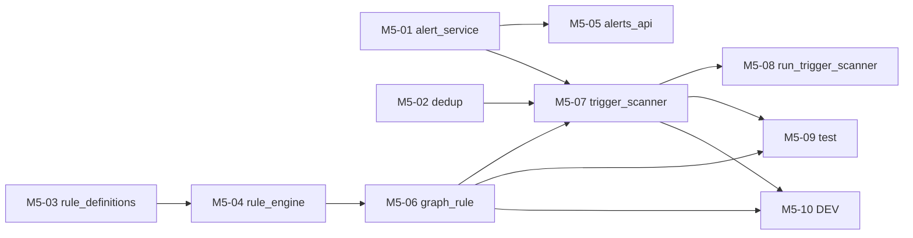

# M5 任务分发 Prompt 手册

> 建议每个执行 Agent 附加 skill：`/elk-backend-agent`  
> 任务详情真相来源：`task_m5/M5-0x-*.md`  
> **进度与依赖真相源**：`task_m5/STATUS.md`（开工前必读，完成后必更新）  
> 编排总览：`task_m5/README.md`  
> 总体规划：`doc/后端开发总体规划-Services-LangGraph-MCP.md` §2.5 / §2.8 / §1.3

---

## 零、执行顺序与可并行任务

### 0.1 阶段总览

```text
阶段 A（可并行，3 Agent）
├── M5-01  alert_service.py        alerts-* 读写 + 状态机
├── M5-02  dedup.py                去重幂等
└── M5-03  rule_definitions.py     声明式规则表

阶段 B（可并行，2 Agent）
├── M5-04  rule_engine.py（match_log）   依赖 M5-03
└── M5-05  alerts_api.py                 依赖 M5-01

阶段 C（串行）
└── M5-06  graph_rule.py                 依赖 M5-04

阶段 D（串行）
└── M5-07  trigger_scanner.py            依赖 M5-06、M5-01、M5-02

阶段 E（可并行，3 Agent）
├── M5-08  tasks/run_trigger_scanner.py  依赖 M5-07
├── M5-09  tests/test_m5_rule.py         依赖 M5-06、M5-07
└── M5-10  diagnosis/alert/analysis DEV  依赖 M5-06、M5-07
```

### 0.2 依赖关系图



### 0.3 并行派发矩阵

| 阶段 | 可同时派发的任务 | 条件 |
| --- | --- | --- |
| A | **M5-01 ∥ M5-02 ∥ M5-03** | M1~M4 全绿；三文件互不冲突 |
| B | **M5-04 ∥ M5-05** | M5-04 待 M5-03；M5-05 待 M5-01 |
| C | M5-06 | M5-04 为 `已完成`/`已合并` |
| D | M5-07 | M5-06、M5-01、M5-02 均为 `已完成`/`已合并` |
| E | **M5-08 ∥ M5-09 ∥ M5-10** | M5-06、M5-07 已合并；各改不同文件 |

### 0.4 派发时注意

1. **开工前必读 `task_m5/STATUS.md`** 与第 1 节 M1~M4 前置检查。
2. **无新增第三方依赖**（langgraph/apscheduler 已在 M4 引入）。
3. **降级铁律**：图节点失败写 `state["errors"]` 并降级；`infer_root_cause`/`generate_event_report` 复用 M3 降级。
4. **持久化归属**：`graph_rule` 只产出报告 + 预警候选；**trigger_scanner** 负责写报告 + 去重写预警。
5. **M5 不做**：主图收敛与统一预警决策（M6）、relation_chain/MCP（M7）。
6. **执行 Agent 完成后**：必须更新 STATUS 本人任务行。
7. **不要 commit**：除非负责人明确要求。

### 0.5 速查表

| 任务 | 任务文档 | 唯一负责文件 | 前置依赖 |
| --- | --- | --- | --- |
| M5-01 | M5-01-alert_service.md | `alert/alert_service.py` | M1 |
| M5-02 | M5-02-dedup.md | `alert/dedup.py` | M1 |
| M5-03 | M5-03-rule_definitions.md | `diagnosis/rule_definitions.py` | M1 |
| M5-04 | M5-04-rule_engine.md | `diagnosis/rule_engine.py` | M5-03 |
| M5-05 | M5-05-alerts_api.md | `api/v1/alerts.py` | M5-01 |
| M5-06 | M5-06-graph_rule.md | `analysis/graph_rule.py` | M5-04 |
| M5-07 | M5-07-trigger_scanner.md | `analysis/trigger_scanner.py` | M5-06、M5-01、M5-02 |
| M5-08 | M5-08-run_trigger_scanner.md | `tasks/run_trigger_scanner.py`（新建） | M5-07 |
| M5-09 | M5-09-test_rule.md | `tests/test_m5_rule.py`（新建） | M5-06、M5-07 |
| M5-10 | M5-10-dev_docs.md | `diagnosis/DEV.md` + `alert/DEV.md` + `analysis/DEV.md` | M5-06、M5-07 |

---

## 一、编排 Agent Prompt（负责人用）

```markdown
你是 ELK 后端 M5 编排 Agent。阅读 `task_m5/PROMPT_DISPATCH.md` 第零节、`task_m5/README.md`、**`task_m5/STATUS.md`** 与第 1 节 M1~M4 前置检查。

确认 M1~M4 全部里程碑「已完成」后，根据 STATUS.md 第 3、5 节判断各 M5-0x 是否可派发；不要仅依赖 git 猜测。
为每个可派发任务从本文档「三、各任务派发 Prompt」复制对应完整 Prompt。
阶段 A（M5-01~03）可同时派发；阶段 B（M5-04、M5-05）按依赖派发；M5-06 待 M5-04；M5-07 待 M5-06+01+02；阶段 E（M5-08~10）待 M5-06+07。
确认各 Agent 负责不同文件。不要自己写业务代码。
派发后提醒执行 Agent：开工/完成时更新 STATUS.md 中本人任务行。
```

---

## 二、完成汇报模板（每个执行 Agent 结束时必填）

```markdown
## M5 任务完成汇报 — {TASK_ID}

### 1. 分层
（Alert 持久化 / Diagnosis 规则 / Analysis 编排 / API / Task / 测试 / 文档）

### 2. 修改文件
- `location/backend/{TARGET_FILE}`

### 3. 实现摘要
（3~5 条）

### 4. 验收结果
| AC | 结果 | 说明 |
|----|------|------|

### 5. 自测命令与输出

### 6. 阻塞与遗留

### 7. 下游提醒

### 8. STATUS 已更新
- [ ] 已在 `task_m5/STATUS.md` 将本任务标为 `已完成` 或 `已合并`
```

---

## 二点五、STATUS.md 标准说明（写入各任务 Prompt）

| 项 | 说明 |
| --- | --- |
| **文件路径** | `location/backend/job/task_m5/STATUS.md` |
| **定位** | M5 里程碑各 Agent 共享的**进度与依赖唯一真相源**（动态） |
| **前置** | 开工前确认 STATUS 第 1 节 M1~M4 已满足 |
| **状态枚举** | `未开始` → `进行中` → `已完成` / `已合并`；异常用 `阻塞` |
| **依赖判定** | 下游仅以依赖项为 `已完成`/`已合并` 为准；单分支开发时二者等价 |
| **开工前** | 阅读 STATUS 第 3、5 节；确认依赖满足；将**本任务行**改为 `进行中` 并填负责人 |
| **完成后** | 将**本任务行**改为 `已完成`，填完成时间、验收摘要 |
| **协作纪律** | **只改自己那一行**，勿改其他任务行 |
| **阻塞时** | 状态改 `阻塞`，备注缺哪一任务、现象与建议 |

---

## 三、各任务派发 Prompt

---

### M5-01：alert_service

**阶段 A | 可与 M5-02/03 并行**

```markdown
/elk-backend-agent

## 任务标识
- 任务编号：**M5-01**
- 任务文档：`location/backend/job/task_m5/M5-01-alert_service.md`
- 编排说明：`location/backend/job/task_m5/README.md`
- 总体规划：`doc/后端开发总体规划-Services-LangGraph-MCP.md` §1.3 alert 域

## STATUS.md（进度与依赖真相源）
- **路径**：`location/backend/job/task_m5/STATUS.md`（开工前必读，完成后必更新）
- **前置**：确认 STATUS 第 1 节 M1~M4 已满足
- **开工前**：将 **M5-01** 行改为 `进行中` 并填负责人
- **完成后**：将 **M5-01** 行改为 `已完成`/`已合并`，填完成时间、验收摘要；**只改本行**
- **说明**：M5-05、M5-07 将依赖你此行状态

## 你的角色
预警持久化 Agent — alerts-* 索引读写与状态机。

## 文件边界（强制）
- **唯一允许修改**：`location/backend/app/services/alert/alert_service.py`
- **禁止修改**：`index_service.py`、`dedup.py`、`tools/alert_tools.py`、其他文件

## 跨任务约定
1. 复用 `get_es_client`，不改 index_service（alerts-* 模板已就绪）
2. ES 错误风格沿用 `log_query_service`；不抛裸异常
3. 去除 placeholder；简体中文；不要 commit

## 开发要点
- `write_alert(alert)`：生成 alert_id、status=active、evidence_count=1，写 alerts-*
- `list_active_alerts(limit)`：仅 active，updated_at 倒序
- `acknowledge_alert(alert_id, operator)`：active→acknowledged

## 验收标准
AC-01~AC-05（见任务文档）

## 完成标准
- git diff 仅 `alert_service.py`
- 已更新 `task_m5/STATUS.md` 中 M5-01 行
- 按第二节完成汇报模板输出
```

---

### M5-02：dedup

**阶段 A | 可与 M5-01/03 并行**

```markdown
/elk-backend-agent

## 任务标识
- 任务编号：**M5-02** (作为会话窗口名称)
- 任务文档：`location/backend/job/task_m5/M5-02-dedup.md`
- 总体规划：`doc/后端开发总体规划-Services-LangGraph-MCP.md` §1.3 / §3.2

## STATUS.md（进度与依赖真相源）
- **路径**：`location/backend/job/task_m5/STATUS.md`
- **开工前**：将 **M5-02** 行改为 `进行中`
- **完成后**：更新 **M5-02** 行；只改本行
- **说明**：M5-07 依赖你此行状态

## 你的角色
去重幂等 Agent — 幂等键查重，重复累加 evidence_count。

## 文件边界（强制）
- **唯一允许修改**：`location/backend/app/services/alert/dedup.py`
- **禁止修改**：`alert_service.py`（可 import 查询）、`tools/alert_tools.py`、其他文件

## 跨任务约定
1. 通过 `get_es_client` 查询 alerts-*；不抛裸异常
2. 去除 placeholder；不要 commit

## 开发要点
- `build_idempotency_key(alert_candidate, *, bucket_minutes=10)`：alert_type+affected_service+时间桶
- `check_duplicate(...)`：查同桶预警；命中返 existing_alert_id；未命中 is_duplicate=False

## 验收标准
AC-01~AC-04（见任务文档）

## 完成标准
- git diff 仅 `dedup.py`
- 已更新 `task_m5/STATUS.md` 中 M5-02 行
```

---

### M5-03：rule_definitions

**阶段 A | 可与 M5-01/02 并行**

```markdown
/elk-backend-agent

## 任务标识
- 任务编号：**M5-03** (作为会话窗口名称)
- 任务文档：`location/backend/job/task_m5/M5-03-rule_definitions.md`
- 总体规划：`doc/后端开发总体规划-Services-LangGraph-MCP.md` §1.3 diagnosis 域改造

## STATUS.md（进度与依赖真相源）
- **路径**：`location/backend/job/task_m5/STATUS.md`
- **开工前**：将 **M5-03** 行改为 `进行中`
- **完成后**：更新 **M5-03** 行；只改本行
- **说明**：M5-04 依赖你此行状态

## 你的角色
规则声明 Agent — 填充三类声明式规则表。

## 文件边界（强制）
- **唯一允许修改**：`location/backend/app/services/diagnosis/rule_definitions.py`
- **禁止修改**：`rule_engine.py`、其他文件

## 跨任务约定
1. 纯数据声明，不调用 ES/LLM
2. `PAY_FAIL` 必须存在且 trigger_subgraph=True
3. 去除「占位」字样；不要 commit

## 开发要点
- 错误码规则：PAY_FAIL/DB_TIMEOUT/CIRCUIT_OPEN/UNAVAILABLE → trigger_subgraph=True
- 阈值规则：status_code>=500、response_time_ms>3000、request_time>3
- 频率规则：同服务 N 分钟 ERROR≥M（声明结构）
- `get_rule_definitions()` 返回完整列表

## 验收标准
AC-01~AC-04（见任务文档）

## 完成标准
- git diff 仅 `rule_definitions.py`
- 已更新 `task_m5/STATUS.md` 中 M5-03 行
```

---

### M5-04：rule_engine

**阶段 B | 可与 M5-05 并行 | 依赖 M5-03**

```markdown
/elk-backend-agent

## 任务标识
- 任务编号：**M5-04** (作为会话窗口名称)
- 任务文档：`location/backend/job/task_m5/M5-04-rule_engine.md`

## STATUS.md（进度与依赖真相源）
- **路径**：`location/backend/job/task_m5/STATUS.md`
- **开工前**：确认 **M5-03** 为 `已完成`/`已合并`；将 **M5-04** 行改为 `进行中`
- **完成后**：更新 **M5-04** 行；M5-06 将依赖你此行状态

## 你的角色
规则引擎 Agent — match_log 升级为读取 rule_definitions 的声明式匹配。

## 文件边界（强制）
- **唯一允许修改**：`location/backend/app/services/diagnosis/rule_engine.py`
- **禁止修改**：`rule_definitions.py`（只 import）、`analyzer.py`、`tools/rule_tools.py`

## 前置依赖检查
```powershell
cd location\backend
python -c "from app.services.diagnosis.rule_definitions import get_rule_definitions; assert any(r['match'].get('error_code')=='PAY_FAIL' for r in get_rule_definitions())"
```

## 跨任务约定
1. 纯规则匹配，不调用 ES/LLM
2. 保留 `classify_by_rules` 兼容现有诊断 API
3. 去除 placeholder；不抛裸异常；不要 commit

## 开发要点
- `match_log(log_event)`：遍历规则按 kind 匹配（error_code/threshold/frequency）
- 命中返 matched=True+severity+trigger_subgraph；未命中 matched=False
- frequency 第一版可标注需 aggregation 计数

## 验收标准
AC-01~AC-04（见任务文档）

## 完成标准
- git diff 仅 `rule_engine.py`
- 已更新 `task_m5/STATUS.md` 中 M5-04 行
```

---

### M5-05：alerts_api

**阶段 B | 可与 M5-04 并行 | 依赖 M5-01**

```markdown
/elk-backend-agent

## 任务标识
- 任务编号：**M5-05** (作为会话窗口名称)
- 任务文档：`location/backend/job/task_m5/M5-05-alerts_api.md`

## STATUS.md（进度与依赖真相源）
- **路径**：`location/backend/job/task_m5/STATUS.md`
- **开工前**：确认 **M5-01** 为 `已完成`/`已合并`；将 **M5-05** 行改为 `进行中`
- **完成后**：更新 **M5-05** 行；只改本行

## 你的角色
API 层 Agent — alerts.py 去占位，真实调用 alert_service。

## 文件边界（强制）
- **唯一允许修改**：`location/backend/app/api/v1/alerts.py`
- **禁止修改**：`alert_service.py`（只 import）、`schemas/alert.py`、`router.py`

## 前置依赖检查
```powershell
cd location\backend
python -c "from app.services.alert.alert_service import list_active_alerts, acknowledge_alert; r=list_active_alerts(limit=1); assert 'placeholder' not in r"
```

## 跨任务约定
1. 薄路由：不写 DSL、不定义新 schema
2. 保持 AlertListResponse/AlertAckResponse 契约
3. 不要 commit

## 开发要点
- `GET /active` → list_active_alerts 真实结果
- `POST /{id}/ack` → acknowledge_alert 真实状态

## 验收标准
AC-01~AC-04（见任务文档）

## 完成标准
- git diff 仅 `alerts.py`
- 已更新 `task_m5/STATUS.md` 中 M5-05 行
```

---

### M5-06：graph_rule

**阶段 C | 串行 | 依赖 M5-04**

```markdown
/elk-backend-agent

## 任务标识
- 任务编号：**M5-06** (作为会话窗口名称)
- 任务文档：`location/backend/job/task_m5/M5-06-graph_rule.md`
- 总体规划：`doc/后端开发总体规划-Services-LangGraph-MCP.md` §2.5

## STATUS.md（进度与依赖真相源）
- **路径**：`location/backend/job/task_m5/STATUS.md`
- **开工前**：确认 **M5-04** 为 `已完成`/`已合并`；将 **M5-06** 行改为 `进行中`
- **完成后**：更新 **M5-06** 行；M5-07/09/10 将依赖你此行状态

## 你的角色
规则子图 Agent — 事件深挖：上下文→关联→证据→根因→定级→事件报告。

## 文件边界（强制）
- **唯一允许修改**：`location/backend/app/services/analysis/graph_rule.py`
- **禁止修改**：state/schemas/context_service/evidence_builder/diagnosis_chain/rule_engine（只 import）、graph_scheduled、graph_main、trigger_scanner

## 前置依赖检查
```powershell
cd location\backend
python -c "from app.services.analysis.state import create_initial_state, append_node_trace; from app.services.analysis.schemas import normalize_trigger; from app.services.diagnosis.rule_engine import match_log; from app.services.elasticsearch.context_service import get_trace_context, get_service_window, get_similar_errors; from app.services.langchain.evidence_builder import build_evidence_package; from app.services.langchain.diagnosis_chain import infer_root_cause, generate_event_report; print('deps ok')"
```

## 跨任务约定
1. 节点失败写 errors 并降级，不中断整图
2. infer_root_cause/generate_event_report 复用 diagnosis_chain（含降级）
3. 子图不持久化（由 trigger_scanner 写库）；无 placeholder
4. 不要 commit

## 开发要点
- 节点流：parse_trigger_event→fetch_context→correlate_events→build_evidence→infer_root_cause→assess_severity→generate_event_report
- 推荐 LangGraph StateGraph(AnalysisState)
- `run_rule_subgraph(trigger_event)` 返回 {ok, report, alert_candidate, node_trace, errors}
- `build_rule_graph()` 返回编译图

## 验收标准
AC-01~AC-05（见任务文档）

## 完成标准
- git diff 仅 `graph_rule.py`
- 已更新 `task_m5/STATUS.md` 中 M5-06 行
```

---

### M5-07：trigger_scanner

**阶段 D | 串行 | 依赖 M5-06、M5-01、M5-02**

```markdown
/elk-backend-agent

## 任务标识
- 任务编号：**M5-07** (作为会话窗口名称)
- 任务文档：`location/backend/job/task_m5/M5-07-trigger_scanner.md`
- 总体规划：`doc/后端开发总体规划-Services-LangGraph-MCP.md` §2.5 / §2.6

## STATUS.md（进度与依赖真相源）
- **路径**：`location/backend/job/task_m5/STATUS.md`
- **开工前**：确认 **M5-06、M5-01、M5-02** 均为 `已完成`/`已合并`；将 **M5-07** 行改为 `进行中`
- **完成后**：更新 **M5-07** 行；M5-08/09/10 将依赖你此行状态

## 你的角色
扫描器 Agent — 周期扫描命中规则日志，去重后触发子图并持久化。

## 文件边界（强制）
- **唯一允许修改**：`location/backend/app/services/analysis/trigger_scanner.py`
- **禁止修改**：graph_rule/alert_service/dedup/report_service/rule_engine（只 import）、`core/config.py`（只读）

## 前置依赖检查
```powershell
cd location\backend
python -c "from app.services.analysis.graph_rule import run_rule_subgraph; from app.services.alert.alert_service import write_alert; from app.services.alert.dedup import check_duplicate; from app.services.report.report_service import write_report; print('deps ok')"
```

## 跨任务约定
1. 闭环：发现触发日志 → run_rule_subgraph → write_report + check_duplicate→write_alert
2. 重复触发不重复写预警
3. 按 settings.trigger_scan_seconds 周期；防重叠；不抛裸异常
4. 去除 placeholder；不要 commit

## 开发要点
- `scan_once()`：查询触发日志 → match_log 复核 → 子图 → 持久化（报告+去重预警）
- `start_trigger_scanner()` / `stop_trigger_scanner()`：复用 M4 APScheduler 模式
- 返回 {ok, triggered_count, alert_ids, report_ids}

## 验收标准
AC-01~AC-05（见任务文档）

## 完成标准
- git diff 仅 `trigger_scanner.py`
- 已更新 `task_m5/STATUS.md` 中 M5-07 行
```

---

### M5-08：run_trigger_scanner

**阶段 E | 可与 M5-09/10 并行 | 依赖 M5-07**

```markdown
/elk-backend-agent

## 任务标识
- 任务编号：**M5-08** (作为会话窗口名称)
- 任务文档：`location/backend/job/task_m5/M5-08-run_trigger_scanner.md`

## STATUS.md（进度与依赖真相源）
- **路径**：`location/backend/job/task_m5/STATUS.md`
- **开工前**：确认 **M5-07** 为 `已完成`/`已合并`；将 **M5-08** 行改为 `进行中`
- **完成后**：更新 **M5-08** 行；只改本行

## 你的角色
Task 层 Agent — 新建扫描入口，仅调用 trigger_scanner。

## 文件边界（强制）
- **唯一允许新建**：`location/backend/app/tasks/run_trigger_scanner.py`
- **禁止修改**：`trigger_scanner.py` 及任何其他文件

## 前置依赖检查
```powershell
cd location\backend
python -c "from app.services.analysis.trigger_scanner import start_trigger_scanner, scan_once; print('deps ok')"
```

## 跨任务约定
1. 风格对齐 `tasks/run_scheduler.py`
2. 仅 import trigger_scanner，不重复业务逻辑；不要 commit

## 开发要点
- `python -m app.tasks.run_trigger_scanner` 常驻；`--once` 执行一次并打印摘要
- 成功 stdout 摘要；失败 sys.exit(1)

## 验收标准
AC-01~AC-03（见任务文档）

## 完成标准
- git diff 仅新增 `run_trigger_scanner.py`
- 已更新 `task_m5/STATUS.md` 中 M5-08 行
```

---

### M5-09：test_rule

**阶段 E | 可与 M5-08/10 并行 | 依赖 M5-06、M5-07**

```markdown
/elk-backend-agent

## 任务标识
- 任务编号：**M5-09** (作为会话窗口名称)
- 任务文档：`location/backend/job/task_m5/M5-09-test_rule.md`

## STATUS.md（进度与依赖真相源）
- **路径**：`location/backend/job/task_m5/STATUS.md`
- **开工前**：确认 **M5-06、M5-07** 均为 `已完成`/`已合并`；将 **M5-09** 行改为 `进行中`
- **完成后**：更新 **M5-09** 行；只改本行

## 你的角色
测试 Agent — 新建 M5 单测，ES/LLM 全 mock。

## 文件边界（强制）
- **唯一允许新建/修改**：`location/backend/tests/test_m5_rule.py`
- **禁止修改**：`analysis/*`、`alert/*`、`diagnosis/*` 生产逻辑（bug 记备注）

## 并行冲突提醒
可与 **M5-08、M5-10** 并行（不同文件）。

## 前置依赖
M5-06、M5-07 已合并。

## 开发要点
- `monkeypatch` mock ES/LLM/子图
- 覆盖：rule_definitions（PAY_FAIL）、match_log 命中/未命中、alert_service 三函数与状态机、dedup 命中/未命中、run_rule_subgraph（含降级）、scan_once 闭环与去重、无 placeholder
- ≥12 个 test 函数；不联网

## 验收标准
AC-01~AC-04（见任务文档）；`pytest tests/test_m5_rule.py -v` 全绿

## 完成标准
- 已更新 `task_m5/STATUS.md` 中 M5-09 行
- 按第二节完成汇报模板输出；不要 commit
```

---

### M5-10：dev_docs

**阶段 E | 可与 M5-08/09 并行 | 依赖 M5-06、M5-07**

```markdown
/elk-backend-agent

## 任务标识
- 任务编号：**M5-10** (作为会话窗口名称)
- 任务文档：`location/backend/job/task_m5/M5-10-dev_docs.md`

## STATUS.md（进度与依赖真相源）
- **路径**：`location/backend/job/task_m5/STATUS.md`
- **开工前**：确认 **M5-06、M5-07** 均为 `已完成`/`已合并`；将 **M5-10** 行改为 `进行中`
- **完成后**：更新 **M5-10** 行；刷新 STATUS 第 5 节；若 M5-09 亦完成，备注「M5 里程碑可收口」

## 你的角色
文档 Agent — 更新 diagnosis、alert、analysis 模块 DEV 文档（不碰业务代码）。

## 文件边界（强制）
- **唯一允许修改**：`diagnosis/DEV.md`、`alert/DEV.md`、`analysis/DEV.md`
- **禁止修改**：任何 `.py` 文件

## 并行冲突提醒
可与 **M5-08、M5-09** 并行。**勿与**仍在改对应 `.py` 的 Agent 并行。

## 前置依赖检查
确认 M5-06、M5-07 已合并。

## 开发要点
- diagnosis/DEV.md：rule_definitions / rule_engine.match_log → 已实现；三类规则与 trigger_subgraph 语义
- alert/DEV.md：alert_service / dedup → 已实现；alerts-* 状态机与幂等键
- analysis/DEV.md：graph_rule / trigger_scanner → 已实现（M5）；规则子图节点流、scan_once 闭环与去重；graph_main 标 M6、analyze_relations 标 M7

## 验收标准
AC-01~AC-03（见任务文档）

## 完成标准
- git diff 仅三个 DEV.md
- 已更新 `task_m5/STATUS.md` 中 M5-10 行；若 M5-01~10 均完成，更新 STATUS 第 5 节为「无可派发 M5 任务，后续见 M6」
```

---

## 四、推荐派发时间线（示例）

| 时间点 | 派发任务 | Agent 数 |
| --- | --- | --- |
| T0（M1~M4 已收口） | M5-01 + M5-02 + M5-03 | 3 |
| T1（M5-03 合并→M5-04；M5-01 合并→M5-05） | M5-04 + M5-05 | 2 |
| T2（M5-04 合并） | M5-06 | 1 |
| T3（M5-06+01+02 合并） | M5-07 | 1 |
| T4（M5-06+07 合并后） | M5-08 + M5-09 + M5-10 | 3 |

**最短关键路径**：M5-03 → M5-04 → M5-06 → M5-07 → M5-09 → M5 验收（约 5 个串行环节）。

**M5 里程碑收口检查清单**：
- [ ] `task_m5/STATUS.md` M5-01~10 均为 `已完成`/`已合并`
- [ ] `pytest tests/test_m5_rule.py` 全绿
- [ ] 注入 PAY_FAIL → `scan_once` 触发子图 → 写 `analysis-results-*` 报告 + `alerts-*` 预警（mock 验证）
- [ ] `GET /api/v1/alerts/active`、`POST /alerts/{id}/ack` 去占位
- [ ] 规则子图、alert_service、dedup、rule_engine 无 `placeholder: true`
