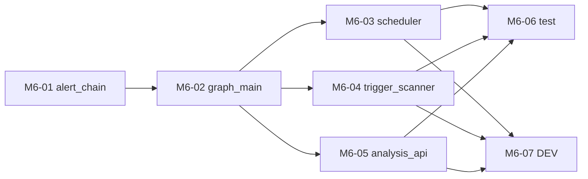

# M6 任务分发 Prompt 手册

> 建议每个执行 Agent 附加 skill：`/elk-backend-agent`  
> 任务详情真相来源：`task_m6/M6-0x-*.md`  
> **进度与依赖真相源**：`task_m6/STATUS.md`（开工前必读，完成后必更新）  
> 编排总览：`task_m6/README.md`  
> 总体规划：`doc/后端开发总体规划-Services-LangGraph-MCP.md` §2.3 / §1.3

---

## 零、执行顺序与可并行任务

### 0.1 阶段总览

```text
阶段 A：M6-01  alert_chain.py
阶段 B：M6-02  graph_main.py            依赖 M6-01
阶段 C（可并行，3 Agent，依赖 M6-02）
├── M6-03  scheduler.py（委托 graph_main）
├── M6-04  trigger_scanner.py（委托 graph_main）
└── M6-05  api/v1/analysis.py + router.py
阶段 D（可并行，2 Agent，依赖 C）
├── M6-06  tests/test_m6_main.py
└── M6-07  analysis/langchain/api DEV
```

### 0.2 依赖关系图



### 0.3 并行派发矩阵

| 阶段 | 可同时派发的任务 | 条件 |
| --- | --- | --- |
| A | M6-01 | M3 完成 |
| B | M6-02 | M6-01 为 `已完成`/`已合并` |
| C | **M6-03 ∥ M6-04 ∥ M6-05** | M6-02 为 `已完成`/`已合并`；三文件互不冲突 |
| D | **M6-06 ∥ M6-07** | M6-02~05 已合并；各改不同文件 |

### 0.4 派发时注意

1. **开工前必读 `task_m6/STATUS.md`** 与第 1 节 M1~M5 前置检查。
2. **无新增第三方依赖**（langgraph/apscheduler 已就绪）。
3. **持久化收口**：M6 后写报告/写预警只发生在主图 `persist_result`；M6-03/04 移除子图层直接持久化。
4. **契约稳定**：M6-03/04 须保持 `run_once`/`scan_once` 对外返回契约；如变化由 M6-06 校正 test_m4/test_m5。
5. **router.py 仅 M6-05 编辑**。
6. **降级铁律**：节点失败写 errors 并降级；alert_chain/子图链 LLM 不可用降级。
7. **执行 Agent 完成后**：必须更新 STATUS 本人任务行。
8. **不要 commit**：除非负责人明确要求。

### 0.5 速查表

| 任务 | 任务文档 | 唯一负责文件 | 前置依赖 |
| --- | --- | --- | --- |
| M6-01 | M6-01-alert_chain.md | `langchain/alert_chain.py` | M3 |
| M6-02 | M6-02-graph_main.md | `analysis/graph_main.py` | M6-01 |
| M6-03 | M6-03-scheduler.md | `analysis/scheduler.py` | M6-02 |
| M6-04 | M6-04-trigger_scanner.md | `analysis/trigger_scanner.py` | M6-02 |
| M6-05 | M6-05-analysis_api.md | `api/v1/analysis.py`（新建）+ `api/router.py` | M6-02 |
| M6-06 | M6-06-test_main.md | `tests/test_m6_main.py`（新建，必要时校正 test_m4/m5） | M6-02~05 |
| M6-07 | M6-07-dev_docs.md | `analysis/DEV.md` + `langchain/DEV.md` + `api/DEV.md` | M6-02~05 |

---

## 一、编排 Agent Prompt（负责人用）

```markdown
你是 ELK 后端 M6 编排 Agent。阅读 `task_m6/PROMPT_DISPATCH.md` 第零节、`task_m6/README.md`、**`task_m6/STATUS.md`** 与第 1 节 M1~M5 前置检查。

确认 M1~M5 全部里程碑「已完成」后，根据 STATUS.md 第 3、5 节判断各 M6-0x 是否可派发；不要仅依赖 git 猜测。
为每个可派发任务从本文档「三、各任务派发 Prompt」复制对应完整 Prompt。
M6-01 先行；M6-02 待 M6-01；阶段 C（M6-03/04/05）待 M6-02 可并行；阶段 D（M6-06/07）待 C。
确认各 Agent 负责不同文件（router.py 仅 M6-05）。不要自己写业务代码。
派发后提醒执行 Agent：开工/完成时更新 STATUS.md 中本人任务行。
```

---

## 二、完成汇报模板（每个执行 Agent 结束时必填）

```markdown
## M6 任务完成汇报 — {TASK_ID}

### 1. 分层
（LangChain / Analysis 编排 / API / 测试 / 文档）

### 2. 修改文件
- `location/backend/{TARGET_FILE}`

### 3. 实现摘要
（3~5 条）

### 4. 验收结果
| AC | 结果 | 说明 |
|----|------|------|

### 5. 自测命令与输出

### 6. 阻塞与遗留

### 7. 下游提醒

### 8. STATUS 已更新
- [ ] 已在 `task_m6/STATUS.md` 将本任务标为 `已完成` 或 `已合并`
```

---

## 二点五、STATUS.md 标准说明（写入各任务 Prompt）

| 项 | 说明 |
| --- | --- |
| **文件路径** | `location/backend/job/task_m6/STATUS.md` |
| **定位** | M6 里程碑各 Agent 共享的**进度与依赖唯一真相源**（动态） |
| **前置** | 开工前确认 STATUS 第 1 节 M1~M5 已满足 |
| **状态枚举** | `未开始` → `进行中` → `已完成` / `已合并`；异常用 `阻塞` |
| **依赖判定** | 下游仅以依赖项为 `已完成`/`已合并` 为准；单分支开发时二者等价 |
| **开工前** | 阅读 STATUS 第 3、5 节；确认依赖满足；将**本任务行**改为 `进行中` 并填负责人 |
| **完成后** | 将**本任务行**改为 `已完成`，填完成时间、验收摘要 |
| **协作纪律** | **只改自己那一行**，勿改其他任务行 |
| **阻塞时** | 状态改 `阻塞`，备注缺哪一任务、现象与建议 |

---

## 三、各任务派发 Prompt

---

### M6-01：alert_chain

**阶段 A**

```markdown
/elk-backend-agent

## 任务标识
- 任务编号：**M6-01** (作为会话窗口名称)
- 任务文档：`location/backend/job/task_m6/M6-01-alert_chain.md`
- 编排说明：`location/backend/job/task_m6/README.md`
- 总体规划：`doc/后端开发总体规划-Services-LangGraph-MCP.md` §2.3 alert_decision

## STATUS.md（进度与依赖真相源）
- **路径**：`location/backend/job/task_m6/STATUS.md`（开工前必读，完成后必更新）
- **前置**：确认 STATUS 第 1 节 M1~M5 已满足
- **开工前**：将 **M6-01** 行改为 `进行中` 并填负责人
- **完成后**：将 **M6-01** 行改为 `已完成`/`已合并`，填完成时间、验收摘要；**只改本行**
- **说明**：M6-02 将依赖你此行状态

## 你的角色
预警文案 Agent — explain_alert（LLM + 降级）。

## 文件边界（强制）
- **唯一允许修改**：`location/backend/app/services/langchain/alert_chain.py`
- **禁止修改**：llm_manager/prompts/output_parsers（只 import）、其他 langchain/analysis 文件

## 跨任务约定
1. 统一走 `llm_manager`，不直接 import LLM SDK
2. LLM 不可用降级模板，degraded=True；无 placeholder；不抛裸异常
3. 简体中文；不要 commit

## 开发要点
- `explain_alert(alert_candidate)`：LLM 生成 title/detail；失败降级；返回 {ok, degraded, title, detail}

## 验收标准
AC-01~AC-04（见任务文档）

## 完成标准
- git diff 仅 `alert_chain.py`
- 已更新 `task_m6/STATUS.md` 中 M6-01 行
- 按第二节完成汇报模板输出
```

---

### M6-02：graph_main

**阶段 B | 依赖 M6-01**

```markdown
/elk-backend-agent

## 任务标识
- 任务编号：**M6-02** (作为会话窗口名称)
- 任务文档：`location/backend/job/task_m6/M6-02-graph_main.md`
- 总体规划：`doc/后端开发总体规划-Services-LangGraph-MCP.md` §2.3

## STATUS.md（进度与依赖真相源）
- **路径**：`location/backend/job/task_m6/STATUS.md`
- **开工前**：确认 **M6-01** 为 `已完成`/`已合并`；将 **M6-02** 行改为 `进行中`
- **完成后**：更新 **M6-02** 行；M6-03/04/05 将依赖你此行状态

## 你的角色
主图 Agent — 路由两子图，统一归一化、预警决策、持久化收口。

## 文件边界（强制）
- **唯一允许修改**：`location/backend/app/services/analysis/graph_main.py`
- **禁止修改**：graph_scheduled/graph_rule/state/schemas/alert_chain/dedup/report_service/alert_service（只 import）、scheduler、trigger_scanner

## 前置依赖检查
```powershell
cd location\backend
python -c "from app.services.analysis.graph_scheduled import run_scheduled_subgraph; from app.services.analysis.graph_rule import run_rule_subgraph; from app.services.alert.dedup import check_duplicate; from app.services.alert.alert_service import write_alert; from app.services.report.report_service import write_report; from app.services.langchain.alert_chain import explain_alert; print('deps ok')"
```

## 跨任务约定
1. 持久化只在 persist_result（收口）
2. 节点失败写 errors 并降级，不中断；无 placeholder
3. 不要 commit

## 开发要点
- 节点流：normalize_trigger→build_state→route→[scheduled|rule 子图]→merge_result→alert_decision→persist_result
- alert_decision：severity≥high/risk_level=high 出预警 + dedup + alert_chain 文案
- `run_main_graph(trigger_type, **kwargs)` 返回 {ok, report_id, alert_id, node_trace, alert_decision, errors}
- `build_main_graph()` 返回编译图（子图作为节点）

## 验收标准
AC-01~AC-05（见任务文档）

## 完成标准
- git diff 仅 `graph_main.py`
- 已更新 `task_m6/STATUS.md` 中 M6-02 行
```

---

### M6-03：scheduler

**阶段 C | 可与 M6-04/05 并行 | 依赖 M6-02**

```markdown
/elk-backend-agent

## 任务标识
- 任务编号：**M6-03** (作为会话窗口名称)
- 任务文档：`location/backend/job/task_m6/M6-03-scheduler.md`

## STATUS.md（进度与依赖真相源）
- **路径**：`location/backend/job/task_m6/STATUS.md`
- **开工前**：确认 **M6-02** 为 `已完成`/`已合并`；将 **M6-03** 行改为 `进行中`
- **完成后**：更新 **M6-03** 行；只改本行

## 你的角色
调度器收敛 Agent — run_once 委托主图，持久化交主图。

## 文件边界（强制）
- **唯一允许修改**：`location/backend/app/services/analysis/scheduler.py`
- **禁止修改**：graph_main/graph_scheduled/report_service（只 import）、`core/config.py`（只读）

## 并行冲突提醒
可与 M6-04、M6-05 并行（不同文件）。

## 前置依赖检查
```powershell
cd location\backend
python -c "from app.services.analysis.graph_main import run_main_graph; print('deps ok')"
```

## 跨任务约定
1. run_once 改调 run_main_graph("scheduled", time_window=...)，移除直接 write_report
2. 保持返回契约 {ok, report_id, node_trace}
3. start/stop 周期与防重叠不变；契约变化知会 M6-06
4. 不要 commit

## 验收标准
AC-01~AC-04（见任务文档）

## 完成标准
- git diff 仅 `scheduler.py`
- 已更新 `task_m6/STATUS.md` 中 M6-03 行
```

---

### M6-04：trigger_scanner

**阶段 C | 可与 M6-03/05 并行 | 依赖 M6-02**

```markdown
/elk-backend-agent

## 任务标识
- 任务编号：**M6-04** (作为会话窗口名称)
- 任务文档：`location/backend/job/task_m6/M6-04-trigger_scanner.md`

## STATUS.md（进度与依赖真相源）
- **路径**：`location/backend/job/task_m6/STATUS.md`
- **开工前**：确认 **M6-02** 为 `已完成`/`已合并`；将 **M6-04** 行改为 `进行中`
- **完成后**：更新 **M6-04** 行；只改本行

## 你的角色
扫描器收敛 Agent — scan_once 委托主图。

## 文件边界（强制）
- **唯一允许修改**：`location/backend/app/services/analysis/trigger_scanner.py`
- **禁止修改**：graph_main/graph_rule/alert_service/dedup/report_service/rule_engine（只 import）、`core/config.py`（只读）

## 并行冲突提醒
可与 M6-03、M6-05 并行（不同文件）。

## 前置依赖检查
```powershell
cd location\backend
python -c "from app.services.analysis.graph_main import run_main_graph; from app.services.diagnosis.rule_engine import match_log; print('deps ok')"
```

## 跨任务约定
1. 保留扫描 + match_log 复核；对触发日志改调 run_main_graph("rule", trigger_event=...)
2. 移除直接 write_report/check_duplicate/write_alert（收口主图）
3. 保持返回契约 {ok, triggered_count, alert_ids, report_ids}；契约变化知会 M6-06
4. 不要 commit

## 验收标准
AC-01~AC-04（见任务文档）

## 完成标准
- git diff 仅 `trigger_scanner.py`
- 已更新 `task_m6/STATUS.md` 中 M6-04 行
```

---

### M6-05：analysis_api

**阶段 C | 可与 M6-03/04 并行 | 依赖 M6-02**

```markdown
/elk-backend-agent

## 任务标识
- 任务编号：**M6-05** (作为会话窗口名称)
- 任务文档：`location/backend/job/task_m6/M6-05-analysis_api.md`

## STATUS.md（进度与依赖真相源）
- **路径**：`location/backend/job/task_m6/STATUS.md`
- **开工前**：确认 **M6-02** 为 `已完成`/`已合并`；将 **M6-05** 行改为 `进行中`
- **完成后**：更新 **M6-05** 行；只改本行

## 你的角色
API 层 Agent — 新建分析轨迹 API 并注册路由。

## 文件边界（强制）
- **唯一允许修改/新建**：`location/backend/app/api/v1/analysis.py`（新建）、`location/backend/app/api/router.py`（注册）
- **禁止修改**：graph_main/report_service（只 import）、其他 api/v1/*.py、schemas

## 并行冲突提醒
可与 M6-03、M6-04 并行。**router.py 仅本任务编辑**。

## 前置依赖检查
```powershell
cd location\backend
python -c "from app.services.analysis.graph_main import run_main_graph; from app.services.report.report_service import list_recent_reports; print('deps ok')"
```

## 跨任务约定
1. 薄路由：不写 ES DSL；本文件内可定义轻量响应模型
2. 不要 commit

## 开发要点
- `GET /api/v1/analysis/runs/recent`：从 list_recent_reports 提取 node_trace 摘要
- `POST /api/v1/analysis/run`：body trigger_type(+event/window) → run_main_graph，返回 node_trace + ids
- router 注册 analysis_router（prefix=/v1/analysis, tags=["analysis"]）

## 验收标准
AC-01~AC-04（见任务文档）

## 完成标准
- git diff 仅 `analysis.py` + `router.py`
- 已更新 `task_m6/STATUS.md` 中 M6-05 行
```

---

### M6-06：test_main

**阶段 D | 可与 M6-07 并行 | 依赖 M6-02~05**

```markdown
/elk-backend-agent

## 任务标识
- 任务编号：**M6-06** (作为会话窗口名称)
- 任务文档：`location/backend/job/task_m6/M6-06-test_main.md`

## STATUS.md（进度与依赖真相源）
- **路径**：`location/backend/job/task_m6/STATUS.md`
- **开工前**：确认 **M6-02~M6-05** 均为 `已完成`/`已合并`；将 **M6-06** 行改为 `进行中`
- **完成后**：更新 **M6-06** 行；只改本行

## 你的角色
测试 Agent — 新建 M6 单测 + 回归校正，ES/LLM 全 mock。

## 文件边界（强制）
- **唯一允许新建/修改**：`tests/test_m6_main.py`；必要时校正 `tests/test_m4_scheduled.py`、`tests/test_m5_rule.py`
- **禁止修改**：任何生产代码（bug 记备注）

## 并行冲突提醒
可与 M6-07 并行（不同文件）。

## 前置依赖
M6-02~05 已合并。

## 开发要点
- `monkeypatch` mock ES/LLM/子图
- 覆盖：alert_chain 两路径、graph_main 两路由 + merge + alert_decision（去重）+ persist 收口、analysis API、降级、无 placeholder
- 运行 M1~M5 全量回归；若 M6-03/04 改变契约则校正 test_m4/test_m5
- ≥12 个 test 函数；不联网

## 验收标准
AC-01~AC-04（见任务文档）；`pytest tests/test_m6_main.py -v` 全绿 + 全量回归通过

## 完成标准
- 已更新 `task_m6/STATUS.md` 中 M6-06 行
- 按第二节完成汇报模板输出；不要 commit
```

---

### M6-07：dev_docs

**阶段 D | 可与 M6-06 并行 | 依赖 M6-02~05**

```markdown
/elk-backend-agent

## 任务标识
- 任务编号：**M6-07** (作为会话窗口名称)
- 任务文档：`location/backend/job/task_m6/M6-07-dev_docs.md`

## STATUS.md（进度与依赖真相源）
- **路径**：`location/backend/job/task_m6/STATUS.md`
- **开工前**：确认 **M6-02~M6-05** 均为 `已完成`/`已合并`；将 **M6-07** 行改为 `进行中`
- **完成后**：更新 **M6-07** 行；刷新 STATUS 第 5 节；若 M6-06 亦完成，备注「M6 里程碑可收口」

## 你的角色
文档 Agent — 更新 analysis、langchain、api 模块 DEV 文档（不碰业务代码）。

## 文件边界（强制）
- **唯一允许修改**：`analysis/DEV.md`、`langchain/DEV.md`、`api/DEV.md`
- **禁止修改**：任何 `.py` 文件

## 并行冲突提醒
可与 M6-06 并行。**勿与**仍在改对应 `.py` 的 Agent 并行。

## 开发要点
- analysis/DEV.md：graph_main → 已实现；主图节点流与持久化收口；scheduler/scanner 委托主图；analyze_relations 标 M7
- langchain/DEV.md：alert_chain → 已实现 + 降级；relation_chain 标 M7
- api/DEV.md：新增 /analysis/runs/recent、/analysis/run；node_trace 展示用途

## 验收标准
AC-01~AC-03（见任务文档）

## 完成标准
- git diff 仅三个 DEV.md
- 已更新 `task_m6/STATUS.md` 中 M6-07 行；若 M6-01~07 均完成，更新 STATUS 第 5 节为「无可派发 M6 任务，后续见 M7」
```

---

## 四、推荐派发时间线（示例）

| 时间点 | 派发任务 | Agent 数 |
| --- | --- | --- |
| T0（M1~M5 已收口） | M6-01 | 1 |
| T1（M6-01 合并） | M6-02 | 1 |
| T2（M6-02 合并） | M6-03 + M6-04 + M6-05 | 3 |
| T3（M6-03~05 合并） | M6-06 + M6-07 | 2 |

**最短关键路径**：M6-01 → M6-02 → M6-05 → M6-06 → M6 验收（约 4 个串行环节）。

**M6 里程碑收口检查清单**：
- [ ] `task_m6/STATUS.md` M6-01~07 均为 `已完成`/`已合并`
- [ ] `pytest tests/test_m6_main.py` 全绿；M1~M5 全量回归通过
- [ ] `run_main_graph` 两路由跑通，持久化仅在 persist_result
- [ ] `/analysis/runs/recent`、`/analysis/run`、`/reports/recent`、`/alerts/active` 联通
- [ ] graph_main / alert_chain 无 `placeholder: true`
