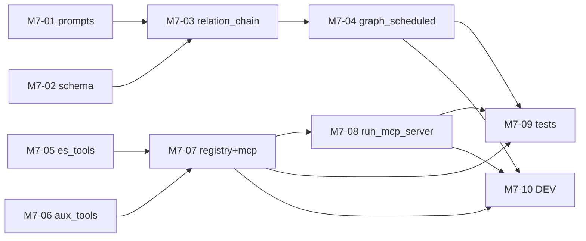

# M7 任务分发 Prompt 手册

> 建议每个执行 Agent 附加 skill：`/elk-backend-agent`  
> 任务详情真相来源：`task_m7/M7-0x-*.md`  
> **进度与依赖真相源**：`task_m7/STATUS.md`（开工前必读，完成后必更新）  
> 编排总览：`task_m7/README.md`  
> 总体规划：`doc/后端开发总体规划-Services-LangGraph-MCP.md` §2.4 / §3.2 / §3.4

---

## 零、执行顺序与可并行任务

### 0.1 阶段总览

```text
阶段 A（可并行，4 Agent）
├── M7-01  prompts.py（RELATION_PROMPT）
├── M7-02  chain_schemas.py（RelationChainOutput）
├── M7-05  elasticsearch_tools.py（工具 11/12/13）
└── M7-06  kibana_tools.py(新建)+report_tools.py+alert_tools.py（工具 14/15/16）
阶段 B（可并行，2 Agent）
├── M7-03  relation_chain.py                依赖 M7-01、M7-02
└── M7-07  registry.py + requirements.txt   依赖 M7-05、M7-06
阶段 C（可并行，2 Agent）
├── M7-04  graph_scheduled.py（analyze_relations）  依赖 M7-03
└── M7-08  tasks/run_mcp_server.py            依赖 M7-07
阶段 D（可并行，2 Agent，依赖 C）
├── M7-09  tests/test_m7_enhancements.py
└── M7-10  langchain/analysis/tools DEV
```

### 0.2 依赖关系图



### 0.3 并行派发矩阵

| 阶段 | 可同时派发的任务 | 条件 |
| --- | --- | --- |
| A | **M7-01 ∥ M7-02 ∥ M7-05 ∥ M7-06** | M1/M3 完成；四者互不冲突 |
| B | **M7-03 ∥ M7-07** | A 对应前置已合并 |
| C | **M7-04 ∥ M7-08** | B 对应前置已合并 |
| D | **M7-09 ∥ M7-10** | M7-04/07/08 已合并 |

### 0.4 派发时注意

1. **开工前必读 `task_m7/STATUS.md`** 与第 1 节 M1~M6 前置检查。
2. **唯一新增依赖**：`fastmcp`（仅 M7-07 写入 requirements；registry 懒加载，缺失不破坏测试）。
3. **读写分离铁律**：MCP Server 仅暴露读类工具；写类工具（6 `analysis_write_report`、7 `alert_write_event`）绝不对外。
4. **降级铁律**：relation_chain LLM 不可用降级空列表；create_mcp_server fastmcp 缺失结构化降级；均不得抛裸异常或破坏测试。
5. **向后兼容**：M7-04 改 graph_scheduled 须保持 relations 为空时与 M4 等价；如改动影响既有测试，由 **M7-09** 校正 test_m4/test_m6（仅测试文件）。
6. **字段对齐**：M7-01（Prompt）与 M7-02（schema）字段命名须一致，以 `chain_schemas.py` 为字段真相源。
7. **registry.py / requirements.txt 仅 M7-07 编辑**；`elasticsearch_tools.py` 仅 M7-05；`report_tools.py`/`alert_tools.py`/`kibana_tools.py` 仅 M7-06。
8. 执行 Agent 完成后必须更新 STATUS 本人任务行。**不要 commit**（除非负责人明确要求）。

### 0.5 速查表

| 任务 | 任务文档 | 唯一负责文件 | 前置依赖 |
| --- | --- | --- | --- |
| M7-01 | M7-01-relation_prompt.md | `langchain/prompts.py` | M3 |
| M7-02 | M7-02-relation_schema.md | `langchain/chain_schemas.py` | M3 |
| M7-03 | M7-03-relation_chain.md | `langchain/relation_chain.py` | M7-01、M7-02 |
| M7-04 | M7-04-graph_scheduled.md | `analysis/graph_scheduled.py` | M7-03 |
| M7-05 | M7-05-es_tools.md | `tools/elasticsearch_tools.py` | M1 |
| M7-06 | M7-06-aux_tools.md | `tools/kibana_tools.py`(新)+`report_tools.py`+`alert_tools.py` | M1 |
| M7-07 | M7-07-registry_mcp.md | `tools/registry.py`+`requirements.txt` | M7-05、M7-06 |
| M7-08 | M7-08-run_mcp_server.md | `tasks/run_mcp_server.py`(新) | M7-07 |
| M7-09 | M7-09-tests.md | `tests/test_m7_enhancements.py`(新) | M7-04、M7-07、M7-08 |
| M7-10 | M7-10-dev_docs.md | `langchain/DEV.md`+`analysis/DEV.md`+`tools/DEV.md` | M7-04、M7-07、M7-08 |

---

## 一、编排 Agent Prompt（负责人用）

```markdown
你是 ELK 后端 M7 编排 Agent。阅读 `task_m7/PROMPT_DISPATCH.md` 第零节、`task_m7/README.md`、**`task_m7/STATUS.md`** 与第 1 节 M1~M6 前置检查。

确认 M1~M6 全部里程碑「已完成」后，根据 STATUS.md 第 3、5 节判断各 M7-0x 是否可派发；不要仅依赖 git 猜测。
阶段 A 可同时派发 M7-01/02/05/06（四者文件互不冲突）；阶段 B（M7-03/07）、C（M7-04/08）、D（M7-09/10）按依赖推进。
为每个可派发任务从「三、各任务派发 Prompt」复制对应完整 Prompt。
确认各 Agent 负责不同文件（registry.py/requirements.txt 仅 M7-07；elasticsearch_tools 仅 M7-05；report/alert/kibana_tools 仅 M7-06）。不要自己写业务代码。
派发后提醒执行 Agent：开工/完成时更新 STATUS.md 中本人任务行。
```

---

## 二、完成汇报模板（每个执行 Agent 结束时必填）

```markdown
## M7 任务完成汇报 — {TASK_ID}

### 1. 分层
（LangChain / Analysis 编排 / Tools / Task 入口 / 测试 / 文档）

### 2. 修改文件
- `location/backend/{TARGET_FILE}`

### 3. 实现摘要
（3~5 条）

### 4. 验收结果
| AC | 结果 | 说明 |
|----|------|------|

### 5. 自测命令与输出

### 6. 阻塞与遗留

### 7. 下游提醒

### 8. STATUS 已更新
- [ ] 已在 `task_m7/STATUS.md` 将本任务标为 `已完成` 或 `已合并`
```

---

## 二点五、STATUS.md 标准说明（写入各任务 Prompt）

| 项 | 说明 |
| --- | --- |
| **文件路径** | `location/backend/job/task_m7/STATUS.md` |
| **定位** | M7 里程碑各 Agent 共享的**进度与依赖唯一真相源**（动态） |
| **前置** | 开工前确认 STATUS 第 1 节 M1~M6 已满足 |
| **状态枚举** | `未开始` → `进行中` → `已完成` / `已合并`；异常用 `阻塞` |
| **依赖判定** | 下游仅以依赖项为 `已完成`/`已合并` 为准；单分支开发时二者等价 |
| **开工前** | 阅读 STATUS 第 3、5 节；确认依赖满足；将**本任务行**改为 `进行中` 并填负责人 |
| **完成后** | 将**本任务行**改为 `已完成`，填完成时间、验收摘要 |
| **协作纪律** | **只改自己那一行**，勿改其他任务行 |
| **阻塞时** | 状态改 `阻塞`，备注缺哪一任务、现象与建议 |

---

## 三、各任务派发 Prompt

---

### M7-01：relation_prompt

**阶段 A | 可与 M7-02/05/06 并行**

```markdown
/elk-backend-agent

## 任务标识
- 任务编号：**M7-01** (作为会话窗口名称)
- 任务文档：`location/backend/job/task_m7/M7-01-relation_prompt.md`
- 总体规划：`doc/后端开发总体规划-Services-LangGraph-MCP.md` §2.4

## STATUS.md（进度与依赖真相源）
- **路径**：`location/backend/job/task_m7/STATUS.md`（开工前必读，完成后必更新）
- **前置**：确认 STATUS 第 1 节 M1~M6 已满足
- **开工前**：将 **M7-01** 行改为 `进行中` 并填负责人
- **完成后**：将 **M7-01** 行改为 `已完成`/`已合并`；**只改本行**；M7-03 依赖你此行

## 你的角色
Prompt Agent — 填充 RELATION_PROMPT。

## 文件边界（强制）
- **唯一允许修改**：`location/backend/app/services/langchain/prompts.py`
- **禁止修改**：其他 langchain 文件；勿改已有四个模板语义与注册结构

## 跨任务约定
1. 输出 JSON 字段须与 M7-02 的 RelationChainOutput 一致（以 chain_schemas 为真相源）
2. 简体中文；不要 commit

## 开发要点
- 替换 `RELATION_PROMPT` 占位文案为投产 Prompt：关系发现专家、基于证据包、输出 relations(JSON：relation_type/description/entities/confidence/evidence_refs)、无关系输出空数组、不得编造

## 验收标准
AC-01~AC-04（见任务文档）

## 完成标准
- git diff 仅 `prompts.py`；已更新 STATUS 中 M7-01 行；按第二节模板汇报
```

---

### M7-02：relation_schema

**阶段 A | 可与 M7-01/05/06 并行**

```markdown
/elk-backend-agent

## 任务标识
- 任务编号：**M7-02** (作为会话窗口名称)
- 任务文档：`location/backend/job/task_m7/M7-02-relation_schema.md`

## STATUS.md（进度与依赖真相源）
- **路径**：`location/backend/job/task_m7/STATUS.md`
- **开工前**：将 **M7-02** 行改为 `进行中`
- **完成后**：更新 **M7-02** 行；M7-03 依赖你此行

## 你的角色
Schema Agent — 新增 RelationItem / RelationChainOutput。

## 文件边界（强制）
- **唯一允许修改**：`location/backend/app/services/langchain/chain_schemas.py`
- **禁止修改**：已有两个模型字段；其他 langchain 文件

## 跨任务约定
1. 字段命名为本层真相源，须与 M7-01 Prompt 对齐
2. confidence 加 before 校验器钳制 [0,1]（仿 DiagnosisChainOutput）
3. 简体中文；不要 commit

## 开发要点
- RelationItem：relation_type(Literal) / description / entities / confidence / evidence_refs
- RelationChainOutput：relations: list[RelationItem]

## 验收标准
AC-01~AC-04（见任务文档）

## 完成标准
- git diff 仅 `chain_schemas.py`；已更新 STATUS 中 M7-02 行
```

---

### M7-03：relation_chain

**阶段 B | 依赖 M7-01、M7-02**

```markdown
/elk-backend-agent

## 任务标识
- 任务编号：**M7-03** (作为会话窗口名称)
- 任务文档：`location/backend/job/task_m7/M7-03-relation_chain.md`

## STATUS.md（进度与依赖真相源）
- **路径**：`location/backend/job/task_m7/STATUS.md`
- **开工前**：确认 **M7-01、M7-02** 均为 `已完成`/`已合并`；将 **M7-03** 行改为 `进行中`
- **完成后**：更新 **M7-03** 行；M7-04 依赖你此行

## 你的角色
关系发现 Chain Agent — 实装 discover_relations + 降级。

## 文件边界（强制）
- **唯一允许修改**：`location/backend/app/services/langchain/relation_chain.py`
- **禁止修改**：prompts/chain_schemas/llm_manager/output_parsers/evidence_builder（只 import）

## 前置依赖检查
```powershell
cd location\backend
python -c "from app.services.langchain.prompts import get_prompt; from app.services.langchain.chain_schemas import RelationChainOutput; print('ok' if not get_prompt('relation').startswith('[M7') else 'prompt未就绪')"
```

## 跨任务约定
1. 统一走 llm_manager；参照 report_chain/diagnosis_chain 骨架
2. LLM/解析失败降级 {ok:True, degraded:True, relations:[]}；无 placeholder；不抛裸异常
3. 简体中文；不要 commit

## 开发要点
- discover_relations(evidence_package)：LLM 结构化→RelationChainOutput→relations dump；失败降级空列表

## 验收标准
AC-01~AC-04（见任务文档）

## 完成标准
- git diff 仅 `relation_chain.py`；已更新 STATUS 中 M7-03 行
```

---

### M7-04：graph_scheduled

**阶段 C | 依赖 M7-03**

```markdown
/elk-backend-agent

## 任务标识
- 任务编号：**M7-04** (作为会话窗口名称)
- 任务文档：`location/backend/job/task_m7/M7-04-graph_scheduled.md`
- 总体规划：§2.4 定时子图七节点流

## STATUS.md（进度与依赖真相源）
- **路径**：`location/backend/job/task_m7/STATUS.md`
- **开工前**：确认 **M7-03** 为 `已完成`/`已合并`；将 **M7-04** 行改为 `进行中`
- **完成后**：更新 **M7-04** 行；M7-09/10 依赖你此行

## 你的角色
定时子图 Agent — 插入 analyze_relations 节点并把 relations 注入报告。

## 文件边界（强制）
- **唯一允许修改**：`location/backend/app/services/analysis/graph_scheduled.py`
- **禁止修改**：relation_chain/report_chain/state/schemas（只 import）、graph_main/scheduler/graph_rule

## 前置依赖检查
```powershell
cd location\backend
python -c "from app.services.langchain.relation_chain import discover_relations; print('deps ok')"
```

## 跨任务约定
1. 节点流：build_evidence → analyze_relations → generate_report → END（七节点）
2. relations 写 state + 注入报告；关系发现降级时节点 skipped、报告仍产出（与 M4 等价）
3. 向后兼容；节点失败写 errors 降级；无 placeholder
4. 不要 commit；契约变化知会 M7-09

## 验收标准
AC-01~AC-05（见任务文档）

## 完成标准
- git diff 仅 `graph_scheduled.py`；已更新 STATUS 中 M7-04 行
```

---

### M7-05：es_tools

**阶段 A | 可与 M7-01/02/06 并行**

```markdown
/elk-backend-agent

## 任务标识
- 任务编号：**M7-05** (作为会话窗口名称)
- 任务文档：`location/backend/job/task_m7/M7-05-es_tools.md`
- 总体规划：§3.2 工具 11/12/13、§3.3 Schema 约定

## STATUS.md（进度与依赖真相源）
- **路径**：`location/backend/job/task_m7/STATUS.md`
- **开工前**：将 **M7-05** 行改为 `进行中`
- **完成后**：更新 **M7-05** 行；M7-07 依赖你此行

## 你的角色
ES 工具 Agent — 新增工具 11/12/13，薄包装 aggregation_service。

## 文件边界（强制）
- **唯一允许修改**：`location/backend/app/services/tools/elasticsearch_tools.py`
- **禁止修改**：aggregation_service（只 import）、registry、其他 tools 文件

## 前置依赖检查
```powershell
cd location\backend
python -c "from app.services.elasticsearch.aggregation_service import aggregate_behavior_funnel, aggregate_traffic; print('deps ok')"
```

## 跨任务约定
1. 薄适配：参数校验→调 service→裁剪；时间窗必填、跨度≤24h、条数≤50
2. 异常返回 {ok:false,error:...}，不抛裸异常
3. 简体中文；不要 commit

## 开发要点
- es_get_business_funnel(漏斗)、es_detect_traffic_peak(附 peak_bucket)、es_compare_time_windows(双窗口环比)；各带 Pydantic 入参模型

## 验收标准
AC-01~AC-04（见任务文档）

## 完成标准
- git diff 仅 `elasticsearch_tools.py`；已更新 STATUS 中 M7-05 行
```

---

### M7-06：aux_tools

**阶段 A | 可与 M7-01/02/05 并行**

```markdown
/elk-backend-agent

## 任务标识
- 任务编号：**M7-06** (作为会话窗口名称)
- 任务文档：`location/backend/job/task_m7/M7-06-aux_tools.md`
- 总体规划：§3.2 工具 14/15/16

## STATUS.md（进度与依赖真相源）
- **路径**：`location/backend/job/task_m7/STATUS.md`
- **开工前**：将 **M7-06** 行改为 `进行中`
- **完成后**：更新 **M7-06** 行；M7-07 依赖你此行

## 你的角色
辅助工具 Agent — Kibana 链接工具 + report/alert 只读列表工具。

## 文件边界（强制）
- **唯一允许新建/修改**：`tools/kibana_tools.py`（新建）、`tools/report_tools.py`、`tools/alert_tools.py`
- **禁止修改**：report_service/alert_service（只 import）、registry、elasticsearch_tools

## 前置依赖检查
```powershell
cd location\backend
python -c "from app.services.report.report_service import list_recent_reports; from app.services.alert.alert_service import list_active_alerts; print('deps ok')"
```

## 跨任务约定
1. 均为读类工具；薄适配；条数 le=50；异常 {ok:false,error:...}，不抛裸异常
2. kibana_generate_link 离线纯拼 URL，不访问网络/ES
3. 简体中文；不要 commit

## 开发要点
- 14 kibana_generate_link(新文件)、15 report_list_recent、16 alert_list_active；各带 Pydantic 入参模型

## 验收标准
AC-01~AC-04（见任务文档）

## 完成标准
- git diff 仅三个 tools 文件；已更新 STATUS 中 M7-06 行
```

---

### M7-07：registry_mcp

**阶段 B | 依赖 M7-05、M7-06**

```markdown
/elk-backend-agent

## 任务标识
- 任务编号：**M7-07** (作为会话窗口名称)
- 任务文档：`location/backend/job/task_m7/M7-07-registry_mcp.md`
- 总体规划：§3.1 / §3.4

## STATUS.md（进度与依赖真相源）
- **路径**：`location/backend/job/task_m7/STATUS.md`
- **开工前**：确认 **M7-05、M7-06** 均为 `已完成`/`已合并`；将 **M7-07** 行改为 `进行中`
- **完成后**：更新 **M7-07** 行；M7-08/09/10 依赖你此行

## 你的角色
注册中心 Agent — 工具表扩到 16 + 实装 create_mcp_server。

## 文件边界（强制）
- **唯一允许修改**：`location/backend/app/services/tools/registry.py`、`location/backend/requirements.txt`
- **禁止修改**：各 tools 工具文件（只 import 函数与入参模型）

## 前置依赖检查
```powershell
cd location\backend
python -c "from app.services.tools import elasticsearch_tools, report_tools, alert_tools, kibana_tools; print('deps ok')"
```

## 跨任务约定
1. _TOOL_NAMES/_all_tool_specs 追加 6 项（11~16，全读类，不入 _WRITE_TOOL_NAMES）
2. create_mcp_server 懒加载 fastmcp（顶层不 import）；仅注册读类工具，写类 6/7 绝不对外；缺失时结构化降级
3. requirements 增 fastmcp；读写分离铁律；简体中文；不要 commit

## 开发要点
- list_registered_tool_names() 返回 16；get_langchain_tools 行为不变（默认排除写类）

## 验收标准
AC-01~AC-04（见任务文档）

## 完成标准
- git diff 仅 `registry.py` + `requirements.txt`；已更新 STATUS 中 M7-07 行
```

---

### M7-08：run_mcp_server

**阶段 C | 依赖 M7-07**

```markdown
/elk-backend-agent

## 任务标识
- 任务编号：**M7-08** (作为会话窗口名称)
- 任务文档：`location/backend/job/task_m7/M7-08-run_mcp_server.md`

## STATUS.md（进度与依赖真相源）
- **路径**：`location/backend/job/task_m7/STATUS.md`
- **开工前**：确认 **M7-07** 为 `已完成`/`已合并`；将 **M7-08** 行改为 `进行中`
- **完成后**：更新 **M7-08** 行

## 你的角色
任务入口 Agent — 新建 MCP Server 启动 CLI。

## 文件边界（强制）
- **唯一允许新建**：`location/backend/app/tasks/run_mcp_server.py`
- **禁止修改**：registry（只 import create_mcp_server）、其他文件

## 前置依赖检查
```powershell
cd location\backend
python -c "from app.services.tools.registry import create_mcp_server; print('deps ok')"
```

## 跨任务约定
1. 仅 import registry；参照 run_scheduler/run_trigger_scanner 风格
2. fastmcp 缺失/降级时清晰中文提示 + exit(1)，不抛裸栈
3. `--list` 仅打印读类工具名后退出；简体中文；不要 commit

## 验收标准
AC-01~AC-04（见任务文档）

## 完成标准
- git diff 仅 `run_mcp_server.py`；已更新 STATUS 中 M7-08 行
```

---

### M7-09：tests

**阶段 D | 可与 M7-10 并行 | 依赖 M7-04、M7-07、M7-08**

```markdown
/elk-backend-agent

## 任务标识
- 任务编号：**M7-09** (作为会话窗口名称)
- 任务文档：`location/backend/job/task_m7/M7-09-tests.md`

## STATUS.md（进度与依赖真相源）
- **路径**：`location/backend/job/task_m7/STATUS.md`
- **开工前**：确认 **M7-04、M7-07、M7-08** 均为 `已完成`/`已合并`；将 **M7-09** 行改为 `进行中`
- **完成后**：更新 **M7-09** 行

## 你的角色
测试 Agent — M7 单测 + M1~M6 全量回归，全 mock。

## 文件边界（强制）
- **唯一允许新建**：`tests/test_m7_enhancements.py`
- **可校正（仅当 M7-04 改动导致失配）**：`tests/test_m4_scheduled.py`、`tests/test_m6_main.py`
- **禁止修改**：任何生产代码（bug 记备注）

## 跨任务约定
1. monkeypatch mock ES/LLM/FastMCP；不联网、不要求安装 fastmcp
2. ≥14 个 test；覆盖关系发现降级、七节点子图、16 工具注册、MCP 读写分离与 fastmcp 缺失降级、run_mcp_server --list
3. 跑 M1~M6 全量回归（119 passed 基线不退化）；不要 commit

## 验收标准
AC-01~AC-04（见任务文档）；`pytest tests/test_m7_enhancements.py -v` 全绿 + 全量回归通过

## 完成标准
- 已更新 STATUS 中 M7-09 行；按第二节模板汇报
```

---

### M7-10：dev_docs

**阶段 D | 可与 M7-09 并行 | 依赖 M7-04、M7-07、M7-08**

```markdown
/elk-backend-agent

## 任务标识
- 任务编号：**M7-10** (作为会话窗口名称)
- 任务文档：`location/backend/job/task_m7/M7-10-dev_docs.md`

## STATUS.md（进度与依赖真相源）
- **路径**：`location/backend/job/task_m7/STATUS.md`
- **开工前**：确认 **M7-04、M7-07、M7-08** 均为 `已完成`/`已合并`；将 **M7-10** 行改为 `进行中`
- **完成后**：更新 **M7-10** 行；刷新 STATUS 第 5 节；若 M7-01~10 均完成，标注「M1~M7 全规划收口」

## 你的角色
文档 Agent — 更新 langchain/analysis/tools DEV（不碰业务代码）。

## 文件边界（强制）
- **唯一允许修改**：`langchain/DEV.md`、`analysis/DEV.md`、`tools/DEV.md`
- **禁止修改**：任何 `.py` 文件

## 并行冲突提醒
可与 M7-09 并行；**勿与**仍在改对应 `.py` 的 Agent 并行。

## 开发要点
- langchain/DEV：relation_chain 已实现 + 降级；RELATION_PROMPT/RelationChainOutput 落地
- analysis/DEV：定时子图七节点 + relations 注入/降级
- tools/DEV：16 工具表 + create_mcp_server 形态 + 读写分离 + fastmcp 懒加载 + run_mcp_server
- 标注 M7 完成即全规划收口

## 验收标准
AC-01~AC-03（见任务文档）

## 完成标准
- git diff 仅三个 DEV.md；已更新 STATUS 中 M7-10 行；若全部完成，更新 STATUS 第 5 节为「无可派发任务，M1~M7 全规划收口」
```

---

## 四、推荐派发时间线（示例）

| 时间点 | 派发任务 | Agent 数 |
| --- | --- | --- |
| T0（M1~M6 已收口） | M7-01 + M7-02 + M7-05 + M7-06 | 4 |
| T1（A 合并） | M7-03 + M7-07 | 2 |
| T2（B 合并） | M7-04 + M7-08 | 2 |
| T3（C 合并） | M7-09 + M7-10 | 2 |

**最短关键路径**：M7-02 → M7-03 → M7-04 → M7-09 → M7 验收（约 4 个串行环节，另一条 M7-05/06 → M7-07 → M7-08 并行）。

**M7 里程碑收口检查清单**：
- [ ] `task_m7/STATUS.md` M7-01~10 均为 `已完成`/`已合并`
- [ ] `pytest tests/test_m7_enhancements.py` 全绿；M1~M6 全量回归通过
- [ ] 定时子图七节点跑通；relations 注入报告且降级安全
- [ ] `list_registered_tool_names()` == 16；MCP Server 仅读类工具
- [ ] `create_mcp_server` fastmcp 缺失结构化降级；`run_mcp_server --list` 可用
- [ ] relation_chain / registry 无 `placeholder: true` / NotImplementedError 遗留
- [ ] **M1~M7 全规划收口**
```