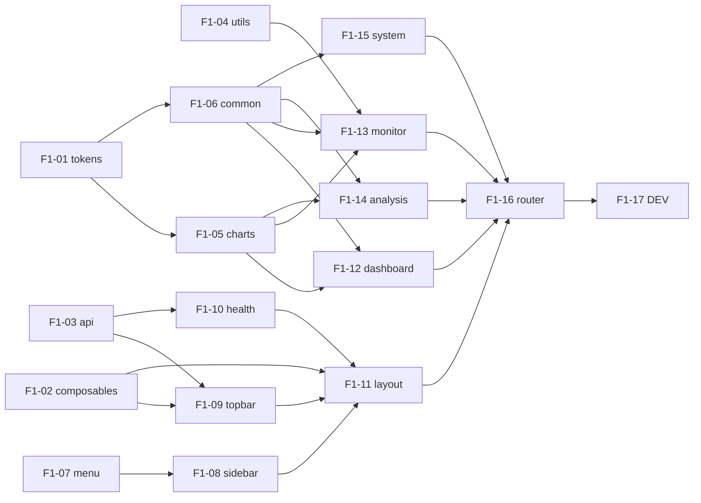

# F1 任务分发 Prompt 手册

> 建议每个执行 Agent 附加 skill：`/elk-frontend-agent`
> 任务详情真相来源：`task_m1/F1-xx-*.md`
> **进度与依赖真相源**：`task_m1/STATUS.md`（开工前必读，完成后必更新）
> 编排总览：`task_m1/README.md`
> 强制基线：`location/frontend/前端开发总体规划.md`

---

## 零、执行顺序与可并行任务

### 0.1 阶段总览

```text
阶段 A（可并行，最多 4 Agent）
├── F1-01  assets/styles/index.css
├── F1-02  composables/useTimeRange.js + usePolling.js
├── F1-03  api/*.js（7 wrapper + USE_MOCK）
└── F1-04  utils/format.js + logTypeMeta.js

阶段 B（依赖 A-01；可并行，2 Agent）
├── F1-05  components/common/charts/*（BaseChart + 5 图表）
└── F1-06  components/common/*（EmptyState/.../StageRing）

阶段 C（布局；F1-07 可提前，其余依赖 A/B）
├── F1-07  layout/menu.js                ← 无依赖
├── F1-08  SidebarTree + SidebarTreeNode ← 依赖 F1-07
├── F1-09  TopBar                        ← 依赖 F1-02、F1-03
├── F1-10  PipelineHealthDot             ← 依赖 F1-03
└── F1-11  layout/index.vue             ← 依赖 F1-08/09/10、F1-02

阶段 D（页面占位；可并行，4 Agent；依赖 B）
├── F1-12  dashboard 占位
├── F1-13  monitor 占位（7 子页）
├── F1-14  analysis 占位（5 页）
└── F1-15  system 占位（3 页）

阶段 E（串行）
└── F1-16  router/index.js              ← 依赖 D 全部页面存在

阶段 F（串行，必须最后）
└── F1-17  frontend/DEV.md              ← 依赖 F1-01~16
```

### 0.2 依赖关系图



### 0.3 并行派发矩阵

| 阶段 | 可同时派发的任务 | 条件 |
| --- | --- | --- |
| A | **F1-01 ∥ F1-02 ∥ F1-03 ∥ F1-04 ∥ F1-07** | 无前置；改不同文件 |
| B | **F1-05 ∥ F1-06** | F1-01 已完成 |
| C | F1-08 / F1-09 / F1-10 | 各自依赖满足；改不同文件 |
| C | F1-11 | F1-08/09/10、F1-02 均已完成 |
| D | **F1-12 ∥ F1-13 ∥ F1-14 ∥ F1-15** | F1-05、F1-06 已完成 |
| E | F1-16 | F1-12~15 全部已完成（页面文件存在） |
| F | F1-17 | F1-01~16 全部完成 |

### 0.4 派发时注意

1. **开工前必读 `task_m1/STATUS.md`**：以第 2、3 节判断依赖是否满足，勿仅凭 git 猜测。
2. **同一阶段并行任务**：每个 Agent 只改自己负责的文件/目录，Prompt 内已写「并行冲突提醒」。
3. **F1-16 router 必须等 D 完成**：本项目用静态 import，view 文件不存在会导致构建失败。
4. **F1-17 必须最后**：避免多人同时改 DEV.md。
5. **执行 Agent 完成后**：必须更新 STATUS 本人任务行。
6. **不要 commit**：除非负责人明确要求。

### 0.5 速查表

| 任务 | 任务文档 | 唯一负责文件/目录 | 前置依赖 |
| --- | --- | --- | --- |
| F1-01 | F1-01-design_tokens.md | `assets/styles/index.css` | 无 |
| F1-02 | F1-02-composables.md | `composables/useTimeRange.js`+`usePolling.js` | 无 |
| F1-03 | F1-03-api_wrappers.md | `api/*.js`（7 个） | 无 |
| F1-04 | F1-04-utils.md | `utils/format.js`+`logTypeMeta.js` | 无 |
| F1-05 | F1-05-charts.md | `components/common/charts/*` | F1-01 |
| F1-06 | F1-06-common_components.md | `components/common/*`（非 charts） | F1-01 |
| F1-07 | F1-07-menu.md | `layout/menu.js` | 无 |
| F1-08 | F1-08-sidebar_tree.md | `SidebarTree.vue`+`SidebarTreeNode.vue` | F1-07 |
| F1-09 | F1-09-topbar.md | `TopBar.vue` | F1-02,F1-03 |
| F1-10 | F1-10-pipeline_health_dot.md | `PipelineHealthDot.vue` | F1-03 |
| F1-11 | F1-11-layout_shell.md | `layout/index.vue` | F1-08,09,10,02 |
| F1-12 | F1-12-dashboard_placeholder.md | `views/dashboard/`+`components/dashboard/` | F1-05,06 |
| F1-13 | F1-13-monitor_placeholder.md | `views/monitor/`+`components/monitor/` | F1-04,05,06 |
| F1-14 | F1-14-analysis_placeholder.md | `views/analysis/`+`components/analysis-*/` | F1-05,06 |
| F1-15 | F1-15-system_placeholder.md | `views/system/`(新3页)+`components/system/` | F1-06 |
| F1-16 | F1-16-router.md | `router/index.js` | F1-12~15 |
| F1-17 | F1-17-dev_docs.md | `frontend/DEV.md` | F1-01~16 |

---

## 一、编排 Agent Prompt（负责人用）

```markdown
你是 ELK 前端 F1 编排 Agent。阅读 `task_m1/PROMPT_DISPATCH.md` 第零节、`task_m1/README.md`、**`task_m1/STATUS.md`** 与 `location/frontend/前端开发总体规划.md`。

根据 STATUS.md 第 3 节任务状态表与第 2 节依赖规则，判断各 F1-xx 是否可派发；不要仅依赖 git 猜测。
为每个可派发任务从本文档「三、各任务派发 Prompt」复制对应完整 Prompt。
同一阶段可并行任务须同时派发，并确认各 Agent 负责不同文件/目录。
F1-16 仅在 F1-12~15 均为「已完成」后派发；F1-17 仅在 F1-01~16 均完成后派发。不要自己写业务代码。
派发后提醒执行 Agent：开工/完成时更新 STATUS.md 中本人任务行。
```

---

## 二、完成汇报模板（每个执行 Agent 结束时必填）

```markdown
## F1 任务完成汇报 — {TASK_ID}

### 1. 分层
（样式 / composable / API / utils / 通用组件 / 图表 / 布局 / 页面 / 路由 / 文档）

### 2. 修改文件
- `location/frontend/{TARGET_FILE}`

### 3. 实现摘要
（3~5 条）

### 4. 验收结果
| AC | 结果 | 说明 |
|----|------|------|

### 5. 自测命令与输出
（至少 `npm run build`）

### 6. 阻塞与遗留

### 7. 下游提醒

### 8. STATUS 已更新
- [ ] 已在 `task_m1/STATUS.md` 将本任务标为 `已完成` 或 `已合并`
```

---

## 二点五、STATUS.md 标准说明（写入各任务 Prompt）

| 项 | 说明 |
| --- | --- |
| **文件路径** | `location/frontend/job/task_m1/STATUS.md` |
| **定位** | F1 各 Agent 共享的**进度与依赖唯一真相源**（动态）；与静态 `README.md`、派发手册 `PROMPT_DISPATCH.md` 互补 |
| **状态枚举** | `未开始` → `进行中` → `已完成` / `已合并`；异常用 `阻塞` |
| **依赖判定** | 下游仅以依赖项在 STATUS 中为 `已完成` 或 `已合并` 为准；单分支开发时二者等价 |
| **开工前** | 阅读 STATUS 第 2、3 节；确认依赖已满足；将**本任务行**改为 `进行中` 并填 `负责人/Agent` |
| **完成后** | 将**本任务行**改为 `已完成`（合入集成分支后改 `已合并`）；填完成时间、验收摘要 |
| **协作纪律** | **只改自己那一行**，勿改其他任务行 |
| **阻塞时** | 状态改 `阻塞`，备注写明缺哪一任务、现象与建议 |

---

## 三、各任务派发 Prompt

> 以下每个 Prompt 可直接复制派发。统一头部：附 `/elk-frontend-agent` skill；强制基线 `前端开发总体规划.md`；只改自己负责文件；不直接 axios/fetch；图表只进 charts/；简体中文；不要 commit。

---

### F1-01：design_tokens（阶段 A | 无依赖）

```markdown
/elk-frontend-agent

## 任务标识
- 任务编号：**F1-01**
- 任务文档：`location/frontend/job/task_m1/F1-01-design_tokens.md`
- 编排说明：`location/frontend/job/task_m1/README.md`
- 强制基线：`location/frontend/前端开发总体规划.md` §4

## STATUS.md（进度与依赖真相源）
- 路径：`location/frontend/job/task_m1/STATUS.md`（开工前必读，完成后必更新）
- 开工前：**本任务无前置依赖**；将 F1-01 行改为 `进行中`
- 完成后：将 F1-01 行改为 `已完成`/`已合并`；只改本行
- 说明：F1-05/F1-06 依赖你此行状态

## 文件边界（强制）
- 唯一允许修改：`src/assets/styles/index.css`
- 禁止修改：其他任何文件

## 开发要点
- 设计令牌（色板/语义色/侧边栏色/圆角/阴影）+ 全局基础样式 + 栅格工具类（.page-section/.page-grid-2/3）

## 验收标准
AC-01~AC-04（见任务文档）；引入后 `npm run build` 通过

## 完成标准
- git diff 仅 `index.css`
- 已更新 STATUS 中 F1-01 行；按第二节模板汇报
```

---

### F1-02：composables（阶段 A | 无依赖）

```markdown
/elk-frontend-agent

## 任务标识
- 任务编号：**F1-02**
- 任务文档：`location/frontend/job/task_m1/F1-02-composables.md`

## STATUS.md
- 开工前：无前置依赖；F1-02 行改 `进行中`
- 完成后：F1-02 行改 `已完成`；F1-09/F1-11 依赖你此行

## 文件边界（强制）
- 唯一允许修改：`src/composables/useTimeRange.js`、`src/composables/usePolling.js`
- 禁止修改：其他任何文件

## 开发要点
- useTimeRange：provide/inject 全局时间窗（5 预设 + range 计算）
- usePolling：统一轮询，卸载清理定时器

## 验收标准
AC-01~AC-04（见任务文档）

## 完成标准
- git diff 仅两个 composable；更新 STATUS F1-02 行
```

---

### F1-03：api_wrappers（阶段 A | 无依赖）

```markdown
/elk-frontend-agent

## 任务标识
- 任务编号：**F1-03**
- 任务文档：`location/frontend/job/task_m1/F1-03-api_wrappers.md`
- 强制基线：`前端开发总体规划.md` §6 API 契约表

## STATUS.md
- 开工前：无前置依赖；F1-03 行改 `进行中`
- 完成后：F1-03 行改 `已完成`；F1-09/F1-10 依赖你此行

## 文件边界（强制）
- 唯一允许修改：`src/api/`下 request/logs/metrics/diagnosis/reports/alerts/system 共 7 个
- 禁止修改：views/components/layout/composables/utils

## 开发要点
- logs/diagnosis/system 走真实 request；metrics/reports/alerts 带 `USE_MOCK=true` 返回契约化空数据
- 页面与组件不得直接 axios/fetch（本任务建立唯一通道）

## 验收标准
AC-01~AC-04（见任务文档）

## 完成标准
- git diff 仅 7 个 api 文件；更新 STATUS F1-03 行
```

---

### F1-04：utils（阶段 A | 无依赖）

```markdown
/elk-frontend-agent

## 任务标识
- 任务编号：**F1-04**
- 任务文档：`location/frontend/job/task_m1/F1-04-utils.md`

## STATUS.md
- 开工前：无前置依赖；F1-04 行改 `进行中`
- 完成后：F1-04 行改 `已完成`；F1-13 依赖你此行

## 文件边界（强制）
- 唯一允许修改：`src/utils/format.js`、`src/utils/logTypeMeta.js`
- 禁止修改：`utils/systemStatus.js` 及其他文件

## 开发要点
- format：时间/字节/百分比/耗时；logTypeMeta：7 类日志展示元数据 + getLogTypeMeta

## 验收标准
AC-01~AC-04（见任务文档）

## 完成标准
- git diff 仅两个 utils；更新 STATUS F1-04 行
```

---

### F1-05：charts（阶段 B | 依赖 F1-01）

```markdown
/elk-frontend-agent

## 任务标识
- 任务编号：**F1-05**
- 任务文档：`location/frontend/job/task_m1/F1-05-charts.md`

## STATUS.md
- 开工前：确认 F1-01 = `已完成`/`已合并`；F1-05 行改 `进行中`
- 完成后：F1-05 行改 `已完成`；F1-12~14 依赖你此行

## 文件边界（强制）
- 唯一允许修改：`src/components/common/charts/*`（BaseChart/Gauge/Trend/Bar/Pie/Funnel）
- 禁止修改：common/ 非 charts 组件及其他文件

## 并行冲突提醒
可与 **F1-06** 并行（各写各目录）。**图表只进不出**：仅 BaseChart import echarts。

## 开发要点
- BaseChart：option/loading/height/emptyText + resize + dispose；5 图表基于它，空态占位

## 验收标准
AC-01~AC-05（见任务文档）；`npm run build` 通过

## 完成标准
- git diff 仅 charts/；更新 STATUS F1-05 行
```

---

### F1-06：common_components（阶段 B | 依赖 F1-01）

```markdown
/elk-frontend-agent

## 任务标识
- 任务编号：**F1-06**
- 任务文档：`location/frontend/job/task_m1/F1-06-common_components.md`

## STATUS.md
- 开工前：确认 F1-01 = `已完成`/`已合并`；F1-06 行改 `进行中`
- 完成后：F1-06 行改 `已完成`；F1-12~15 依赖你此行

## 文件边界（强制）
- 唯一允许修改：`src/components/common/` 下 EmptyState/StatCard/StatusCard/SeverityBadge/LogTable/TimeAxis/StageRing
- 禁止修改：`common/charts/`（归 F1-05）及其他文件

## 并行冲突提醒
可与 **F1-05** 并行。不直接 import echarts；需要图表时由页面组合 charts 组件。

## 开发要点
- EmptyState 为统一占位载体；SeverityBadge 用语义色令牌；LogTable F1 仅占位（真实表格留 F2）

## 验收标准
AC-01~AC-04（见任务文档）

## 完成标准
- git diff 仅 common/ 非图表组件；更新 STATUS F1-06 行
```

---

### F1-07：menu（阶段 A/C | 无依赖）

```markdown
/elk-frontend-agent

## 任务标识
- 任务编号：**F1-07**
- 任务文档：`location/frontend/job/task_m1/F1-07-menu.md`

## STATUS.md
- 开工前：无前置依赖；F1-07 行改 `进行中`
- 完成后：F1-07 行改 `已完成`；F1-08 依赖你此行

## 文件边界（强制）
- 唯一允许修改：`src/layout/menu.js`
- 禁止修改：SidebarTree/layout/router 等

## 开发要点
- 导出 menuTree：1 一级叶子 + 3 分组（7+5+3 叶子）；path 对齐 README §2.1

## 验收标准
AC-01~AC-03（见任务文档）

## 完成标准
- git diff 仅 menu.js；更新 STATUS F1-07 行
```

---

### F1-08：sidebar_tree（阶段 C | 依赖 F1-07）

```markdown
/elk-frontend-agent

## 任务标识
- 任务编号：**F1-08**
- 任务文档：`location/frontend/job/task_m1/F1-08-sidebar_tree.md`

## STATUS.md
- 开工前：确认 F1-07 = `已完成`/`已合并`；F1-08 行改 `进行中`
- 完成后：F1-08 行改 `已完成`；F1-11 依赖你此行

## 文件边界（强制）
- 唯一允许修改：`src/layout/components/SidebarTree.vue`、`SidebarTreeNode.vue`
- 禁止修改：menu.js（只 import）、layout/index.vue、TopBar、router

## 开发要点
- 递归渲染 menuTree；命中叶子高亮，父分组自动展开，分组可折叠

## 验收标准
AC-01~AC-04（见任务文档）

## 完成标准
- git diff 仅两个 sidebar 组件；更新 STATUS F1-08 行
```

---

### F1-09：topbar（阶段 C | 依赖 F1-02、F1-03）

```markdown
/elk-frontend-agent

## 任务标识
- 任务编号：**F1-09**
- 任务文档：`location/frontend/job/task_m1/F1-09-topbar.md`

## STATUS.md
- 开工前：确认 F1-02、F1-03 = `已完成`/`已合并`；F1-09 行改 `进行中`
- 完成后：F1-09 行改 `已完成`；F1-11 依赖你此行

## 文件边界（强制）
- 唯一允许修改：`src/layout/components/TopBar.vue`
- 禁止修改：composables、alerts.js（只 import）、layout/index.vue、SidebarTree

## 开发要点
- meta.title 标题 + 时间范围选择器（useTimeRange）+ 预警角标（getActiveAlerts 30s 轮询，可跳转）

## 验收标准
AC-01~AC-04（见任务文档）

## 完成标准
- git diff 仅 TopBar.vue；更新 STATUS F1-09 行
```

---

### F1-10：pipeline_health_dot（阶段 C | 依赖 F1-03）

```markdown
/elk-frontend-agent

## 任务标识
- 任务编号：**F1-10**
- 任务文档：`location/frontend/job/task_m1/F1-10-pipeline_health_dot.md`

## STATUS.md
- 开工前：确认 F1-03 = `已完成`/`已合并`；F1-10 行改 `进行中`
- 完成后：F1-10 行改 `已完成`；F1-11 依赖你此行

## 文件边界（强制）
- 唯一允许修改：`src/layout/components/PipelineHealthDot.vue`
- 禁止修改：system.js（只 import）、layout/index.vue、SidebarTree、TopBar

## 开发要点
- getSystemStatus 60s 轮询，绿/黄/红/灰四态（语义色），点击跳 /system/pipeline，失败降级灰态

## 验收标准
AC-01~AC-04（见任务文档）

## 完成标准
- git diff 仅 PipelineHealthDot.vue；更新 STATUS F1-10 行
```

---

### F1-11：layout_shell（阶段 C | 依赖 F1-08/09/10、F1-02）

```markdown
/elk-frontend-agent

## 任务标识
- 任务编号：**F1-11**
- 任务文档：`location/frontend/job/task_m1/F1-11-layout_shell.md`

## STATUS.md
- 开工前：确认 F1-08/09/10、F1-02 均 = `已完成`/`已合并`；F1-11 行改 `进行中`
- 完成后：F1-11 行改 `已完成`；F1-16 依赖你此行

## 文件边界（强制）
- 唯一允许修改：`src/layout/index.vue`
- 禁止修改：SidebarTree/TopBar/PipelineHealthDot（只 import）、menu.js、router

## 开发要点
- aside（品牌+SidebarTree+底部 PipelineHealthDot）+ content（TopBar + router-view）；顶层 provideTimeRange()

## 验收标准
AC-01~AC-04（见任务文档）；`npm run build` 通过

## 完成标准
- git diff 仅 layout/index.vue；更新 STATUS F1-11 行
```

---

### F1-12：dashboard_placeholder（阶段 D | 依赖 F1-05、F1-06）

```markdown
/elk-frontend-agent

## 任务标识
- 任务编号：**F1-12**
- 任务文档：`location/frontend/job/task_m1/F1-12-dashboard_placeholder.md`

## STATUS.md
- 开工前：确认 F1-05、F1-06 = `已完成`/`已合并`；F1-12 行改 `进行中`
- 完成后：F1-12 行改 `已完成`；F1-16 依赖你此行

## 文件边界（强制）
- 唯一允许修改：`src/views/dashboard/`、`src/components/dashboard/`
- 禁止修改：common/、其他页面目录、router、layout

## 并行冲突提醒
可与 F1-13/14/15 并行（各写各页面目录）。

## 开发要点
- 按 §3.1 编排 5 区块；待接入区块用 EmptyState + pending-api；图表用 F1-05 组件

## 验收标准
AC-01~AC-03（见任务文档）

## 完成标准
- git diff 仅 dashboard 视图/组件；更新 STATUS F1-12 行
```

---

### F1-13：monitor_placeholder（阶段 D | 依赖 F1-04、F1-05、F1-06）

```markdown
/elk-frontend-agent

## 任务标识
- 任务编号：**F1-13**
- 任务文档：`location/frontend/job/task_m1/F1-13-monitor_placeholder.md`

## STATUS.md
- 开工前：确认 F1-04、F1-05、F1-06 = `已完成`/`已合并`；F1-13 行改 `进行中`
- 完成后：F1-13 行改 `已完成`；F1-16 依赖你此行

## 文件边界（强制）
- 唯一允许修改：`src/views/monitor/`(7)、`src/components/monitor/`
- 禁止修改：common/、logTypeMeta.js（只 import）、其他页面目录、router

## 并行冲突提醒
可与 F1-12/14/15 并行。

## 开发要点
- LogMonitorShell 三段式骨架；7 子页通过 getLogTypeMeta 配置驱动，不复制代码；筛选/图表带占位

## 验收标准
AC-01~AC-03（见任务文档）

## 完成标准
- git diff 仅 monitor 视图/组件；更新 STATUS F1-13 行
```

---

### F1-14：analysis_placeholder（阶段 D | 依赖 F1-05、F1-06）

```markdown
/elk-frontend-agent

## 任务标识
- 任务编号：**F1-14**
- 任务文档：`location/frontend/job/task_m1/F1-14-analysis_placeholder.md`
- 强制基线：`前端开发总体规划.md` §5 智能体耦合规范

## STATUS.md
- 开工前：确认 F1-05、F1-06 = `已完成`/`已合并`；F1-14 行改 `进行中`
- 完成后：F1-14 行改 `已完成`；F1-16 依赖你此行

## 文件边界（强制）
- 唯一允许修改：`src/views/analysis/`(5)、`src/components/analysis-*/`
- 禁止修改：common/、其他页面目录、router、layout

## 并行冲突提醒
可与 F1-12/13/15 并行。

## 开发要点
- 按 §3.3~§3.7 编排诊断/报告/预警/链路/漏斗占位；禁止对话框形态；数值预留 Gauge；node_trace 仅 StageRing

## 验收标准
AC-01~AC-03（见任务文档）

## 完成标准
- git diff 仅 analysis 视图/组件；更新 STATUS F1-14 行
```

---

### F1-15：system_placeholder（阶段 D | 依赖 F1-06）

```markdown
/elk-frontend-agent

## 任务标识
- 任务编号：**F1-15**
- 任务文档：`location/frontend/job/task_m1/F1-15-system_placeholder.md`

## STATUS.md
- 开工前：确认 F1-06 = `已完成`/`已合并`；F1-15 行改 `进行中`
- 完成后：F1-15 行改 `已完成`；F1-16 依赖你此行

## 文件边界（强制）
- 唯一允许修改：`src/views/system/`(pipeline/components/config)、`src/components/system/`(新3件)
- 禁止修改：`views/system/index.vue`（旧页保留）、`ServiceStatusCard.vue`、systemStatus.js、api/system.js（只 import）、router

## 并行冲突提醒
可与 F1-12/13/14 并行。**F1 仅占位**，旧系统页能力迁移留待 F3，不删旧页。

## 开发要点
- 按 §3.8 编排链路图/验证输出/状态卡矩阵/配置快照占位

## 验收标准
AC-01~AC-03（见任务文档）

## 完成标准
- git diff 仅 system 新视图/新组件；更新 STATUS F1-15 行
```

---

### F1-16：router（阶段 E | 依赖 F1-12~15）

```markdown
/elk-frontend-agent

## 任务标识
- 任务编号：**F1-16**
- 任务文档：`location/frontend/job/task_m1/F1-16-router.md`

## STATUS.md
- 开工前：确认 F1-12~15 均 = `已完成`/`已合并`；F1-16 行改 `进行中`
- 完成后：F1-16 行改 `已完成`；F1-17 依赖你此行

## 文件边界（强制）
- 唯一允许修改：`src/router/index.js`
- 禁止修改：layout/views（只 import）、menu.js

## 前置依赖检查
16 个 view 文件必须已存在（静态 import），否则构建失败 → 停止并汇报缺哪页。

## 开发要点
- Layout 根布局 + 16 子路由（meta.title）+ 5 条旧路由重定向 + /temp/developer

## 验收标准
AC-01~AC-05（见任务文档）；`npm run build` 通过

## 完成标准
- git diff 仅 router/index.js；更新 STATUS F1-16 行
```

---

### F1-17：dev_docs（阶段 F | 必须最后 | 依赖 F1-01~16）

```markdown
/elk-frontend-agent

## 任务标识
- 任务编号：**F1-17**
- 任务文档：`location/frontend/job/task_m1/F1-17-dev_docs.md`

## STATUS.md
- 开工前：确认 F1-01~16 均 = `已完成`/`已合并`；F1-17 行改 `进行中`
- 完成后：F1-17 行改 `已完成`，并在 STATUS 第 4 节注明 F1 里程碑收尾
- 注意：本任务必须最后；勿与未完成 Agent 并行

## 文件边界（强制）
- 唯一允许修改：`frontend/DEV.md`
- 禁止修改：任何 .vue/.js/.css

## 前置依赖检查
确认 F1-01~16 均已完成；`npm run build` 通过。

## 开发要点
- 更新路由表/目录职责/状态表/约束/开发日志，使 DEV.md 与 F1 落地一致

## 验收标准
AC-01~AC-04（见任务文档）；git diff 仅 DEV.md

## 完成标准
- 已更新 STATUS F1-17 行并刷新第 4 节；按第二节模板汇报
```

---

## 四、推荐派发时间线（示例）

| 时间点 | 派发任务 | Agent 数 |
| --- | --- | --- |
| T0 | F1-01 + F1-02 + F1-03 + F1-04 + F1-07 | 5 |
| T1（F1-01 完成后） | F1-05 + F1-06 | 2 |
| T2 | F1-08（F1-07 后）+ F1-09（F1-02/03 后）+ F1-10（F1-03 后） | 3 |
| T3（F1-08/09/10 完成后） | F1-11 | 1 |
| T4（F1-05/06 完成后） | F1-12 + F1-13 + F1-14 + F1-15 | 4 |
| T5（F1-12~15 完成后） | F1-16 | 1 |
| T6（全部完成） | F1-17 | 1 |

**最短关键路径**：F1-01 → F1-06 → F1-12/13/14/15 → F1-16 → F1-17；并行可显著缩短日历时间。
